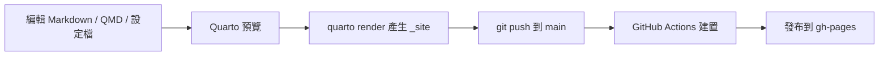

# 網站更新與維護詳細說明手冊

版本：1.0
日期：2026-07-07
適用資料夾：`C:\Users\f1240\Desktop\Quarto_Website_Editing_Kit`
原始 Git 專案：`C:\Users\f1240\Desktop\Quarto_Website`

本手冊說明如何維護這個 Quarto 靜態網站與 Shiny CMS 後台，包含日常更新、文章發布、學生專區密碼、預覽、部署、備份與故障排除。

## 1. 核心觀念

這個網站由兩個部分組成：

1. Quarto 靜態網站
   Quarto 讀取 `.md`、`.qmd`、圖片、樣式與 `_quarto.yml`，產生 `_site/` 內的 HTML 網站。

2. Shiny CMS 後台
   `admin_app/app.R` 提供本機後台介面，可以編輯頁面、發布知識庫文章、上傳圖片、更新學生專區密碼，並執行 Git 發布。

基本流程如下：



最重要的規則：

- 永遠編輯 source 檔，不要直接改 `_site/`。
- 新文章放在 `knowledge/posts/`。
- 學生專區密碼公開檔只放 hash，明文密碼只留在 `students/.password_secret.txt`。
- 發布前先跑 `quarto render`，確認網站可以完整產生。
- 如果使用整理包部署，必須先把整理包接成 Git 工作副本。

## 2. 資料夾結構

| 路徑 | 用途 | 是否常改 |
| --- | --- | --- |
| `_quarto.yml` | 全站設定、導覽列、Quarto render 白名單 | 需要新增主頁或改導覽列時 |
| `index.md` | 首頁內容 | 偶爾 |
| `about/index.md` | 個人介紹頁 | 偶爾 |
| `activities/index.md` | 活動與服務頁 | 偶爾 |
| `publications/index.md` | 發表與研究成果頁 | 偶爾 |
| `lab/index.md` | AI 實驗室或專題頁 | 偶爾 |
| `knowledge/index.md` | 知識站首頁與 listing 入口 | 偶爾 |
| `knowledge/posts/` | 知識庫文章，每篇文章一個資料夾 | 經常 |
| `students/index.qmd` | 學生專區內容 | 經常 |
| `students/_password.html` | 學生專區前端密碼保護邏輯 | 很少 |
| `students/password_hash.txt` | 學生專區密碼 SHA-256 hash | 改密碼時 |
| `students/.password_secret.txt` | 本機明文密碼，方便 CMS 顯示 | 改密碼時 |
| `custom.scss` | Quarto 主視覺樣式 | 需要改版時 |
| `styles.css` | 額外 CSS | 需要改版時 |
| `admin_app/app.R` | Shiny CMS 後台 | 需要改後台功能時 |
| `.github/workflows/publish.yml` | GitHub Pages 自動發布流程 | 很少 |
| `r-library/` | 整理包本機 R 套件 | 通常不用手動改 |
| `_site/` | Quarto 產出網站 | 不要手動改 |

## 3. 初次使用

### 3.1 開啟整理包

建議用 RStudio 開啟：

```text
C:\Users\f1240\Desktop\Quarto_Website_Editing_Kit\Quarto_Website.Rproj
```

也可以直接在 PowerShell 進入資料夾：

```powershell
cd C:\Users\f1240\Desktop\Quarto_Website_Editing_Kit
```

### 3.2 安裝或確認 R 套件

第一次使用整理包，請在 R Console 執行：

```r
source("install_r_packages.R")
```

這會把 CMS 需要的套件安裝到整理包自己的 `r-library/`。目前需要：

- `shiny`
- `bslib`
- `processx`
- `digest`
- `knitr`
- `rmarkdown`

整理包會依照目前開啟的 R minor version 建立專屬套件資料夾，例如：

```text
r-library/R-4.4-cms
r-library/R-4.6-cms
```

不要讓不同 R 版本共用同一個套件資料夾。Windows 版 R 套件常包含 `.dll`，如果套件是用另一個 R 版本建造，就可能出現 `LoadLibrary failure` 或「套件是用 R 版本 x.y.z 建造的」。

### 3.3 啟動 CMS

在 R Console 執行：

```r
source("run_cms.R")
```

如果目前 R session 已經載入另一個 library 或版本的 `shiny`、`bslib`、`processx`、`digest`，`run_cms.R` 會自動呼叫 `launch_cms_clean.R`，改用乾淨的背景 R session 啟動 CMS。這可以避免 Windows 上 `.dll` 已被 `htmltools` 或其他 namespace 鎖住、無法卸載的問題。

瀏覽器分頁由 `run_cms.R` 或 `launch_cms_clean.R` 統一開啟一次；`admin_app/app.R` 本身不再額外要求 Shiny 開 browser，避免啟動後同時跳出兩個 CMS 分頁。

CMS 啟動後會嘗試在背景開啟：

```powershell
quarto preview --port 4200 --no-browser
```

右側預覽 iframe 會讀取 `http://localhost:4200/`。

## 4. CMS 頁籤總覽

CMS 目前有四個主要功能區。

| 頁籤 | 主要用途 | 對應檔案 |
| --- | --- | --- |
| 頁面內容管理 | 編輯固定頁面、上傳固定頁面圖片、即時預覽 | `index.md`、各頁 `index.md`、`students/index.qmd`、`_quarto.yml` |
| 知識站管理 | 建立、編輯、公開或隱藏知識貼文 | `knowledge/posts/post-YYYYMMDD-HHMMSS/index.qmd` |
| 存取權限設定 | 更新學生專區密碼 | `students/password_hash.txt`、`students/.password_secret.txt` |
| 雲端同步與部署 | 執行 `git add .`、`git commit`、`git push origin main` | Git repository |

## 5. 日常更新流程

日常最穩定的順序是：

1. 開啟整理包或原專案。
2. 啟動 CMS。
3. 修改頁面或新增文章。
4. 檢查右側預覽。
5. 在 PowerShell 執行 `quarto render`。
6. 確認沒有錯誤。
7. 發布到 GitHub。
8. 等 GitHub Actions 完成。
9. 到正式網站按 `Ctrl + F5` 強制重新整理。

建議每次改版只做一個主題，例如「新增一篇文章」或「更新學生專區」，不要同時混太多不相關修改，日後比較容易追蹤。

## 6. 編輯既有頁面

### 6.1 用 CMS 編輯

1. 啟動 CMS。
2. 進入「頁面內容管理」。
3. 在「選擇要編輯的頁面」選取目標頁面。
4. 按「載入此頁面」。
5. 在中央「文章編輯器」修改內容。
6. 停止打字約 1.5 秒後會自動儲存。
7. 需要確認時也可以按「手動儲存」。
8. 右側預覽會自動指向對應頁面。

CMS 的頁面編輯器會直接寫入原始檔，例如：

- 首頁：`index.md`
- 個人介紹：`about/index.md`
- 學生專區：`students/index.qmd`

知識站貼文不會出現在這個下拉選單；請到「知識站管理」處理。

新版頁面內容管理改為三欄工作台：

| 區域 | 用途 |
| --- | --- |
| 左側工具欄 | 選擇頁面、載入頁面、手動儲存、查看同步狀態、上傳圖片 |
| 中央寫作區 | 主要文章編輯器，提供較大的可視高度與類 Notion/Substack 的工具列 |
| 右側預覽區 | 即時網站預覽，自動切換到目前正在編輯的頁面 |

中央寫作區內仍保留三個可折疊區塊：

| 區域 | 用途 |
| --- | --- |
| 頁面設定 | 編輯 YAML front matter，例如 `title`、`subtitle`、`date`、`categories`。預設收合，需要改設定時再展開 |
| 文章編輯器 | 主要寫作區，可用工具列編輯標題、粗體、引文、清單、表格、連結與程式碼區塊 |
| 完整原始碼 | 保留完整 Markdown/QMD 原始碼，遇到 Quarto callout、fenced div、特殊 shortcode 時可直接修正 |

若選到 `_quarto.yml` 這類純設定檔，CMS 會自動切換成完整原始碼模式，避免富文字編輯器誤處理全站設定。

文章編輯器的資源已放在：

```text
admin_app/www/toastui/
```

所以不需要依賴外部 CDN 才能開啟編輯器。

### 6.2 手動用文字編輯器編輯

也可以用 VS Code、RStudio 或 Obsidian 直接打開檔案修改。修改後請執行：

```powershell
quarto render
```

如果只是預覽：

```powershell
quarto preview
```

### 6.3 Markdown 常用語法

```markdown
# 第一層標題

## 第二層標題

一般段落文字。

- 項目一
- 項目二

[連結文字](https://example.com)


```

Quarto callout：

```markdown
::: {.callout-note}
## 提醒

這裡放補充說明。
:::
```

表格：

```markdown
| 欄位一 | 欄位二 |
| --- | --- |
| 內容 | 內容 |
```

## 7. 知識站貼文管理

### 7.1 建立新貼文

1. 啟動 CMS。
2. 進入「知識站管理」。
3. 輸入文章標題。
4. 選擇發布日期。
5. 輸入文章分類，用半形逗號分隔，例如：

```text
AI, Teaching, 心得
```

6. 選擇「建立後立即公開」或取消勾選作為隱藏草稿。
7. 按「建立並載入貼文」。
8. 在中央「知識貼文編輯器」撰寫內容。
9. 按「儲存內容與狀態」。

CMS 會建立：

```text
knowledge/posts/post-YYYYMMDD-HHMMSS/index.qmd
```

例如：

```text
knowledge/posts/post-20260707-002801/index.qmd
```

檔案開頭會自動產生 YAML：

```yaml
---
title: "文章標題"
date: "2026-07-07"
categories: ["AI", "Teaching"]
draft: false
---
```

### 7.2 編輯既有貼文

知識貼文有自己的管理區，不會和固定頁面混在一起。

1. 進入「知識站管理」。
2. 在「選擇知識貼文」選取貼文。
3. 按「載入貼文」。
4. 在中央編輯器修改內容。
5. 需要改標題、日期、分類時，展開「貼文設定」。
6. 按「儲存內容與狀態」。

### 7.3 公開或隱藏貼文

在「知識站管理」中載入貼文後，可以用「公開狀態」切換：

| 狀態 | YAML | 網站效果 |
| --- | --- | --- |
| 公開 | `draft: false` | 正式 render 後會出現在知識站列表 |
| 隱藏 | `draft: true` | 正式 render 後不會出現在 listing、搜尋、sitemap |

Quarto 官方的 drafts 機制會處理隱藏貼文；隱藏貼文適合當作草稿或暫時下架內容。CMS 右側使用的是 `quarto preview`，因此草稿可能仍會在預覽中顯示，這是為了方便檢查內容。真正發布前請執行 `quarto render`；正式 render 後，`draft: true` 的貼文不會出現在 listing、搜尋或 sitemap。

### 7.4 刪除貼文

刪除貼文採用「移至垃圾桶」方式，避免誤刪後無法復原。

1. 進入「知識站管理」。
2. 在「選擇知識貼文」選取貼文。
3. 按「移至垃圾桶」。
4. 在確認視窗檢查貼文標題與路徑。
5. 按「確認移至垃圾桶」。

CMS 會把整個貼文資料夾從：

```text
knowledge/posts/
```

移到：

```text
knowledge/_trash/
```

移入 `_trash` 後，該貼文不會再被 Quarto render 或出現在知識站列表。若要復原，手動把該貼文資料夾移回 `knowledge/posts/` 後重新執行 `quarto render`。

### 7.5 文章命名原則

CMS 目前使用時間戳作為文章資料夾名稱，格式是：

```text
post-YYYYMMDD-HHMMSS
```

這樣可以避免同名文章互相覆蓋。不要手動把文章放在 `_site/knowledge/posts/`，那是產出結果。

## 8. 圖片管理

### 8.1 用 CMS 上傳圖片

1. 若圖片屬於固定頁面，先在「頁面內容管理」載入目標頁面。
2. 若圖片屬於知識貼文，先在「知識站管理」載入目標貼文。
3. 在「插入圖片」區選擇圖片。
4. 在「圖片標題」欄位輸入圖標題。
5. CMS 會把圖片複製到目前載入檔案所在資料夾。
6. CMS 會把圖片與可直接編輯的圖標題插入目前編輯位置。

範例：

```markdown


*請在此輸入圖片標題*
```

插入後，可以直接在編輯器中修改圖片下方那一行圖標題：

```markdown


*課堂討論活動照片*
```

### 8.2 圖片放置規則

| 使用位置 | 建議放置 |
| --- | --- |
| 首頁圖片 | 根目錄或專用 assets 資料夾 |
| 某篇文章圖片 | 該文章資料夾內 |
| 學生專區圖片 | `students/` |
| 共用圖示或頭像 | 根目錄或 `profile.png` |

CMS 目前會把上傳圖片放在「目前載入檔案」所在資料夾，所以新增圖片前一定要先載入正確頁面。

### 8.3 圖片檔名建議

建議使用：

```text
english-or-number-file-name.png
```

避免：

- 空白
- 過長檔名
- 特殊符號
- 重複檔名

CMS 會自動把空白改成底線，但最好一開始就用乾淨檔名。

## 9. 學生專區密碼

### 9.1 密碼保護如何運作

學生專區由三個檔案配合：

| 檔案 | 用途 |
| --- | --- |
| `students/index.qmd` | 學生專區內容 |
| `students/_password.html` | 前端輸入密碼與解鎖邏輯 |
| `students/password_hash.txt` | 公開的 SHA-256 hash |
| `students/.password_secret.txt` | 本機明文密碼，方便 CMS 顯示 |

`students/index.qmd` 會引用：

```yaml
resources:
  - password_hash.txt
include-after-body:
  - file: _password.html
```

部署後，網頁會讀取 `password_hash.txt`，將使用者輸入的密碼轉成 SHA-256 後比對。

### 9.2 用 CMS 修改密碼

1. 啟動 CMS。
2. 進入「存取權限設定」。
3. 查看目前密碼。
4. 輸入新密碼。
5. 按「儲存並更新密碼」。

CMS 會做兩件事：

1. 將新密碼 trim 後轉成 SHA-256，寫入 `students/password_hash.txt`。
2. 將明文密碼寫入 `students/.password_secret.txt`。

### 9.3 安全注意事項

這個密碼機制適合阻擋一般訪客，不適合放高度敏感資料。因為 GitHub Pages 是靜態網站，前端密碼保護無法等同伺服器端權限控管。

不要把以下內容放入學生專區：

- 個資
- 成績
- 未公開研究資料
- 有版權限制且不能公開的教材
- 需要嚴格身份驗證的資料

`students/.password_secret.txt` 不應上傳到 GitHub。整理包的 `.gitignore` 已包含：

```gitignore
students/.password_secret.txt
```

發布前仍建議檢查：

```powershell
git status --short
```

若看到 `.password_secret.txt` 被加入，請先停止發布。

## 10. 更新導覽列與新增主頁

如果只是新增知識庫文章，不需要改 `_quarto.yml`。
如果要新增一個主頁，例如 `courses/index.md`，就需要改 `_quarto.yml`。

### 10.1 新增主頁步驟

1. 建立資料夾：

```powershell
mkdir courses
```

2. 新增頁面檔：

```text
courses/index.md
```

3. 在 `_quarto.yml` 的 `project.render` 加入：

```yaml
    - courses/index.md
```

4. 在 `_quarto.yml` 的 `website.navbar.left` 加入：

```yaml
      - href: courses/index.md
        text: 課程
```

5. 執行：

```powershell
quarto render
```

### 10.2 YAML 注意事項

YAML 對縮排非常敏感：

- 使用空白，不要使用 tab。
- 同一層縮排要一致。
- `href` 和 `text` 要放在同一個導覽項目下面。
- 中文文字可以直接寫，但若含特殊符號，建議加雙引號。

錯誤範例：

```yaml
      - href: courses/index.md
      text: 課程
```

正確範例：

```yaml
      - href: courses/index.md
        text: 課程
```

## 11. 樣式與版面維護

### 11.1 主要樣式檔

| 檔案 | 用途 |
| --- | --- |
| `custom.scss` | Quarto theme、色彩、版面、元件樣式 |
| `styles.css` | 額外 CSS |
| `students/_password.html` | 學生專區解鎖介面相關 HTML/CSS/JS |

### 11.2 改樣式的建議流程

1. 先確認要改的是全站樣式還是單頁樣式。
2. 全站樣式優先改 `custom.scss`。
3. 學生專區密碼畫面才改 `students/_password.html`。
4. 改完執行：

```powershell
quarto render
```

5. 在桌機與手機寬度檢查。

### 11.3 不要直接改 Quarto 產物

不要修改這些路徑：

```text
_site/
_site/site_libs/
_site/search.json
_site/listings.json
```

這些會在下一次 `quarto render` 時被覆蓋。

## 12. 本機預覽與完整渲染

### 12.1 預覽網站

在整理包根目錄執行：

```powershell
quarto preview
```

或固定使用 CMS 需要的 port：

```powershell
quarto preview --port 4200
```

瀏覽器網址：

```text
http://localhost:4200/
```

### 12.2 完整渲染

發布前一定要執行：

```powershell
quarto render
```

成功時會看到類似：

```text
Output created: _site\index.html
```

如果失敗，先修正錯誤再發布。

### 12.3 清掉卡住的預覽服務

如果 `localhost:4200` 無法更新，或 Quarto preview 卡住，可以在 PowerShell 執行：

```powershell
Stop-Process -Name quarto -Force
```

然後重新啟動 CMS 或重新執行：

```powershell
quarto preview --port 4200
```

## 13. 發布到 GitHub Pages

### 13.1 發布管線

目前 GitHub workflow 位於：

```text
.github/workflows/publish.yml
```

它會在 `main` 分支 push 後：

1. checkout repository
2. 安裝 Quarto
3. 執行 Quarto publish action
4. 發布到 `gh-pages`

正式網址由 GitHub Pages 設定決定，目前 repository remote 是：

```text
https://github.com/changhsiuwei/changhsiuwei.github.io.git
```

### 13.2 從原專案發布

原專案含 `.git`，可直接部署：

```powershell
cd C:\Users\f1240\Desktop\Quarto_Website
quarto render
git status --short
git add .
git commit -m "Update website content"
git push origin main
```

也可以在原專案啟動 CMS，按「一鍵發布至 GitHub」。

### 13.3 從整理包發布

整理包目前集中內容與本機套件，但預設不含 `.git` 歷史。若要讓 CMS 的「一鍵發布」在整理包內可用，需要先把整理包變成 Git 工作副本。

做法一：重新 clone 後套用整理包內容。

```powershell
cd C:\Users\f1240\Desktop
git clone https://github.com/changhsiuwei/changhsiuwei.github.io.git Quarto_Website_Working
```

再把整理包內的網站 source 複製到 `Quarto_Website_Working`。不要複製 `r-library/`、`_site/`、`.quarto/`。

做法二：在整理包初始化 Git。

```powershell
cd C:\Users\f1240\Desktop\Quarto_Website_Editing_Kit
git init
git branch -M main
git remote add origin https://github.com/changhsiuwei/changhsiuwei.github.io.git
git fetch origin main
```

初始化後，第一次推送前請特別檢查：

```powershell
git status --short
```

確認沒有把 `r-library/`、`_site/`、`.quarto/`、`students/.password_secret.txt` 加入 Git。

### 13.4 CMS 一鍵發布實際做的事

CMS 按鈕會執行：

```powershell
git add .
git commit -m "Auto-publish CMS update: YYYY-MM-DD HH:MM:SS"
git push origin main
```

因此它需要：

- 目前資料夾是 Git repository。
- remote `origin` 指向正確 GitHub repository。
- 目前分支是 `main`。
- GitHub 認證可正常 push。

### 13.5 發布後檢查

發布後等待約 1 至 3 分鐘，然後檢查：

1. GitHub Actions 是否成功。
2. 正式網站是否更新。
3. 知識庫文章 listing 是否出現新文章。
4. 圖片是否正常顯示。
5. 學生專區密碼是否可解鎖。

如果正式網站還是舊版，瀏覽器按：

```text
Ctrl + F5
```

## 14. 發布前檢查清單

每次發布前建議逐項確認：

- `quarto render` 成功。
- 頁面沒有明顯錯字或破版。
- 新圖片可正常顯示。
- 新文章有正確 title、date、categories。
- `_quarto.yml` 縮排正確。
- `git status --short` 沒有出現不該提交的檔案。
- `students/.password_secret.txt` 沒有被 Git 追蹤。
- 如果改過密碼，正式網站密碼測試成功。
- 如果改過導覽列，所有導覽連結都可開啟。

## 15. 備份與復原

### 15.1 建議備份內容

完整備份時建議保留：

- `_quarto.yml`
- 所有 `.md` 與 `.qmd`
- `knowledge/`
- `students/`
- `admin_app/`
- `custom.scss`
- `styles.css`
- `.github/`
- `profile.png`
- `Quarto_Website.Rproj`
- `START_HERE.md`
- `DEPENDENCIES.md`
- 本手冊

可略過：

- `_site/`
- `.quarto/`
- `.Rproj.user/`
- `r-library/`

若是要把整理包交給另一台電腦直接使用，可以連 `r-library/` 一起帶走，但目標電腦的 R 版本最好相同或相近。

### 15.2 手動備份指令

PowerShell 範例：

```powershell
$src = "C:\Users\f1240\Desktop\Quarto_Website_Editing_Kit"
$dst = "C:\Users\f1240\Desktop\Quarto_Website_Backup_$(Get-Date -Format yyyyMMdd-HHmmss)"
robocopy $src $dst /E /XD ".git" ".quarto" ".Rproj.user" "_site" "r-library"
```

### 15.3 從 Git 復原

查看最近 commit：

```powershell
git log --oneline -5
```

查看某個檔案最近變更：

```powershell
git log -- path/to/file
```

若不確定要不要還原，先不要執行會覆蓋檔案的命令，先備份目前資料夾。

## 16. 常見問題排除

### 16.1 CMS 打不開

可能原因：

- R 套件尚未安裝。
- 目前 R 版本和 `r-library` 裡的套件版本不一致。
- 沒有從整理包根目錄執行 `source("run_cms.R")`。
- `admin_app/app.R` 路徑不正確。

處理方式：

```r
source("install_r_packages.R")
source("run_cms.R")
```

如果錯誤訊息包含：

```text
套件是用 R 版本 4.6.1 來建造的
LoadLibrary failure
```

請先重啟 R session，再從整理包根目錄執行：

```r
source("install_r_packages.R")
source("run_cms.R")
```

不要先手動執行 `library(shiny)`；讓 `run_cms.R` 自己載入整理包內對應 R 版本的套件。

若你已經在同一個 R session 裡手動執行過 `library(shiny)`，也可以直接執行：

```r
source("run_cms.R")
```

此時 `run_cms.R` 會偵測已載入的套件版本；若版本或路徑不一致，會改用乾淨背景 R session 啟動 CMS。

### 16.2 右側預覽空白

可能原因：

- Quarto preview 沒有啟動。
- port 4200 被占用。
- Quarto render 出錯。
- CMS 還在使用舊的執行個體，尚未重新載入修正後的啟動腳本。

處理方式：

```powershell
Stop-Process -Name quarto -Force
quarto preview --port 4200
```

再重新整理 CMS 預覽。

如果只是右側 iframe 出現灰色破圖圖示，先檢查：

```powershell
Invoke-WebRequest http://127.0.0.1:4200/ -UseBasicParsing
```

若有回應，表示 Quarto preview 已正常啟動，回到 CMS 按「載入此頁面」或重新整理瀏覽器即可。若無回應，請關閉舊的 CMS R session，從整理包根目錄重新執行：

```r
source("run_cms.R")
```

新版 `run_cms.R` 會用 Windows hidden background process 啟動 `quarto preview`，並等待 `127.0.0.1:4200` 真正可連後再啟動 CMS。

### 16.3 修改後網站沒有變

可能原因：

- 改到 `_site/`，下一次 render 被覆蓋。
- 沒有儲存 source 檔。
- 瀏覽器快取。
- GitHub Actions 尚未完成。

處理方式：

```powershell
quarto render
git status --short
```

正式網站按 `Ctrl + F5`。

### 16.4 知識庫新文章沒有出現在列表

檢查：

- 文章是否在 `knowledge/posts/某資料夾/index.qmd`。
- YAML front matter 是否完整。
- 貼文是否在「知識站管理」被設為「隱藏」。
- `knowledge/index.md` 是否仍是 listing 頁。
- `quarto render` 是否成功。

文章 YAML 至少要有：

```yaml
---
title: "文章標題"
date: "2026-07-07"
categories: ["AI"]
draft: false
---
```

### 16.5 圖片不顯示

檢查：

- 圖片檔是否在文章同一個資料夾。
- Markdown 路徑是否正確。
- 檔名大小寫是否一致。
- 檔案副檔名是否正確。

同資料夾圖片：

```markdown

```

上一層資料夾圖片：

```markdown

```

### 16.6 學生密碼無法解鎖

檢查：

- 是否有重新發布 `students/password_hash.txt`。
- 瀏覽器是否快取舊 hash。
- 使用者是否輸入多餘空白。
- `students/_password.html` 是否仍會讀取 `password_hash.txt`。

處理方式：

1. 在 CMS 重新設定密碼。
2. 執行 `quarto render`。
3. 發布。
4. 正式網站按 `Ctrl + F5`。

### 16.7 Git push 失敗

可能原因：

- 目前資料夾不是 Git repository。
- GitHub 認證過期。
- remote 設定錯誤。
- 遠端有新 commit，本機未同步。

檢查：

```powershell
git status
git remote -v
git branch --show-current
```

若提示需要先 pull：

```powershell
git pull --rebase origin main
```

再重新 push。

### 16.8 GitHub Actions 失敗

處理方式：

1. 到 GitHub repository 的 Actions 頁面。
2. 打開失敗的 workflow。
3. 查看 `Render and Publish` 的錯誤訊息。
4. 回本機執行 `quarto render` 重現錯誤。
5. 修正 source 檔後再次 push。

## 17. 建議維護節奏

每次更新後：

- 跑 `quarto render`。
- 看 `git status --short`。
- 發布後檢查正式網站。

每週：

- 檢查是否有未發布文章。
- 檢查 knowledge listing。
- 檢查學生專區連線與密碼。

每月：

- 備份整理包。
- 檢查 GitHub Actions 是否仍正常。
- 檢查外部連結是否失效。

每學期：

- 更新學生專區內容。
- 更換學生專區密碼。
- 檢查首頁、個人介紹、研究成果與課程資訊。
- 移除不再需要公開的舊資料。

## 18. 維護原則

好的維護方式不是一次改很多，而是讓每次更新都小、清楚、可回溯。

建議 commit message 寫清楚目的，例如：

```text
Update student resources for 2026 fall
Add AI teaching reflection post
Refresh publication list
Change student area password
```

若遇到不確定的狀況，先做三件事：

1. 不要直接改 `_site/`。
2. 先備份目前資料夾。
3. 用 `quarto render` 找出真正錯誤。

只要 source 檔乾淨、Quarto 可以 render、GitHub Actions 成功，網站就能穩定維護。
