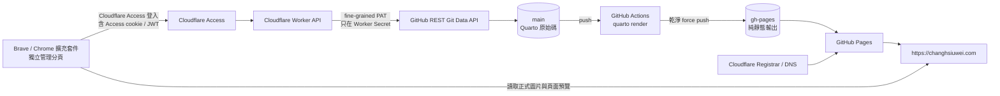

# 架構、資料流與安全邊界

## 系統全貌

Cloudflare Worker 不是網站主機，擴充套件也不直接持有 GitHub Token。GitHub `main` 才是正式內容來源。

## 公開網站資料流

1. 編輯完成後，Worker 或開發者把 commit 寫入 `main`。
2. `.github/workflows/publish.yml` 因 `main` push 啟動。
3. GitHub Runner 取得原始碼並安裝 Quarto。
4. `quarto render` 只渲染 `_quarto.yml` 明列的頁面與文章。
5. `_site` 被複製至暫存目錄，加入 `.nojekyll`。
6. 暫存目錄初始化為全新的 Git 歷史，force push 到 `gh-pages`。
7. GitHub Pages 從 `gh-pages` 根目錄發布。
8. `CNAME` 將 Pages 綁定到 `changhsiuwei.com`；Cloudflare DNS 把網域解析到 GitHub Pages。

這個設計會讓 `gh-pages` 只含公開輸出，不包含 `cloud_admin`、工作流程、原始 Markdown 或本機設定。

## 管理後台資料流

1. 點擊擴充套件圖示，`service-worker.js` 開啟擴充套件內的 `sidepanel.html`；名稱沿用 sidepanel，但實際是獨立分頁。
2. 擴充套件從 `chrome.storage.local` 讀取 API URL、正式網址與文字草稿，從 IndexedDB 讀取待上傳圖片。
3. 首次連線時要求指定 Worker origin 的 optional host permission。
4. 使用者先瀏覽 Worker URL 並完成 Cloudflare Access 登入，瀏覽器取得 Access cookie。
5. 擴充套件呼叫 `/api/session` 與 `/api/tree`。Access 先擋下未驗證請求，Worker 再驗證 JWT。
6. 選擇頁面後呼叫 `/api/file?path=...&ref=...`，Worker 僅允許白名單路徑。
7. 擴充套件把 Markdown 轉成視覺模型；Quarto 版面標記保存在程式狀態，不顯示給使用者。
8. 發布時呼叫 `/api/publish`，包含 `baseCommitSha`、更新說明與檔案批次。
9. Worker 檢查目前 GitHub HEAD 是否仍等於 `baseCommitSha`。不一致就回傳 409，要求重新讀取。
10. 通過後，Worker 以 GitHub Git Data API 建立 blobs、tree、commit，最後非強制更新 `main`。

## Worker API 合約

| Method | Path | 功能 | 主要回傳 |
|---|---|---|---|
| `GET` | `/api/session` | 確認 Access 身分 | `authenticated`, `email` |
| `GET` | `/api/tree` | 取得目前 HEAD 與可編輯檔案清單 | `head`, `files` |
| `GET` | `/api/file?path=...&ref=...` | 讀取白名單內的單一檔案 | `path`, `sha`, `encoding`, `content` |
| `POST` | `/api/publish` | 原子提交一批檔案 | `ok`, `commitSha`, `actor` |

所有正式 API 都需通過：

- Cloudflare Access 應用程式驗證。
- Worker 的 Access JWT issuer 與 Audience 驗證。
- Worker 的管理者 email 比對。
- 精確的 CORS Origin 白名單。

## 可編輯與禁止範圍

固定可編輯頁面：

- `index.md`
- `about/index.md`
- `activities/index.md`
- `publications/index.md`
- `knowledge/index.md`
- `lab/index.md`

條件式可編輯：

- `knowledge/posts/<slug>/` 下的 `.md`、`.qmd`、`.png`、`.jpg`、`.jpeg`、`.webp`
- `lab/posts/<slug>/` 下的相同檔案類型
- `assets/uploads/` 下的圖片

明確不允許透過 Worker 編輯：

- `.github/workflows`
- `_quarto.yml`、`CNAME` 與 Git／Cloudflare 設定
- `cloud_admin` 程式本身
- R 執行檔、套件、快取與建置輸出
- `students` 學生專區
- 私人草稿、明文密碼與任何 Secret

這個限制在 Worker 後端執行，不只依賴前端隱藏。

## 內容模型與預覽

一般頁面使用 Toast UI Editor 的 WYSIWYG 模式。活動與表格另有結構化模型：

- 活動：年份、日期、單位、主題以欄位與卡片編輯。
- 表格：只開放儲存格內容，不顯示 Markdown table separator。
- Quarto callout、grid、columns 與其他版面結構：不進入視覺文字區；儲存時依原始結構重建。
- 圖片：既有圖片由正式網站 URL 顯示，新圖片使用本機 object URL 預覽，發布時轉 base64。

視覺預覽是快速回饋，並非完整 Quarto 編譯器。`quarto render` 和 Actions 才是發布前後的權威渲染證據。

## 狀態與資料保存

| 位置 | 保存內容 | 是否正式來源 |
|---|---|---|
| GitHub `main` | Quarto 原始碼、網站內容、後台程式、測試 | 是 |
| GitHub `gh-pages` | Quarto 產生的公開 HTML／資產 | 否，可重建 |
| Cloudflare Worker Secret | GitHub Token | 機密來源 |
| Cloudflare Access | 身分與政策 | 授權來源 |
| `chrome.storage.local` | API URL、網站 URL、文字草稿、UI 偏好 | 否 |
| IndexedDB | 待上傳圖片草稿 | 否 |
| 本機 `_site`、`.quarto` | 渲染輸出與快取 | 否，可刪除重建 |

## 失敗保護與回復

- GitHub HEAD 改變：Worker 回 409，不覆蓋；重新載入內容再重做修改。
- Quarto render 失敗：Actions 不會更新 `gh-pages`，舊網站繼續服務。
- Pages 發布失敗：檢查 Actions 與 Pages，不要手動修 `gh-pages`；修正 `main` 後重跑。
- Token 到期：Worker GitHub API 呼叫失敗；建立新 Token 並覆蓋 Worker Secret，不改程式。
- 擴充套件 ID 改變：CORS 403；更新 `ALLOWED_ORIGINS` 與 Access CORS 後重新部署。
- 視覺編輯內容出現 Quarto 語法或 `HWCMS-LAYOUT`：停止發布、重新載入擴充套件 1.0.2、清除該頁本機草稿再重新讀取。
