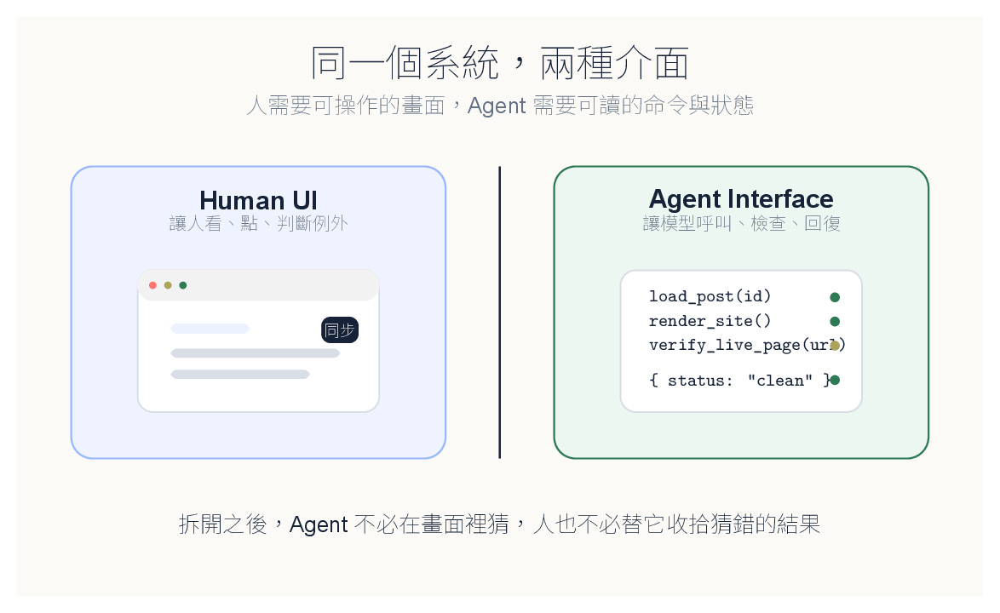
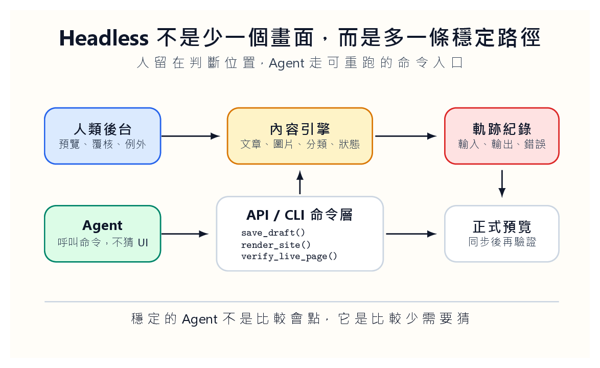
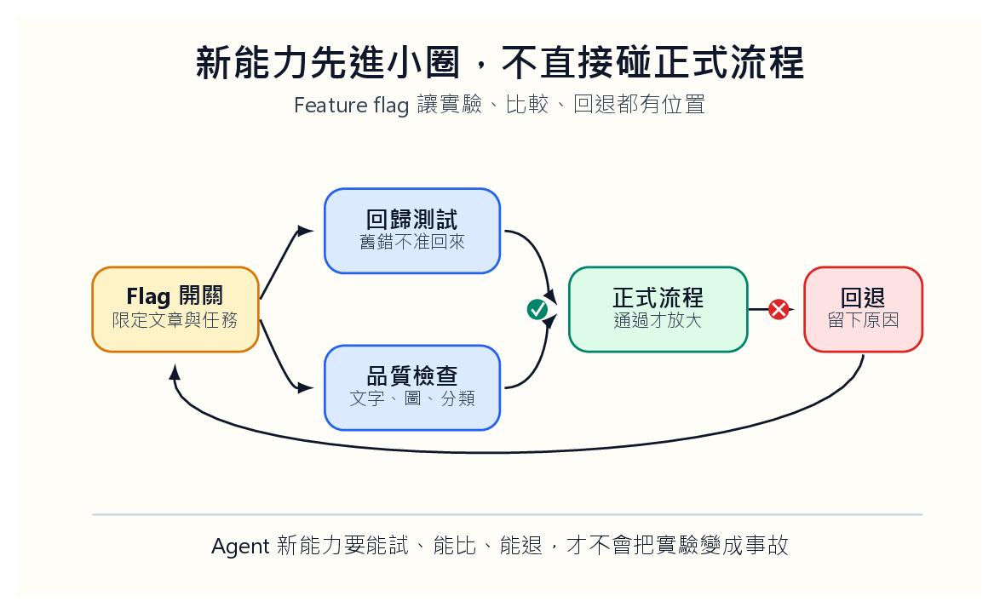

我們以前很自然地假設：如果一個網站人可以用，AI Agent 應該也能用。

畫面都在那裡，按鈕也在那裡，輸入框也在那裡。模型既然能看圖、讀字、操作瀏覽器，讓它像助理一樣點來點去，好像只是順手的下一步。

真正做下去才知道，這一步很貴。

人看到一個頁面，會自動忽略裝飾、陰影、彈窗、載入動畫。人知道哪一個錯誤訊息可以先放著，哪一個是真的失敗。人也知道頁面轉了三秒還沒好時，要等，還是要重新整理。Agent 沒有這些身體經驗。它會把畫面上的雜訊也當成資訊，把暫時狀態當成結果，把「看起來差不多」當成完成。

我們以為自己在做智慧代理，有時其實是在訓練一個昂貴的瀏覽器操作員。

## 人會忽略雜訊，Agent 會把雜訊當訊息

這不是模型夠不夠聰明而已，而是介面把太多判斷推給模型。

一個按鈕的顏色、一段提示的位置、一個 loading spinner 的停留時間，對人來說只是感覺；對 Agent 來說，可能變成判斷依據。若系統沒有明確告訴它「現在是 draft」、「render 已完成」、「同步仍在等 Pages 部署」，它就只能猜。

猜一次看起來很神奇，猜十次就會變成事故。

所以我們後來開始把 UI 分成兩種。一種是給人看的，它需要好讀、好點、有回饋，也要保留判斷的餘地。另一種是給 Agent 用的，它不需要漸層、不需要漂亮空狀態，它需要命令、輸入、錯誤、狀態和可重跑的回報。

這不是把前端做醜。這是承認人和 Agent 不是同一種使用者。

## 同一個系統，應該有兩種入口

[SWE-agent 論文〈SWE-agent: Agent-Computer Interfaces Enable Automated Software Engineering〉](https://arxiv.org/abs/2405.15793)讓我重新理解這件事。它沒有只把模型丟進一般終端機，而是替模型設計適合瀏覽檔案、編輯程式、搜尋、執行測試的命令和回饋格式。

這個角度很有用，因為問題被移回系統設計：不是讓模型在雜亂介面裡表演理解力，而是讓系統把工作說清楚。

以網站管理為例，人類編輯需要好的後台。可以看文章、改標題、插圖片、預覽、同步。這些畫面值得打磨。可是 Agent 不應該只靠這個畫面工作。它更適合走另一條路：讀文章清單，取得單篇原始內容，寫入草稿，執行 render，檢查圖片，提交版本，推送部署，再輪詢正式頁面。

這條路可以沒有按鈕，但不能沒有狀態。

## Headless 不是少一個畫面

很多人聽到 headless，會以為只是把畫面拿掉。不是。Headless 的重點不是少一個畫面，而是多一條穩定路徑。

人類後台讓人處理例外、判斷內容、看預覽。Agent 的命令層則處理可重複工作：`load_post`、`save_draft`、`render_site`、`verify_live_page`、`publish_if_clean`。這些命令不必多，但必須穩。

每個命令都像一張小工作單。`save_draft` 不能只回「完成」，它要回檔案路徑、修改時間、是否碰到圖片、是否更新索引。`verify_live_page` 不能只回「正常」，它要回它查了哪個網址、找到哪個標題、頁面裡有哪些圖檔、是否還停在舊版本。

模糊回饋會讓 Agent 編故事。清楚回饋會讓 Agent 修正。

## 狀態才是真正的介面

很多 AI 產品喜歡放一個聊天框，讓使用者說：「幫我完成這件事。」聊天框很友善，但它不是工作流本身。

工作流需要狀態。

一篇文章現在是 draft、ready、published、hidden，還是 deleted？一張圖片是 uploaded、referenced、rendered，還是 missing？一次部署是 queued、running、failed、live，還是 stale？如果這些狀態只藏在畫面顏色裡，Agent 就會猜。猜錯後，人還要替它收拾。

好的 Agent 介面應該像表單，也像儀表板。它讓模型知道能做什麼、不能做什麼、做了之後系統回了什麼。它也讓人事後可以追問：這次錯在哪裡？是哪個命令送錯？是哪個檢查沒攔？哪個狀態沒有更新？

我們不能相信一句「請你更小心」就能讓 Agent 穩定。人都做不到，模型更不該被期待做到。

## 新能力要先關在小圈裡

Agent 系統還有一個很容易被低估的問題：新功能不能一次丟進正式流程。

例如我們想讓 Agent 自動改寫文章、補圖、同步網站。聽起來很順。可是中間任何一段都可能出錯。它可能寫出漂亮但失真的段落，也可能把圖片放錯位置，或把 hidden 文章一起發布。

所以新能力應該放在 feature flag 後面。先處理測試資料，再處理草稿，再開放少數文章，再進正式流程。每一段都要留下分數、失敗原因和人工覆核紀錄。

Feature flag 還有一個好處：它讓比較變得可能。舊流程和新流程可以同時跑，同一批文章跑兩套，再看哪一套錯少、哪一套省時、哪一套需要人改得少。沒有比較，大家只能憑感覺吵；憑感覺談 Agent，很快就會變成信仰問題。

## 錄影適合 Demo，軌跡才適合維護

很多人喜歡錄 Agent 操作畫面。這當然有用，尤其適合 Demo。可是維護不靠 Demo。

我們更想看軌跡。

它讀了哪個檔案？改了哪一段？為什麼選這張圖？render 花多久？檢查了幾個連結？正式頁面查了幾次才更新？人最後改了哪一句？

這些軌跡會變成下一次改進的材料。錄影只能告訴我們它當時看起來怎樣，軌跡才能告訴我們系統哪裡少了一個檢查、哪裡少了一個狀態、哪裡少了一個更好的命令。

只會操作 UI 的 Agent，還沒有真正進入系統。它只是站在門口，學人按門鈴。

真正的 Agent 介面，不是給它更多畫面，而是給它更少猜測。讓它知道任務、狀態、限制、錯誤和下一步。人負責判斷，系統留下證據，Agent 把可重複的部分做完。

如果一個 Agent 只能在畫面上表演，它還不是系統的一員。它只是被我們放進瀏覽器裡的臨時工。
