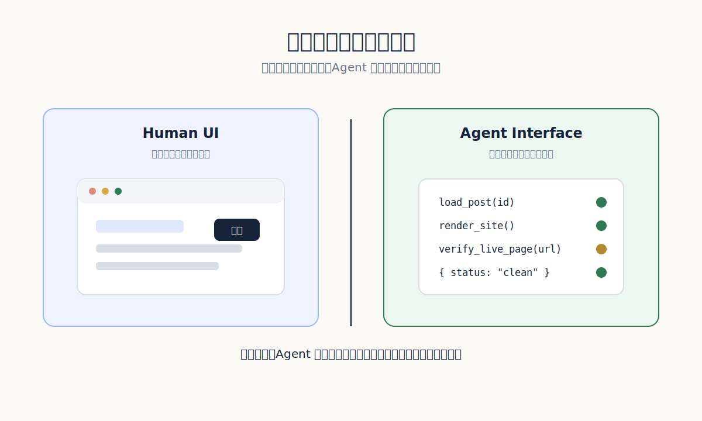
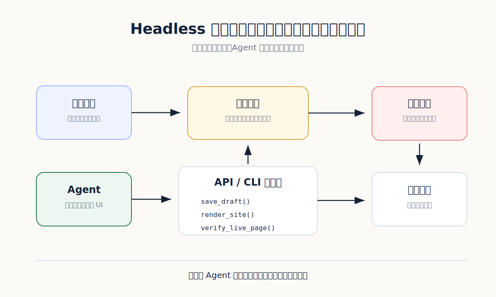
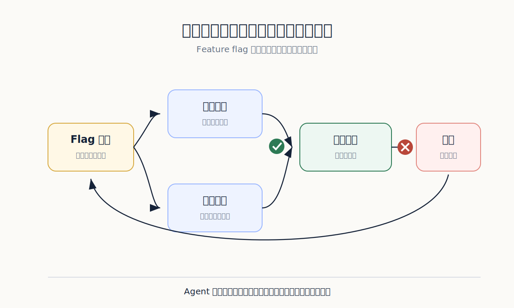

我以前很自然地假設：如果一個網站人可以用，AI Agent 應該也能用。

這個假設很誘人。畫面都在那裡，按鈕也在那裡，輸入框也在那裡。既然模型已經能看圖、能讀文字、能操作瀏覽器，讓它像助理一樣點來點去，好像只是下一步。

實作之後才知道，這是很貴的一步。

人看到一個按鈕，會自動忽略旁邊的裝飾、陰影、彈窗、載入動畫。人知道哪一個錯誤訊息可以無視，哪一個才是真的失敗。人也知道一個頁面轉了三秒還沒好，要等，還是要重新整理。

Agent 不會自然知道這些。它會把畫面上的雜訊也當資訊，把暫時狀態當結果，把「看起來差不多」當完成。你以為自己在做智慧代理，其實常常是在訓練一個昂貴的瀏覽器操作員。

**人看的畫面，不等於 Agent 能用的介面**

我後來開始把 UI 分成兩種。

一種是給人看的。它需要好讀、好點、有回饋、有情緒。人需要知道自己在哪裡，下一步能做什麼，錯了怎麼回來。這是前端設計的本分。

另一種是給 Agent 用的。它不需要漸層，也不需要漂亮空狀態。它需要清楚的命令、乾淨的輸入、可讀的錯誤、穩定的狀態。最好每一步都有結構化輸出，不要讓模型猜。

這不是把前端做醜。這是承認人和 Agent 是兩種使用者。

*人要的是可操作的畫面，Agent 要的是可讀、可重跑、可檢查的入口。*

[SWE-agent 論文〈SWE-agent: Agent-Computer Interfaces Enable Automated Software Engineering〉](https://arxiv.org/abs/2405.15793)把這件事說得很清楚：語言模型代理是新的使用者類型，它們有自己的需求。SWE-agent 的做法不是只把模型丟進一般終端機，而是替它設計 Agent-Computer Interface，也就是 ACI。它給模型適合瀏覽檔案、編輯程式、搜尋、執行測試的命令與回饋格式。

我很喜歡這個角度。因為它把問題從「模型夠不夠聰明」移回「系統有沒有把工作說清楚」。

如果一個 Agent 每次都要猜哪個按鈕是真的提交，猜頁面有沒有載完，猜錯誤訊息藏在哪裡，那不是智慧問題。那是介面把太多判斷推給模型。

**前端留下給人，後端要有給 Agent 走的路**

以網站管理為例，人類編輯需要一個好的後台。可以看文章、改標題、插圖片、預覽、同步。這些畫面很值得打磨。

可是 Agent 不應該只靠這個畫面工作。它更適合走另一條路：讀取文章清單的 API，取得單篇文章的原始內容，寫入新草稿，執行 render，檢查圖片，提交版本，推送部署，輪詢正式頁面。每一步都回傳結構化結果。

這條路可以沒有按鈕，但不能沒有狀態。

它要清楚說出：現在處理哪一篇文章、產生了哪些檔案、哪個測試通過、哪個測試失敗、下一步是否可以繼續。Agent 不怕文字多，它怕資訊混在畫面裡，還要自己從樣式和位置猜意思。

*人用後台處理例外與判斷，Agent 走 headless 路徑處理可重複的工作。*

我現在會盡量把產品拆成兩層。上層是人看的工作台，下層是 Agent 可以呼叫的工作契約。人看到的是文章卡片、編輯器、預覽和同步按鈕。Agent 看到的是 `load_post`、`save_draft`、`render_site`、`verify_live_page`、`publish_if_clean`。

這些命令不需要很多。它們需要穩。

我會把每個命令想成一張很小的工作單。工作單上不寫「請幫我處理好」，而是寫清楚物件、限制、成功條件和失敗回報。`save_draft` 不能只回「完成」，它要回檔案路徑、修改時間、是否碰到圖片、是否更新索引。`verify_live_page` 不能只回「正常」，它要回它查了哪個網址、找到哪個標題、頁面裡有哪些圖檔、是否還在舊版本。

這種設計看起來很工程，但它其實很人。因為人不用再替 Agent 猜它剛剛到底做了什麼。人只要看工作單的回報，就知道要放行、退回，還是叫它重跑。

每個命令都應該有輸入、輸出、失敗訊息和可追蹤的 log。Agent 呼叫錯了，系統要回它「缺少 image_alt」；render 失敗，系統要回錯誤檔案和行數；正式頁面還沒同步，系統要回現在查到的舊版本，而不是只說「請稍後」。

模糊的回饋會讓 Agent 編故事。清楚的回饋會讓 Agent 修正。

**真正的介面不是按鈕，是可讀的狀態**

很多 AI 產品喜歡做一個聊天框，讓使用者說：「幫我完成這件事。」聊天框很友善，但它不是工作流本身。

工作流需要狀態。

一篇文章現在是 draft、ready、published、hidden，還是 deleted？一張圖片是 uploaded、referenced、rendered，還是 missing？一次部署是 queued、running、failed、live，還是 stale？如果這些狀態只藏在畫面顏色裡，Agent 就會猜。猜一次可以，猜十次就會出事。

好的 Agent 介面應該像表單，也像儀表板。它讓模型知道自己能做什麼，不能做什麼，做了之後系統回了什麼。它也讓人類事後可以追問：這次錯在哪裡？是哪個命令送錯？是哪個檢查沒攔？是哪個狀態沒有更新？

我不相信只靠「請你更小心」能讓 Agent 穩定。人都做不到，模型更不該被期待做到。

**Feature flag 不是工程潔癖，是把風險分開**

Agent 系統還有一個常被低估的問題：新功能不能一次丟到正式流程。

例如你想讓 Agent 自動改寫文章、補圖、同步網站。聽起來很順。但中間任何一段都可能出錯。它可能寫出漂亮但失真的段落，也可能把圖片放錯位置，或把隱藏貼文一起發布。

所以我會把新能力放在 feature flag 後面。先讓它只處理測試資料，再處理草稿，再開放給少數文章，再進正式流程。每一段都留下分數、失敗原因和人工覆核紀錄。

這不是怕 Agent。這是不要讓一次錯誤污染整條線。

*新能力先進小圈測試，通過驗證才進正式流程；出錯時回退，而不是讓人救火。*

Feature flag 還有一個好處：它讓比較變得可能。你可以同時保留舊流程和新流程，讓同一批文章跑兩套，再看哪一套錯少、哪一套省時、哪一套需要人改得少。沒有比較，大家只能憑感覺吵。

而憑感覺討論 Agent，通常會很快變成信仰問題。

**留下錄影，不如留下軌跡**

很多人喜歡錄 Agent 操作畫面。這當然有用，尤其適合 Demo。可是對維護來說，錄影常常不夠。

我更想看軌跡。

它讀了哪個檔案？改了哪一段？為什麼選這張圖？render 花了多久？檢查到了幾個連結？正式頁面查了幾次才更新？LLM supervisor 給了哪一段低分？人類最後改了哪一句？

這些軌跡會變成下一次改進的材料。錄影只能告訴你它當時看起來怎樣，軌跡才能告訴你系統哪裡缺了一個檢查、哪裡缺了一個狀態、哪裡缺了一個更好的命令。

我現在看到只會操作 UI 的 Agent，會覺得它還沒有真正進入系統。它只是站在門口，學人類按門鈴。

真正的 Agent 介面要讓它走進來。不是給它更多畫面，而是給它更少猜測。讓它知道任務、狀態、限制、錯誤和下一步。人類負責判斷，系統負責留下證據，Agent 負責把可重複的部分做完。

如果一個 Agent 只能在你的畫面上表演，它還不是系統的一員。它只是被你放進瀏覽器裡的臨時工。
