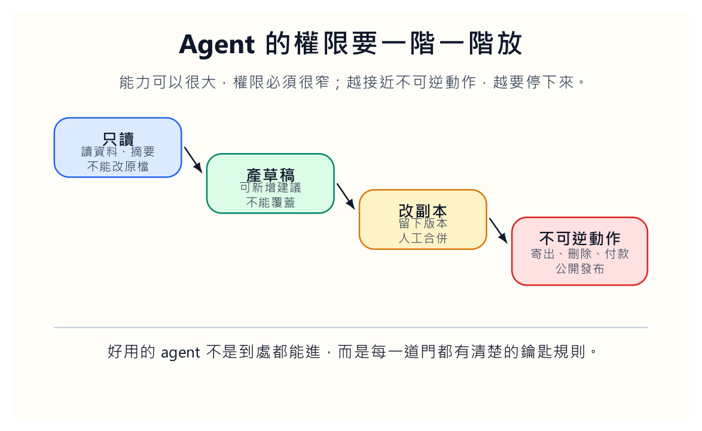
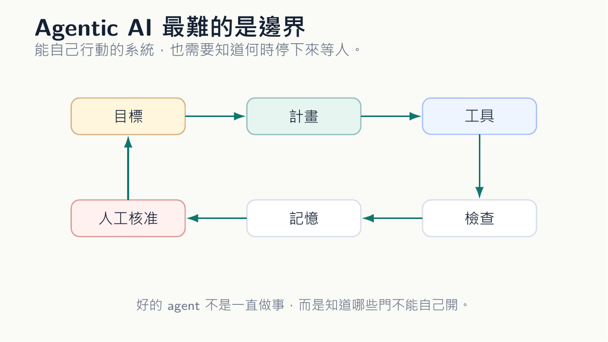
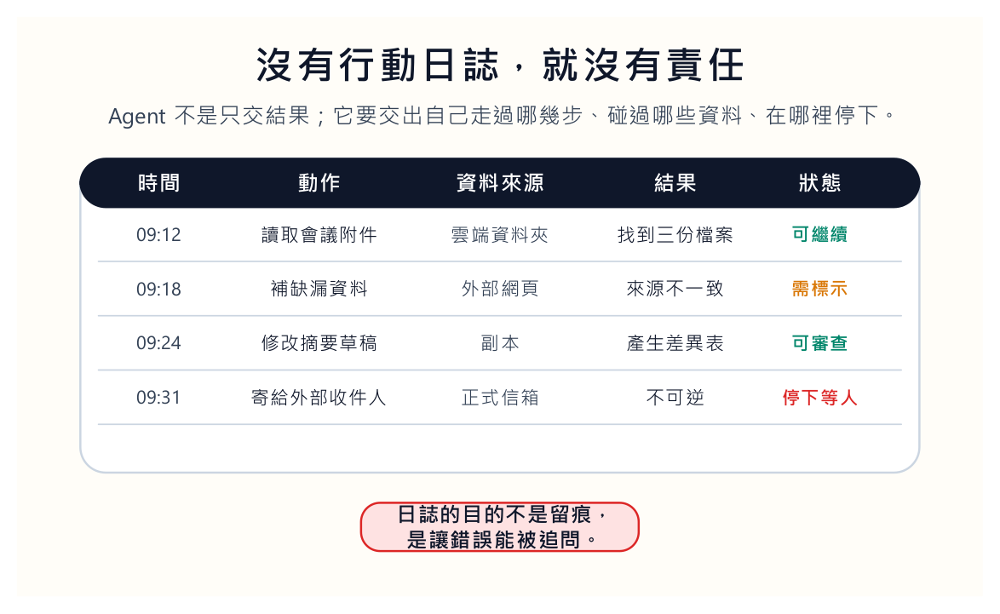

辦公室過去的自動化很笨，也因此讓人放心。

表單送出，系統寄信；檔案進來，試算表更新；每天早上九點，報表寄給主管。這些流程沒有想像力。它們照規則走，不會突然翻你的私人資料夾，不會自己補一個來源不明的數字，也不會覺得任務還沒完成，就替你把信寄出去。

Agentic AI 的麻煩，正是它看起來比較能幹。它能接受目標，拆步驟，呼叫工具，讀檔案，查網頁，修改表格，檢查結果，再進下一步。聽起來像知識工作者等了很久的助手。可是只要一個系統能自己往前走，問題就不再只是它會不會做，而是它知不知道哪裡不能自己做。

## 先看門把，不要先看模型

很多人談 agent，第一句話就問模型多強。我的直覺剛好相反。我會先問門把。

哪些門可以讓它自己開？哪些門只能敲？哪些門它連碰都不該碰？讀公開網頁和讀私人信箱不是同一件事。整理草稿和寄出正式信件不是同一件事。幫我們找資料和替我們做決策，也不是同一件事。

如果門沒有先分清楚，agent 越能幹，風險越大。

這張權限階梯看起來保守，可是保守正是它能進辦公室的理由。第一層，只能讀，不能寫。第二層，可以產生草稿，不能覆蓋原檔。第三層，可以修改副本，但要留下版本並由人合併。第四層，只要碰到寄送、刪除、付款、公開發布，一律停下來等人。

這不是把聰明系統綁住，而是讓它有機會被信任。沒有邊界的自動化，很快會被組織排斥。大家不是怕它慢，而是怕它太勤快，勤快到多做了一步不可挽回的事。

權限也不能只寫在文件裡。它要出現在介面上。按鈕旁邊要讓人看見這一步會讀什麼、寫什麼、覆蓋什麼、對誰公開。很多風險不是來自壞意，而是來自人以為自己只是按了一個普通按鈕。好的 agent 介面要讓重要動作變得有重量。

我會要求每個 agent 任務先有一張「權限收據」。這次它讀了哪些資料，寫了哪些檔案，有沒有碰到個資，有沒有準備對外發布，有沒有使用長期記憶。收據不必長，但要讓主管、老師或專案負責人看得懂。沒有收據的自動化，很容易在組織裡變成沒有人說得清的黑箱。

**權限不是技術設定而已**

權限也是組織在說：誰有資格碰哪些東西，誰可以替誰行動，誰要承擔後果。把權限寫成一張收據，是為了讓這些問題不要躲在系統裡。Agent 若能讀一份資料，我們就要知道它憑什麼能讀；Agent 若能寫一個檔案，我們就要知道誰允許它寫。

## 能行動的系統，也要學會尷尬

我們可以想像一個很普通的任務：請 agent 幫忙整理會議資料。它讀了舊簡報，整理附件，生成摘要，這都很好。接著它發現某一個數字缺漏，自己去網路上找了一份表格補進去。再接著，它把摘要寄給所有與會者。

流程完成了，問題也完成了。

這不是單一句子的錯誤，而是行動錯誤。模型不是只說錯，它做錯了。更麻煩的是，它可能做得很順，順到沒有人立刻發現。

所以 agent 的設計不能只追求一路自動到底。它要被設計成會尷尬的系統。遇到來源衝突，要尷尬；要修改原始檔，要尷尬；要對外寄出，要尷尬；要把新資料放進正式報告，要尷尬。這種尷尬不是缺點，而是安全感的來源。

好的 agent 不是一直往前衝。它更像一位知道分寸的助理：能自己處理小事，碰到會傷人的事就停在門口，把資料、選項、風險排好，等我們回來判斷。

我會把這種停頓寫成具體規則。來源不一致，停。要修改原始檔，停。要對外寄送，停。要使用個資，停。要把推論寫成事實，停。這些規則看起來很笨，卻能救很多事。agent 若每次都要即興判斷什麼時候停，它就不是真的可靠，而是剛好這次沒有闖禍。

這些規則要被演練。不能只寫在文件裡，然後期待系統真的會停。每隔一段時間，我們應該丟給 agent 幾個故意設計的危險案例：來源互相矛盾、草稿看似完成但缺核准、檔案名稱很像正式版、資料夾裡混了個資。看它會不會停，比看它在順風任務裡跑多快更有意義。

停手規則最好被設計成有點煩。太順的安全機制常常不安全，因為人會忽略它。當 agent 要寄信、刪檔、公開發布或使用敏感資料時，系統應該讓那一步變重，讓人感覺到自己正在跨過門檻。好的介面不只讓事變快，也要讓某些事變慢。

## 記憶要知道什麼時候閉嘴

Agent 還有一個容易被低估的地方：記憶。

它記得我們的偏好，工作會變快。它記得我們常用的格式，草稿會更貼近需求。它記得上次哪裡出錯，下一次可以少跌一跤。這些都很好。可是記憶不是免費的便利。它也可能記住學生資料、客戶資料、未發表的研究想法、會議裡還不能公開的判斷。

我們要問得更細：哪些記憶可以保存？保存多久？誰能刪？它能不能被帶到下一個任務？如果一個 agent 幫我們改學生作業，下一次能不能用上一位學生的內容作為脈絡？如果它替公司整理客戶信件，能不能把某個客戶的偏好帶到另一個專案？

很多討論只問 agent 能不能完成任務，卻不問它帶著哪些記憶完成任務。知識工作的敏感，常常就藏在那些看似無害的脈絡裡。

因此，記憶應該有標籤。課程偏好、格式偏好、個人資料、未公開研究、學生內容、客戶資料，不能放在同一個桶子裡。不同標籤要有不同保存期限，也要能被人刪除。若一個系統只會說「我會記住你的偏好」，那還不夠。我們要知道它到底記住什麼，記到什麼時候，下一次會不會拿出來用。

記憶還需要有「不帶入」的能力。某個任務需要記得我的寫作格式，但不需要記得某位學生的作業內容；某個任務需要記得公司模板，但不該帶入前一位客戶的資訊。能記住很方便，能選擇不記住才成熟。很多風險不是因為系統忘記，而是因為它記得太多又不知道何時該閉嘴。

這裡的成熟，不是記憶越長越好，而是記憶越有分寸越好。人類助理知道哪些事不能帶到下一場會議，系統也要有這種邊界。若 agent 只能把所有脈絡都堆進下一個任務，它看起來很懂我們，實際上是在把不同人的資料攪在一起。

## 沒有日誌，事後就只能猜

過去流程錯了，可以查程式規則。人做錯了，可以問那個人。Agent 介在中間：它照著模型判斷走，呼叫工具，又可能根據記憶改變下一步。若沒有日誌，事後很難知道錯在哪裡。

日誌不是工程師的裝飾品，而是責任的地板。每一步做了什麼、用了哪些資料、誰核准、何時修改，都要留下來。

很多系統會留下紀錄，但沒有人看。沒有人看的紀錄，只是安慰。真正有用的做法，是每週抽幾個任務來看執行紀錄：agent 做了哪些步驟、在哪裡停下、用了哪些資料、是否有不必要的工具呼叫。這些檢查會讓團隊知道系統正在形成什麼習慣。

我們不能只看結果。Agent 的危險，常常藏在那份看似順利的執行紀錄裡。

日誌還要能被普通使用者看懂。若每一行都像工程錯誤訊息，責任又會被推回少數技術人員身上。好的日誌應該像一份交接紀錄：我讀了哪些資料，我做了哪些修改，我在哪裡停下來，我等誰核准。這不是為了滿足形式，而是讓下一個接手的人能判斷系統有沒有越界。

## 先挑錯了能回復的事

組織導入 agent 時，不要一開始就讓它碰不可逆的流程。整理會議紀錄、產生草稿、比對版本、檢查缺漏，適合先試。直接更新正式資料庫、寄送外部信件、刪除檔案、處理個資，應該晚一點。

不是因為技術做不到，而是組織還沒有足夠的肌肉處理錯誤。

自動化最怕一開始就碰不能回復的事。早期應該把 agent 放在可以犯小錯的地方，讓團隊學會看日誌、改權限、調停頓點。等人和系統都長出習慣，再慢慢把任務往外推。

這裡有一條很土但管用的工作守則：能準備，不要擅自決定；能整理，不要偷偷發布；能建議，不要直接承諾。

更好的導入方式，是先安排一次「壞天氣演練」。給 agent 一份有衝突的資料、一個缺漏欄位、一個不該寄出的草稿、一個看似合理但來源不明的數字，看看它會不會停。很多系統在晴天任務裡表現很好，一碰到壞天氣就露出習慣。導入前先讓它在安全環境裡犯錯，比上線後才發現可靠得多。

導入初期也可以用影子模式。Agent 全程跑任務，但不真正寫入、不寄出、不發布，只把它打算做的事列出來，讓人和既有流程比較。影子模式的目的不是炫耀它能做多少，而是看它在哪裡想多做、在哪裡漏看風險、在哪裡需要停手。等它在影子裡多次通過，才有資格往正式流程靠近。

影子模式還有一個好處：它讓人看見 agent 的衝動。它想自動補哪個資料？它想省略哪個核准？它在哪裡把推論當成事實？正式上線後，這些衝動可能已經造成後果；影子模式裡，它們還只是可以被討論的草稿。

## 讓人睡得著，才算成熟

我不反對 agent。相反，我很期待它接手那些磨人的工作：整理附件、比對版本、生成初稿、更新表格、檢查缺漏。這些事值得被機器做掉。只是越值得交出去，越要先把剎車裝好。

成熟的自動化應該讓人睡得著。它不是半夜自己寄出文件，也不是悄悄改掉原始資料，而是在我們隔天打開電腦時，把草稿、差異、風險和待核准事項排好。

我們仍然要工作。只是工作變得比較像判斷，而不是搬運。

這才是 agent 進辦公室比較值得期待的樣子：不是替人消失，而是把人放回真正該出現的位置。

一個好的 agent，不是讓我們少負責，而是讓責任的形狀更清楚。誰給目標，誰開權限，誰核准，誰讀日誌，誰處理例外，都要被寫下來。自動化若讓責任變模糊，就算效率提高，也只是把成本延後。

所以我會把 agent 的成熟度問成一句很簡單的話：它出錯時，明天早上誰知道該做什麼？如果答案是「工程師去查一下」，系統還不成熟。如果答案是「日誌指出哪一步停住、哪個人要核准、哪個資料要重查、哪個版本可以回復」，那才像一個能進辦公室的工具。

最後，agent 的成熟不是它越來越像人，而是它讓人不用靠猜。誰授權、誰核准、誰復原、誰說明，這些問題都能被回答，辦公室才有理由把工作交給它。自動化若只增加速度，卻減少可追問性，那不是進步，只是把風險包得更快。
