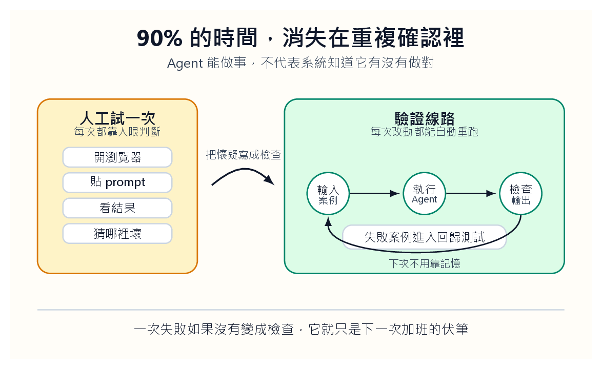
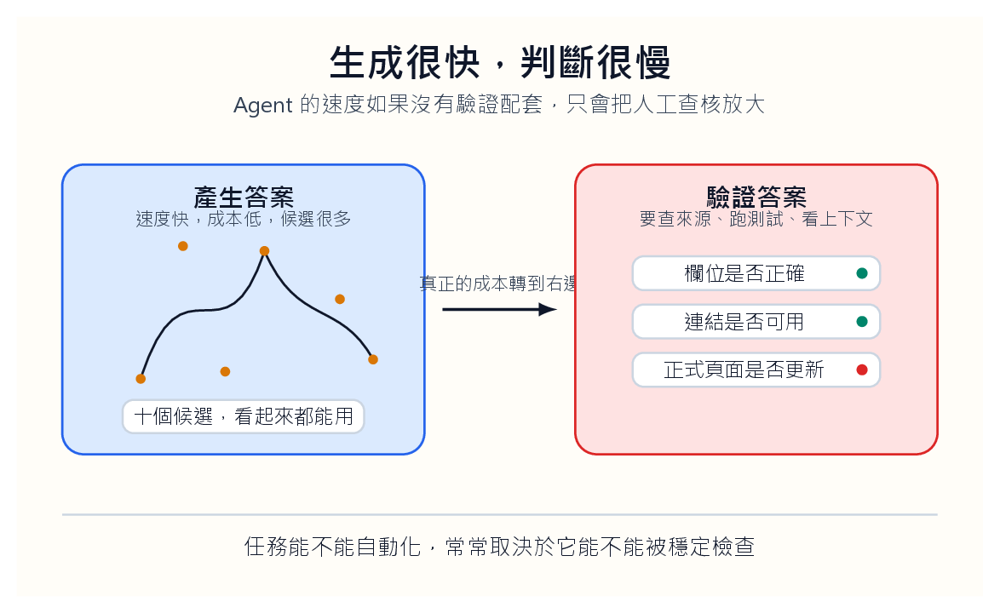
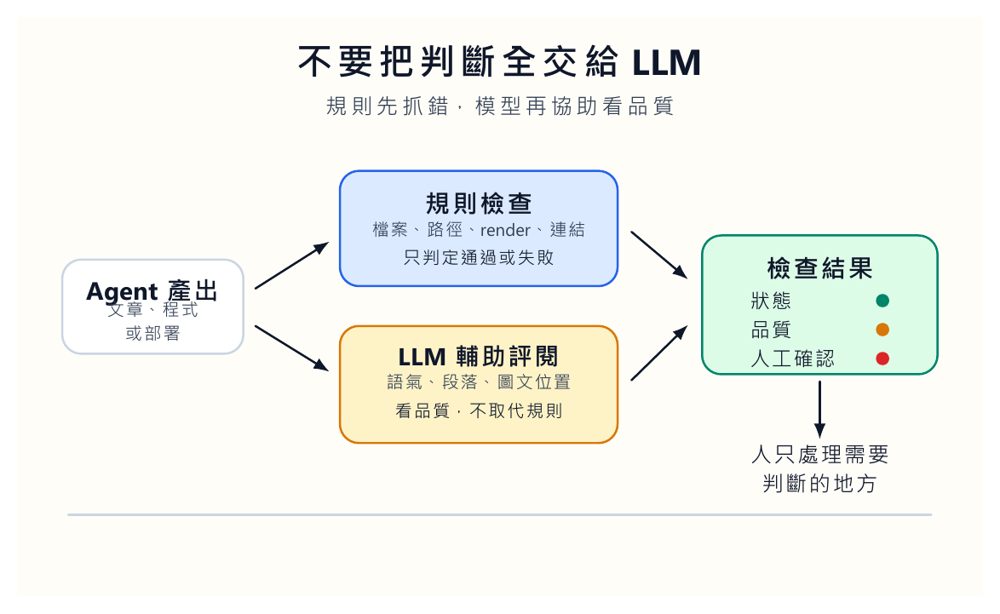

我們最不想承認的一件事是：做 AI Agent 這一年，很多時間根本不是在做 Agent。

我們是在開瀏覽器、貼提示詞、等回應、看紀錄檔、截圖、重跑、再改一個字。模型有時走對路，有時繞遠路，有時看起來很聰明，最後卻把一個小欄位填錯。每次失敗，我們都以為自己抓到問題了。隔天換一個案例，它又用另一種方式錯。

那種疲憊很熟悉。不是被困在大問題裡，而是被一堆小動作拖住。你知道自己在前進，可是每一步都要親手確認。

像一個人拿著手電筒，在倉庫裡一扇門一扇門確認。明明是系統該留下紀錄，最後卻變成我們用記憶補洞。

## 我們不是在開發，是在替系統補眼睛

最早我們以為答案是把提示詞寫得更好。把角色講清楚，把步驟列出來，把限制寫死。這當然有用，但只解決了一小段路。

真正耗人的地方不在「Agent 不知道要做什麼」。它多半知道。真正耗人的地方是：它做完之後，我們不知道能不能相信。

它產生了一份報表，欄位對嗎？它改了一段程式，有沒有偷改別的地方？它更新了一篇文章，圖片有沒有消失？它說同步成功，正式網站真的更新了嗎？

如果這些問題都要靠人工確認，Agent 做得越多，人越累。

後來我們慢慢承認：Agent 的能力不能只看它能不能做事，而要看它做完後，系統能不能自己說出哪裡不對。沒有這套檢查流程，Agent 看起來像自動化，實際上只是把人的手移到另一個位置。

以前我們會盯著畫面問：「它這次有沒有成功？」現在我們比較想問：「如果它錯了，哪一盞燈會亮？」

這兩句話差很多。

燈也不能只亮一下。它要告訴我們錯在哪裡、從哪一步開始、下一次要怎麼防。若系統只回「失敗」，人還是要重新翻紀錄、猜原因、找畫面。好的檢查流程不只是抓錯，而是把錯誤整理成下一輪可使用的知識。紅燈本身不是目的，紅燈後面的說明才是節省時間的地方。

**驗證不是附加功能**

很多團隊把驗證當成最後補上的保險。先讓 Agent 會做事，再想辦法檢查。這個順序很危險。Agent 只要能改檔案、寄信、發布、查資料，驗證就不是附加功能，而是產品本身的一部分。沒有驗證的行動能力，越強越讓人不安。

## 生成很快，判斷很慢

[Jason Wei 在〈Asymmetry of verification and verifier’s rule〉](https://www.jasonwei.net/blog/asymmetry-of-verification-and-verifiers-law)裡談到一個很有用的概念：有些任務，提出答案很難，檢查答案卻很快。數獨是這樣，程式測試也是這樣。也有一些任務剛好反過來，產生答案很容易，檢查答案卻很麻煩。文章事實查核、研究主張、商業報告常常落在這一邊。

做 Agent 最痛的地方，常常就是把工作放錯邊。

如果任務是「幫我們產生十個標題」，生成很便宜。可是如果任務是「幫我們更新網站，分類正確，圖片正常，連結可用，正式頁面同步，讀者看不到原始 Markdown 符號」，那就不是單純生成。那是一組會失敗的條件。

條件一多，人的注意力就會被切碎。剛檢查完標題，圖片可能壞了。剛檢查完圖片，部署可能還沒完成。剛檢查完正式頁面，才發現摘要卡片還在吃舊快取。

這不是模型笨。這是檢查設計太少。

我會把每個任務拆成兩張清單。第一張叫「生成清單」，寫 Agent 要產出什麼。第二張叫「驗收清單」，寫什麼情況下不能交。多數人只寫第一張，所以 Agent 很快會給出一個看起來完成的結果。真正讓系統變穩的是第二張：標題找不到，不能交；圖檔不存在，不能交；正式頁面還是舊版，不能交；讀者看得到原始 Markdown 符號，不能交。

驗收清單要比生成清單更冷酷。生成清單容易讓人興奮，因為它描述能力；驗收清單讓人不舒服，因為它描述失敗。可是系統能不能長大，通常取決於後者。會產出，不稀奇；知道什麼不能交，才開始像能進正式流程。

## 失敗如果留在腦袋裡，它還活著

我們後來會借用晶片設計的想法。

晶片工程師不會寫完 RTL，就憑感覺說「看起來可以 tape-out」。他們準備 testbench、assertion、coverage、scoreboard。每一個小改動都要跑回歸測試。不是因為工程師不相信自己，而是因為他們知道一個殘酷事實：人的腦子不適合記住所有邊界條件。

AI Agent 也是這樣。

今天我們發現它在「沒有圖片」的貼文會出錯，這不該只寫進腦袋。它應該變成一個測試案例。今天我們發現它把隱藏貼文同步到正式網站，這不該只是一個提醒。它應該變成一條阻擋規則。今天我們發現它把文章分類放錯位置，這不該變成下一次手動確認。它應該加入下一輪自動檢查。

如果錯誤只存在人的記憶裡，那個錯誤其實還活著。

這也是很多 Agent 專案讓人不安的地方。Demo 很漂亮，流程很順，畫面上 Agent 會自己點來點去。可是你問它有多少測試資料、多少錯誤案例、多少回歸紀錄、多少可重跑的執行紀錄，房間就安靜下來。

Agent 不需要被掌聲保護。它需要被檢查逼問。

我會替每個錯誤案例寫一張小卡。卡片上只放四件事：當時輸入、錯誤表現、應該亮的紅燈、後來新增的檢查。這張卡不用長，但它讓錯誤離開人的腦袋，進入系統。幾個月後，我們回頭看這些卡片，會看見 Agent 真正容易摔在哪裡，而不是只記得某天晚上它讓我們很煩。

**測試案例是組織記憶**

錯誤若只存在某個人的印象裡，它會跟著那個人的忙碌、疲憊和離職一起消失。測試案例的價值，是把一次煩人的經驗變成系統以後都會記得的事。這聽起來很工程，但其實很像教學：學生錯過一次的地方，老師下一年會提前補一座橋。Agent 也需要這種橋。

## 不要讓 LLM 當唯一法官

很多人想用另一個 LLM 來檢查 Agent。這可以做，但不能只靠它。

LLM supervisor 很適合看語意、語氣、內容是否跑題、段落是否有說服力。可是它不適合替代所有硬檢查。檔案在不在、網址能不能開、HTML 裡有沒有壞圖、文章是否被標成 draft、正式頁面是否含有新圖檔，這些都應該用確定性的 assertion 判斷。

我們後來比較傾向雙層設計。

第一層是硬檢查。它不講道理，只回報通過或失敗。圖片路徑不存在就是失敗。render 出錯就是失敗。正式網站沒有新文章就是失敗。文章正文出現讀者不該看到的原始符號，就是失敗。

第二層才是 LLM supervisor。它看文字是否像人寫的，標題是否有力，段落是否太像報告，圖是否放在需要的位置，文章是否真的回答讀者的問題。這一層比較像編輯，不像警察。

兩層混在一起會很危險。若讓 LLM 同時判斷檔案存在與文章好不好，它會把可以精確檢查的事變成一段溫柔評論。那不是驗證，那是安慰。

雙層設計還有一個好處：人比較知道自己在修哪一層。硬檢查失敗，就修流程；編輯判斷失敗，就修內容。若兩層混在一起，每一次錯都會變成模糊的不滿：好像不夠穩，好像不夠像人，好像還要再調。工程最怕這種好像。它讓人一直改，卻不知道哪裡真的變好。

## 自動檢查流程要能追問每一步

這套想法不只適用於寫網站。寫程式、整理資料、批改作業、生成報告都一樣。只要 Agent 會改變外部世界，就要留下可以被追問的執行紀錄。

輸入是什麼？它做了哪一步？用了哪個工具？輸出在哪裡？哪一個 assertion 通過？哪一個 supervisor 給低分？如果人最後介入，是因為哪一個紅燈？

沒有這些東西，Agent 的錯會像霧一樣散開。我們知道它錯了，但不知道從哪裡抓。

Codex 也應該被這樣要求。我們不只叫它寫功能，也叫它寫測試；不只叫它改文章，也叫它檢查 render；不只叫它推上 GitHub，也叫它輪詢正式頁面；不只叫它看截圖，也叫它讀 HTML，確認讀者看到的是乾淨頁面。

這樣做一開始比較慢。要設計案例，要寫檢查，要整理輸出，要讓失敗訊息清楚到下一個人能看懂。可是幾輪之後，時間會回來。因為同一種錯不再需要我們用眼睛抓第二次。

驗證流程也要有版本。今天的檢查只能代表今天的理解。等系統新增圖片上傳、貼文隱藏、刪除貼文、雲端同步，舊檢查就不夠了。每加一個能力，都要問：這個能力失敗時，哪一盞燈會亮？若沒有答案，就先不要把它放進正式流程。功能增加得比檢查快，系統很快會變成一座看起來宏偉、其實沒有人敢住的房子。

## 不是讓 Agent 神奇，而是讓人少做重複確認

這才是我們所說的「把 90% 拿回來」。不是讓 Agent 變得神奇，而是讓人的注意力不用一直被低階確認偷走。

做 Agent 最容易犯的錯，是把所有力氣放在行動能力：會點按鈕、會查資料、會寫檔案、會呼叫 API。這些都必要，但還不夠。真正能讓系統長大的，是驗證能力。

一個沒有驗證的 Agent，像一個會講很多話、但從不交作業的人。你會被它吸引幾天，然後開始害怕它。

下一次我們覺得 Agent 不穩，不要先改提示詞。先問一個更難聽、也更有用的問題：如果它錯了，哪一盞燈會亮？

這個問題會讓很多炫目的 demo 安靜下來。它不問模型多聰明，不問流程多順，只問失敗時誰會知道。能回答這個問題的系統，也許看起來比較笨，卻比較能活得久。
