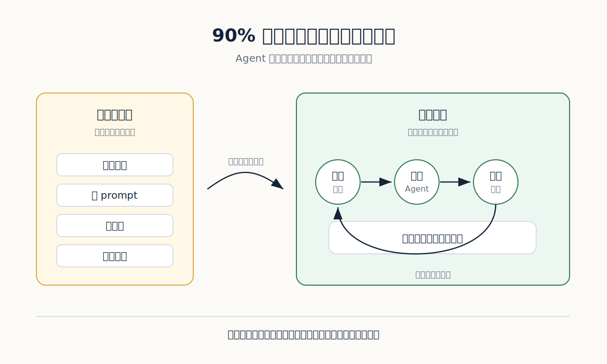
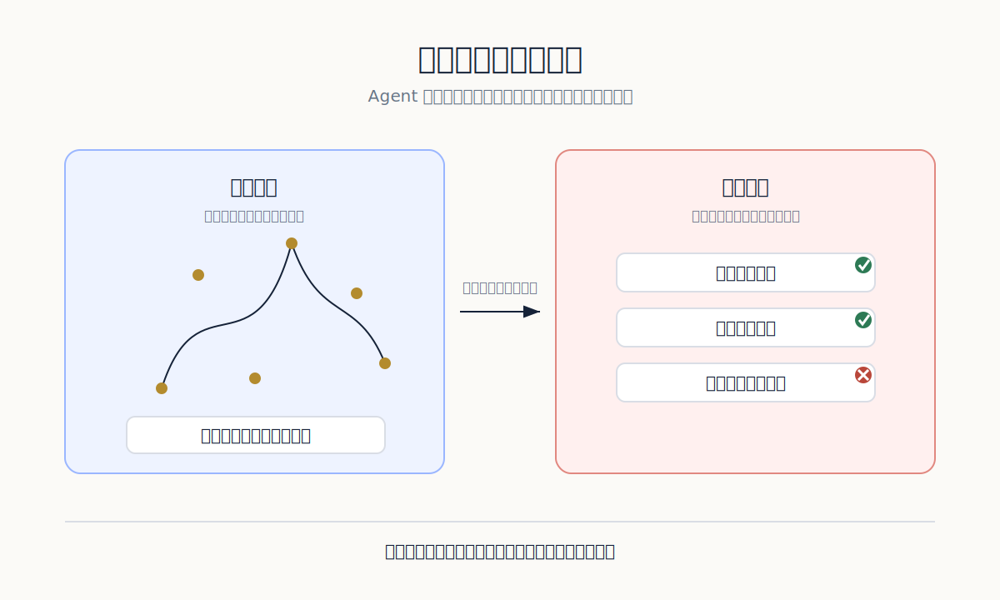
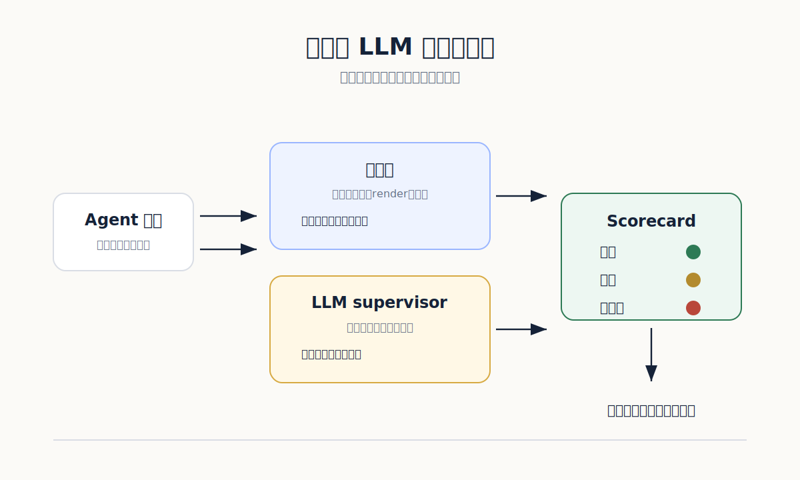

我最不想承認的一件事是：我做 AI Agent 這一年，很多時間根本不是在做 Agent。

我是在開瀏覽器、貼 prompt、等回應、看 log、截圖、重跑、再改一個字。模型有時候走對路，有時候繞遠路，有時候看起來很聰明，最後卻把一個小欄位填錯。每次失敗，我都以為自己抓到問題了。隔天換一個案例，它又用另一種方式錯。

那種疲憊很熟悉。不是被困在大問題裡，而是被一堆小動作拖住。你知道自己在前進，可是每一步都要親手確認。像一個人拿著手電筒，在倉庫裡檢查每一扇門有沒有鎖好。

**我以為自己在開發，其實是在替系統補眼睛**

最早我以為答案是把 prompt 寫得更好。把角色講清楚，把步驟列出來，把限制寫死。這當然有用，但只解決了一小段路。

真正煩人的地方不在「Agent 不知道要做什麼」。它多半知道。真正煩人的是：它做完之後，我不知道能不能相信。它產生了一份報表，欄位對嗎？它改了一段程式，有沒有偷改別的地方？它更新了一篇文章，圖片有沒有消失？它說同步成功，正式網站真的更新了嗎？

如果這些問題都要靠人眼看，Agent 做得越多，人越累。

*不是把人拿掉，而是把每一次懷疑變成下一次會自動執行的檢查。*

我後來才慢慢承認：Agent 的能力不是只看它能不能做事，而是看它做完之後，系統能不能自己說出哪裡不對。沒有這條線路，Agent 看起來像自動化，實際上只是把人的手移到另一個位置。

以前我會盯著畫面問：「它這次有沒有成功？」現在我比較想問：「如果它錯了，哪一個檢查會亮紅燈？」

這兩句話差很多。

**生成很快，判斷很慢**

[Jason Wei 在〈Asymmetry of verification and verifier’s rule〉](https://www.jasonwei.net/blog/asymmetry-of-verification-and-verifiers-law)裡談到一個很有用的概念：有些任務，提出答案很難，檢查答案卻很快。數獨是這樣，程式測試也是這樣。反過來，有些任務產生答案很容易，檢查答案卻很麻煩。文章事實查核、研究主張、商業報告常常落在這一邊。

做 Agent 最痛的地方，常常就是把工作放錯邊。

如果任務是「幫我產生十個標題」，生成很便宜。可是如果任務是「幫我更新網站，分類正確，圖片正常，連結可用，正式頁面同步，讀者看不到原始 Markdown 符號」，那就不是單純生成。這是一組可以失敗的條件。

一旦條件多了，人的注意力就會被切碎。你剛檢查完標題，圖片可能壞了。你剛檢查完圖片，部署可能還沒完成。你剛檢查完正式頁面，才發現摘要卡片還在吃舊的快取。

這不是模型笨。這是驗證設計太薄。

*Agent 產生內容的速度越快，沒有驗證線路的人就越快被淹沒。*

我現在看一個 Agent 任務，第一個反應不是問模型能不能做，而是問它做完後能不能被檢查。能被檢查的任務，才有機會變成穩定的工作流。不能被檢查的任務，只會變成一次又一次的人工巡邏。

**晶片工程師早就知道：一次手動驗證等於沒有驗證**

我後來一直想到晶片設計。

晶片工程師不會寫完 RTL，就憑感覺說「看起來能 tape-out」。他們會準備 testbench、assertion、coverage、scoreboard。每一個小改動都要跑回歸測試。不是因為工程師不相信自己，而是因為他們知道一個殘酷事實：人的腦子不適合記住所有邊界條件。

AI Agent 也是這樣。

你今天發現它在「沒有圖片」的貼文會出錯，這不該只寫進你的腦袋。它應該變成一個測試案例。你今天發現它把隱藏貼文同步到正式網站，這不該只是一個提醒。它應該變成一條阻擋規則。你今天發現它把文章分類放錯位置，這不該變成下一次手動確認。它應該進入回歸測試。

如果錯誤只存在人的記憶裡，那個錯誤其實還活著。

這也是我看很多 Agent 專案時最不安的地方。Demo 很漂亮，流程很順，畫面上 Agent 會自己點來點去。可是你問它有多少測試資料、多少錯誤案例、多少回歸紀錄、多少可重放的軌跡，房間就安靜下來。

Agent 不需要被掌聲保護。它需要被檢查逼問。

**不要讓 LLM 當唯一法官**

很多人想用另一個 LLM 來檢查 Agent。這可以做，但不能只靠它。

LLM supervisor 很適合看語意、語氣、內容是否跑題、段落是否有說服力。可是它不適合替代所有硬檢查。檔案在不在、網址能不能開、HTML 裡有沒有壞圖、文章是否被標成 draft、正式頁面是否含有新圖檔，這些都應該用確定性的 assertion 去判斷。

我後來比較喜歡雙層設計。

第一層是硬檢查。它不講道理，只回報通過或失敗。圖片路徑不存在就是失敗。render 出錯就是失敗。正式網站沒有新文章就是失敗。文章正文出現讀者不該看到的原始符號，就是失敗。

第二層才是 LLM supervisor。它看文字是否像人寫的，標題是否有力，段落是否太像報告，圖是否放在需要的位置，文章是否真的回答了讀者的問題。這層比較像編輯，不像警察。

兩層混在一起會很危險。你讓 LLM 同時判斷檔案存在與文章好不好，它會把可以精確檢查的事變成一段溫柔評論。那不是驗證，那是安慰。

*硬檢查負責把錯誤擋下來，LLM supervisor 負責看那些不能只靠規則判斷的品質。*

這套想法不只適用於寫網站。寫程式、整理資料、批改作業、生成報告都一樣。只要 Agent 會改變外部世界，就要留下可以被追問的軌跡。

輸入是什麼？它做了哪一步？用了哪個工具？輸出在哪裡？哪一個 assertion 通過？哪一個 supervisor 給低分？如果人類最後介入，是因為哪一個紅燈？

沒有這些東西，Agent 的錯會像霧一樣散開。你知道它錯了，但不知道從哪裡抓。

**Codex 不只是寫程式的人，它也該被迫寫驗證**

我現在會把 Coding Agent 當成一個需要被約束的同事。

我不只叫它寫功能，也叫它寫測試；不只叫它改文章，也叫它檢查 render；不只叫它推上 GitHub，也叫它輪詢正式頁面；不只叫它截圖，也叫它讀 HTML，確認讀者看到的是乾淨頁面。

這樣做一開始比較慢。你要設計案例，要寫檢查，要整理輸出，要讓失敗訊息清楚到下一個人能看懂。可是幾輪之後，時間會回來。因為同一種錯不再需要你用眼睛抓第二次。

這才是我所說的「把 90% 拿回來」。不是讓 Agent 變得神奇，而是讓人的注意力不用一直被低階確認偷走。

做 Agent 最容易犯的錯，是把所有力氣放在行動能力。讓它會點按鈕、會查資料、會寫檔案、會呼叫 API。這些都必要，但還不夠。真正能讓系統長大的，是驗證能力。

一個 Agent 沒有驗證，就像一個會講很多話、但從不交作業的人。你會被它吸引幾天，然後開始害怕它。

下一次你覺得 Agent 不穩，不要先改 prompt。先問一個更難聽、也更有用的問題：如果它錯了，哪一盞燈會亮？
