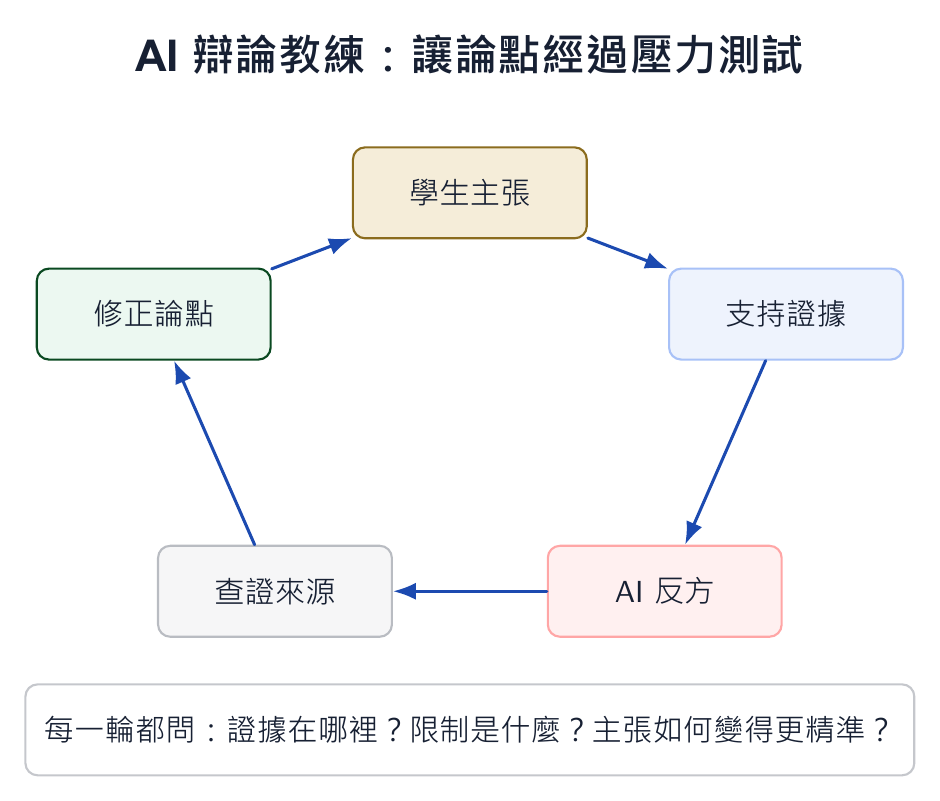

本文整理自「AI 輔助教學：授課教師的應用場景與實踐」簡報第 55-67 張，並改寫為知識站文章。

*概念圖呈現辯論式學習循環：主張、證據、反駁、查證、修正，每一輪都留下理由。*

## 為什麼這個主題值得獨立成一篇

訓練批判思考最困難的地方，是讓學生願意面對反駁。學生常把完成答案視為結束，而不是討論的開始。AI 可以成為不會累的辯論教練：它要求學生補證據、提出反例、挑戰假設，甚至扮演不同利害關係人。

這種活動特別適合商業分析與會計判斷，因為很多結論都需要在不完整資訊下被檢驗。

## 課堂中可以怎麼做

辯論教練可以設計成五步驟：學生提出清楚主張、列出支持證據、請 AI 扮演反方提出最強反駁、學生查證反駁是否成立、最後修正主張。

評分重點不是 AI 說了什麼，而是學生如何回應挑戰。好的學生不是永遠不改答案，而是能說清楚為什麼改、改在哪裡、改完後主張更可靠。

## 使用 AI 時要保留的判斷

AI 可能製造看似有力但未經證實的反駁，因此查證必須被設計進活動。學生要標示哪些句子需要資料支持，並連回原始來源。辯論不該變成流暢文字的比賽，而是證據與推理的訓練。
