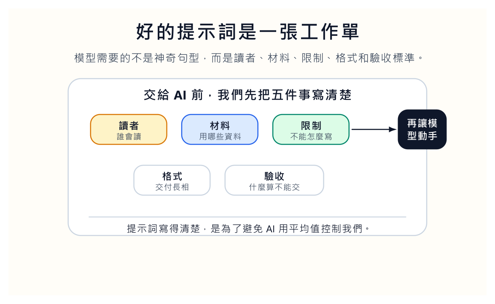
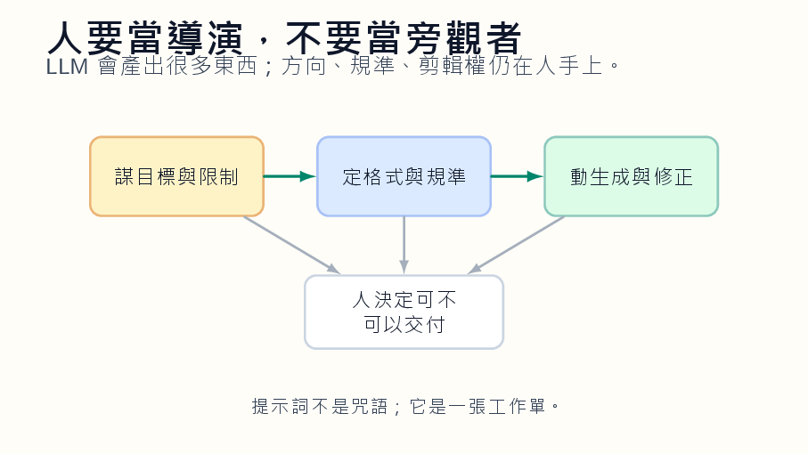
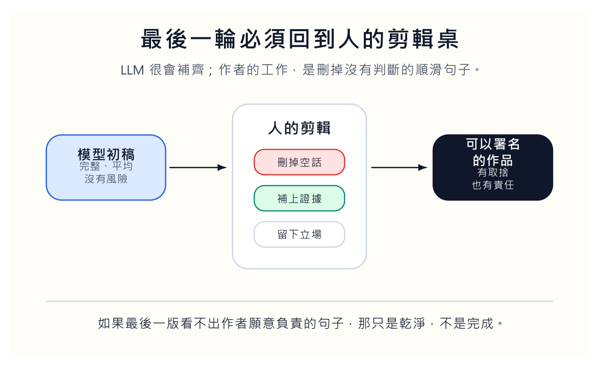

很多人使用 LLM 的方式，像在許願。

「幫我寫得專業一點。」

「幫我整理成一篇文章。」

「幫我做一份簡報。」

模型通常會交出一份看起來完整的東西。它有開頭，有段落，有結尾，語氣也很平穩。問題是，這種平穩常常像沒有作者的公文。每一句都能讀，讀完卻留不下什麼。不是模型太笨，而是我們沒有把工作交代清楚。

提示詞不是咒語。說對幾個字，門不會自動打開。

## 先別急著叫模型寫

咒語的想像是，只要找到神奇句型，AI 就會吐出好作品。工作單的想像完全不同。我們要先告訴它讀者是誰、材料在哪裡、不能寫成什麼樣子、交付格式如何、什麼情況算不能交。

這些事情聽起來很慢。可是少了它們，模型就會用平均值替我們決定。它會選最安全的語氣、最常見的結構、最不冒犯人的句子。最後得到的文本可能很乾淨，也可能很空。

好的提示詞常常不華麗。它可能只是：「讀者是大二學生，已學過固定成本與變動成本。請用早餐店的例子說明成本習性，避免抽象定義。最後給三題小測，不要給答案。」這段話沒有祕密技巧，卻很有用，因為它給了讀者、背景、例子、限制和格式。

更好的提示詞還會提供反例。不要寫成客服公告，不要每段最後硬下結論，不要把小工具講成時代轉折，不要使用沒有來源的數字。這些限制不是挑剔，而是作品的邊界。沒有邊界，模型會用最安全的方式把句子磨平。

## 導演不是旁觀者

我喜歡用導演來理解 AI 協作。導演不一定自己扛攝影機，不一定自己剪每一格，也不一定自己演。可是導演要知道這場戲為什麼存在，鏡頭要看誰，哪一段再漂亮也必須剪掉。

LLM 很像一支反應很快的製作團隊。它能寫、能改、能列、能翻、能模擬。可是如果導演只說「拍得好看一點」，那就別怪團隊交出罐頭作品。

與 AI 協作可以拆成三個動作。先想清楚目的：這份文字是要說服學生、整理研究、回覆行政，還是產生程式？目的不同，證據和語氣都不同。再定出格式：是一頁備忘錄、十頁簡報、rubric 表格，還是可執行程式？最後才讓模型動手。

很多人把順序倒過來。先叫模型生一大堆，再在裡面挑。那當然會累，因為我們把導演的工作延後到垃圾堆裡做。

## 材料不是作品

AI 很會把材料變得像作品。會議紀錄丟進去，它生出摘要；研究筆記丟進去，它生出大綱；幾段想法丟進去，它生出文章。這種能力很方便，也很容易讓我們誤會。

成形不等於完成。

模型做出的是材料的組織方式，不是作者的判斷。它能把每個面向都照顧到，讓文字看起來公平、完整、毫無脾氣。可是真正的作品需要取捨。我們要決定這篇文章不談什麼，這份簡報少放哪張圖，這段程式先不支援哪個例外。取捨才是作者的指紋。

這也是我對「AI 會取代寫作」這句話的保留。它會取代大量沒有判斷的文字。通知、摘要、初稿、格式轉換，當然會被吃掉。若一個人本來只是在排列安全句子，他會很快被模型追上。若一個人知道自己要砍什麼、保留什麼、承認什麼，他還有位置。

## 品味是很實際的能力

品味聽起來主觀，但在 AI 時代會變得很實際。

模型會把文字磨平，讓它不突兀、不冒犯、不留下個人痕跡。若我們沒有品味，最後留下的就是平台平均值。我們要知道自己討厭什麼句子，喜歡什麼節奏，哪些比喻太油，哪些段落看起來像客服，哪些開頭一看就是機器在暖場。

這些偏好不是裝飾。它們是作品不被機器吞掉的邊界。

我們可以建立自己的禁句清單。不要用空泛開場，不要每段最後硬塞一個結論，不要把小事說成時代大事，不要連續列三個抽象名詞。每次請 AI 寫作前，把這份清單放進工作單。這不是為了讓模型變成人，而是讓它少一點統計平均的味道。

## 最後一輪必須回到人的剪輯桌

第一版出來後，不要急著發布。先問幾個難聽的問題：它有沒有回答原本的問題？有沒有亂加資料？語氣像不像我們？哪一段只是漂亮空話？如果是程式，有沒有真的跑？如果是教案，學生會在哪一步卡住？如果是文章，有沒有一句話是作者願意負責的？

沒有這一步，AI 協作只是把責任外包。

最後一輪人工重寫，常常不是把文章修得更順，而是把太順的地方弄出阻力。刪掉自動平衡的語氣，補上具體例子，留下我們願意承擔的判斷。這一步很慢，但它決定作品像不像有人寫。

如果最後一版看不出作者願意負責的句子，那只是一份乾淨的產物，不是一篇完成的作品。

## 不要把 AI 幫忙當成免責

工具參與越多，人的驗收越不能少。按下發布的人是我們。學生讀到的是我們的文章，聽眾看到的是我們的簡報，同事收到的是我們的信。

所以不要把「AI 幫我寫的」當成免責。它幫忙越多，我們越要能說清楚：哪些材料是我給的，哪些限制是我定的，哪些句子是我刪的，哪些判斷是我留下的。

在教學上，我們也可以要求學生把工作單和最後作品一起交。這不是為了抓偷懶，而是讓他看見作品如何被指揮出來。有些提示詞像命令：「幫我寫一篇。」有些提示詞像工作單：讀者、目的、材料、限制、格式、驗收都寫清楚。兩者產出的差異，學生一比較就懂。

未來我們評量的，不該只是一份被機器粉刷過的最終文本。更該看見學生如何組織工作，如何限制模型不亂跑，如何修掉機器語氣，如何把自己的判斷放回去。

AI 可以讓文字先成形。可是能不能變成作品，還要看我們有沒有回到剪輯桌前。
