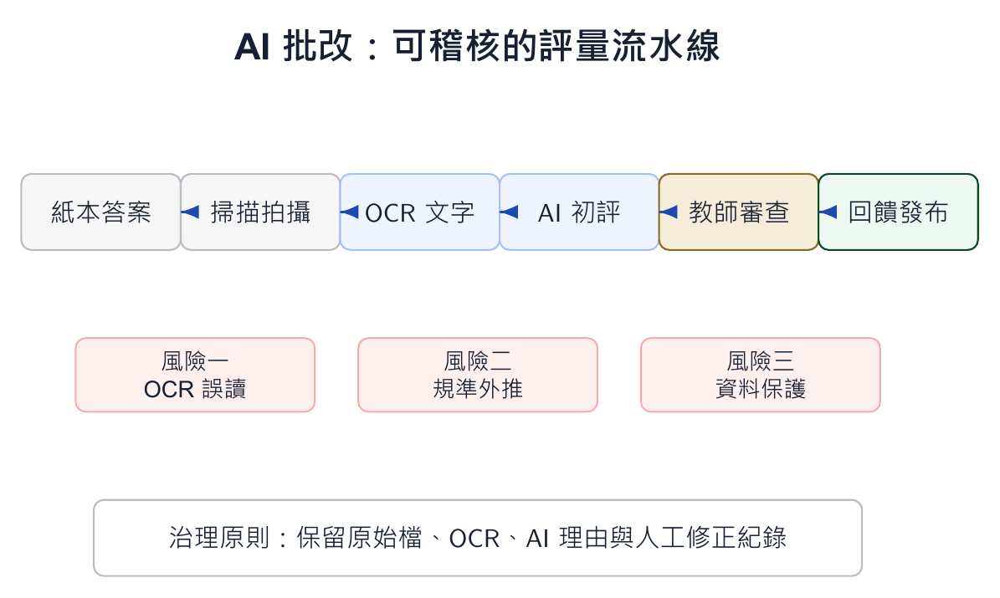

本文整理自「AI 輔助教學：授課教師的應用場景與實踐」簡報第 17-25 張，並改寫為知識站文章。

*概念圖呈現從紙本掃描到 AI 初評，再由教師抽查與修正的評量流水線。*

## 為什麼這個主題值得獨立成一篇

批改的痛點不只是花時間，更是難以給出足夠細緻的診斷。紙本考卷若能先透過 OCR 轉成文字，再依照 rubric 產生初步回饋，教師就能把時間從重複標記移到補救教學。

但這套流程不應被理解成自動給分。AI 是批改助理，不是裁判。

## 課堂中可以怎麼做

流程可以分成五步：掃描或拍攝答案、OCR 轉文字、提供題目與 rubric、AI 產生初步判斷、教師審查與發布回饋。教師特別要抽查邊界案例、低信心案例與高分答案，確認 AI 沒有錯讀或過度推論。

若要讓學生信服，系統也要保留原始掃描、OCR 文字、AI 理由與人工修正紀錄。

## 使用 AI 時要保留的判斷

AI 批改的核心風險是公平性、可追溯性與資料保護。任何牽涉正式成績的流程，都要讓教師保有最後判斷權。技術可以加速，但不能模糊責任。
