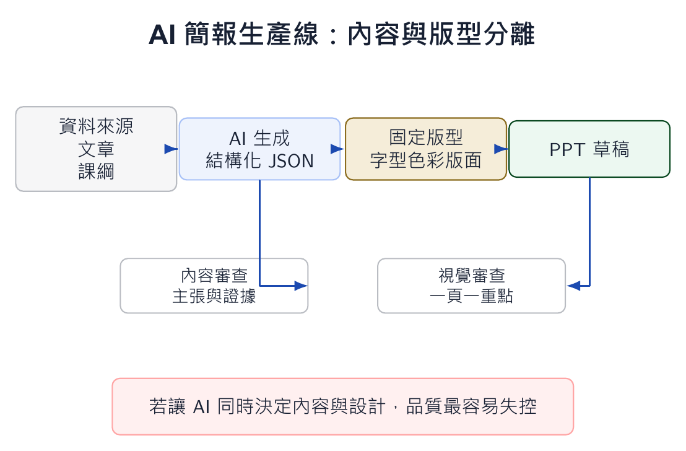

本文整理自「AI 輔助教學：授課教師的應用場景與實踐」簡報第 52-54 張，並改寫為知識站文章。

*概念圖顯示 AI 簡報生產線：先讓內容結構化，再套用版型，最後由人做敘事與視覺審查。*

## 為什麼這個主題值得獨立成一篇

AI 生成簡報最常失敗在版型失控。內容看起來很快完成，但每頁層級不同、字太多、圖表風格不一，正式場合很難使用。若要把 AI 放進簡報工作流，必須把內容生成與版型呈現分開。

一個穩定方法，是先讓 AI 輸出 JSON：每頁包含標題、主訊息、重點、圖表需求、講者備註與資料來源。

## 課堂中可以怎麼做

有了 JSON 之後，再套用固定 PowerPoint 模板。模板決定字型、色彩、標題位置、圖表區域與頁碼；AI 負責填內容，版型負責保持一致。

這套流程也適合學生作業。學生先寫出主張與證據，讓 AI 整理成結構化資料，再生成簡報草稿，最後回來檢查故事線與資料來源。

## 使用 AI 時要保留的判斷

簡報不是資訊堆疊，而是引導聽眾理解。AI 可以加速產出，但不能替你決定聽眾該先知道什麼、哪一頁需要停留、哪個圖表最能支持主張。人的審查仍然是最後一哩。
