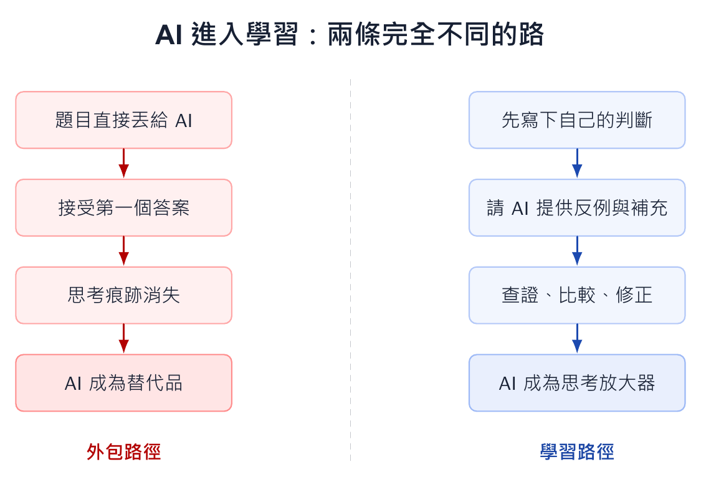

本文整理自「AI 輔助教學：授課教師的應用場景與實踐」簡報第 2-6 張，並改寫為知識站文章。

*概念圖把 AI 使用分成兩條路徑：直接外包會削弱思考，先形成判準再使用 AI，才會放大學習。*

## 為什麼這個主題值得獨立成一篇

生成式 AI 進入課堂後，最常見的焦慮是：學生會不會因此不再思考？這個問題不能用單純禁止或放任來回答。真正的分界不在於學生是否使用 AI，而在於他是在思考之前就把問題交出去，還是在形成初步判斷後，把 AI 當作比較、反例與修正的對象。

如果學生只把題目貼給 AI，再把答案貼回作業，學習確實會被外包。但如果學生先寫下自己的假設、疑問與判準，再讓 AI 提供另一種解釋，他就有機會練習更高階的能力：比較答案、判斷證據、修正自己的推論。

## 課堂中可以怎麼做

課堂可以要求學生留下三欄紀錄：我的原始想法、AI 的補充、我修正後的版本。這個格式會迫使學生說明自己如何被說服、哪些地方仍保留、哪些地方需要回到課本或資料查證。評分也可以從最後答案轉向思考歷程。

例如同一題管理決策題，學生先提出自己的判斷，再請 AI 產生可能反駁，最後寫出修正版。教師看的不是 AI 寫得多漂亮，而是學生是否能辨認哪個反駁有道理、哪個反駁只是語氣流暢。

## 使用 AI 時要保留的判斷

AI 偵測工具很難成為穩定的課堂治理基礎。比較可行的做法，是把 AI 使用透明化，要求學生揭露使用階段與判斷依據。當課堂只問「你有沒有用 AI」，學生會學會隱藏；當課堂問「你如何判斷 AI 是否可靠」，學生才會開始練習真正重要的能力。
