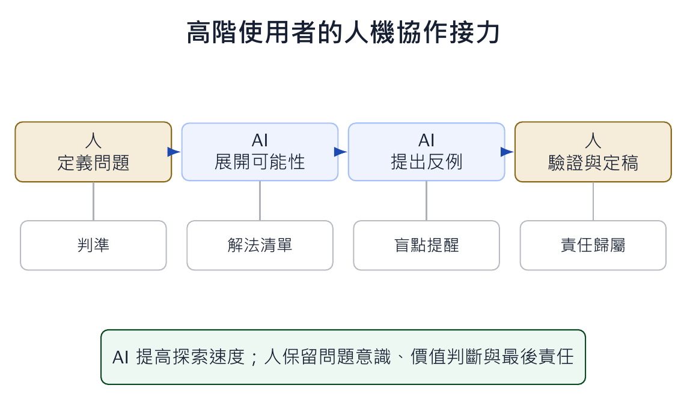

本文整理自「AI 輔助教學：授課教師的應用場景與實踐」簡報第 7-11 張，並改寫為知識站文章。

*概念圖呈現人機協作的接力：人提出問題與判準，AI 擴展可能性，人再回來驗證與定稿。*

## 為什麼這個主題值得獨立成一篇

頂尖研究者使用 AI 的方式，通常不是把它當作答案機，而是把它放進探索流程。人先定義問題、提出判準與限制；AI 協助列出可能方向、反例與替代解法；最後仍由人回到證據與專業脈絡中判斷。

這對教學很有啟發。學生若以為 AI 的價值是替自己完成答案，就會停留在低階使用。若他看見高手把 AI 當成協作者，就會理解：AI 的回應是材料，不是裁判。

## 課堂中可以怎麼做

教師可以把作業設計成「人機接力」。第一步要求學生先說明問題與判斷標準；第二步讓 AI 生成不同解法或反例；第三步要求學生驗證 AI 哪些地方成立、哪些地方過度延伸。

這樣的活動也能幫學生練習提問品質。模糊問題會得到平均答案；清楚問題會讓 AI 成為更有用的探索工具。

## 使用 AI 時要保留的判斷

人機協作最重要的底線，是把責任留在人身上。AI 可以加速探索，但不能替使用者負責研究問題、價值判斷與最後結論。課堂上要反覆提醒學生：你可以借助 AI，但不能把判斷權交出去。
