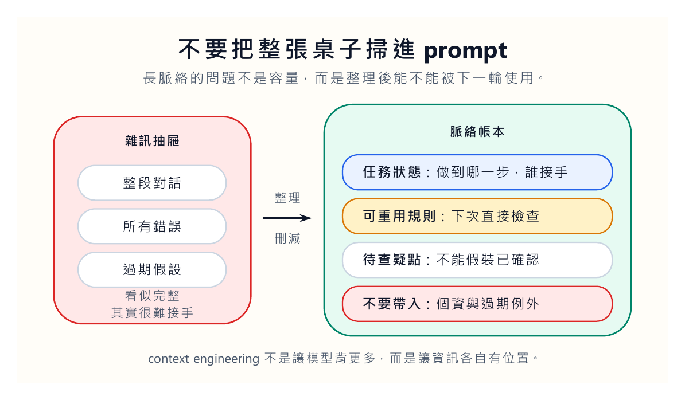
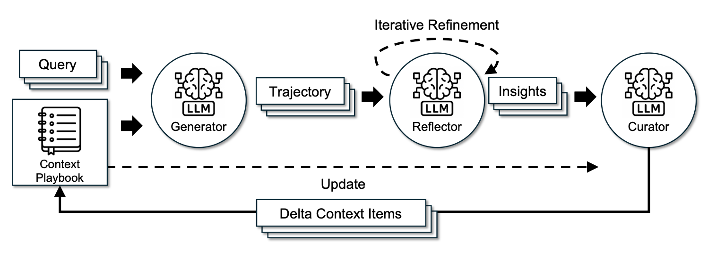
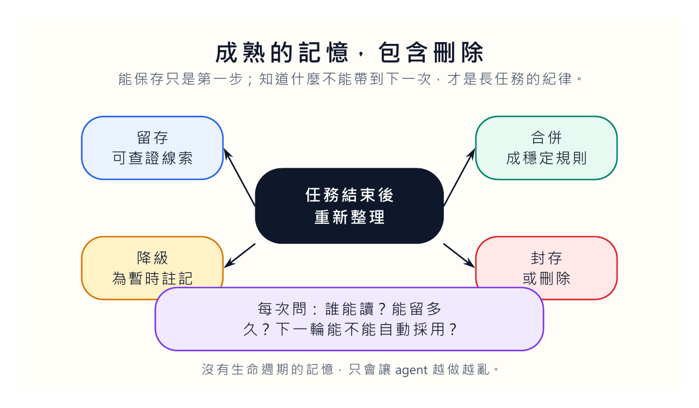
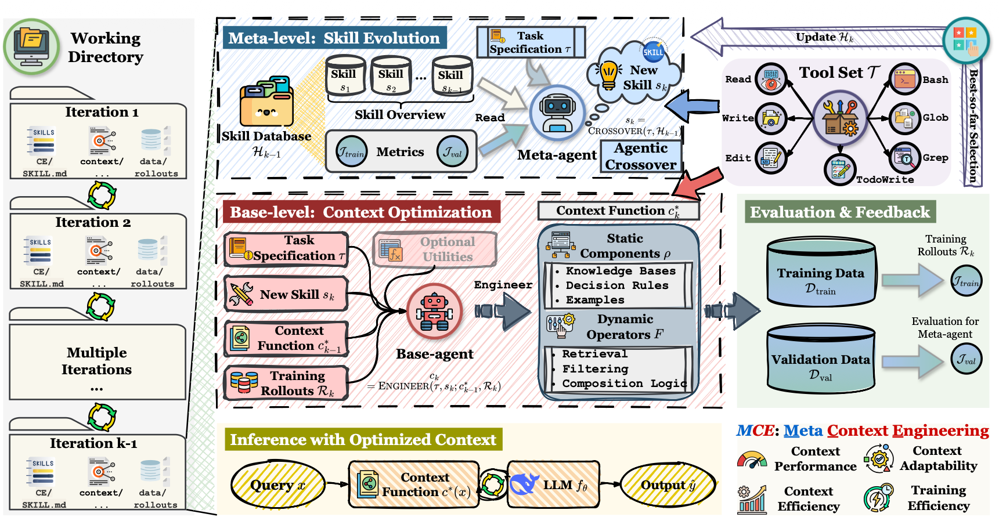

我們很容易把 context engineering 誤會成一件事：把更多資料塞給模型。

這個直覺很自然。模型忘了，就多給一點。答錯了，就把前面的紀錄貼回去。任務做久了，就把所有工具回應、聊天紀錄、錯誤訊息、上一輪草稿全部丟進 prompt。表面上看起來很完整，實際上像把整張辦公桌掃進抽屜，然後期待下一次比較好找。

[Lilian Weng 這篇文章](https://lilianweng.github.io/posts/2026-07-04-harness/)談 harness engineering 時，把 context engineering 放在很核心的位置。我讀到這裡時，想到的不是長 context 模型，而是我們平常管理工作紀錄的方式。

真正困難的不是記住一切。真正困難的是知道什麼值得留下、什麼該降級、什麼要刪掉、什麼只能放在待查清單裡。

## 流水帳很完整，也很殘忍

流水帳式 context 有一種騙人的完整感。每一步都在，所有回應都在，工具輸出也在。可是任務越長，這種完整越像懲罰。

模型要在一堆過期資訊裡找現在需要的線索。人也一樣。當我們打開一份長到看不到盡頭的對話紀錄，常常不是獲得掌控感，而是想放棄。內容太多，不代表資訊更多；很多時候只是噪音比較大聲。

我們在網站維護上就看過這種問題。一次發文牽涉文章、圖片、front matter、render、GitHub、正式網站與快取。如果每一次錯誤都只留在對話裡，下次遇到相似情況，我們還是要翻很久。若能把錯誤類型寫成檢查規則，事情就不一樣。下一次不是靠記憶，而是靠系統提醒。

這就是 context engineering 的味道。它不是讓模型背更多，而是把工作記憶整理成可以重用的形狀。

**不是長就好，是要能被下一輪使用**

一份好的脈絡應該像交接紀錄。下一個人打開後，能知道任務狀態、做過什麼、卡在哪裡、哪些假設不能再用。它不需要把每一句話都留下來，但它要保留足以接手的線索。

Agent 也需要這樣的交接紀錄。否則每次重跑，都是重新進入同一片霧。

## ACE 的直覺：把經驗變成可整理的條目

原文談到 Agentic Context Engineering，也就是 ACE。它的做法可以簡化成三個角色：Generator 產生任務軌跡，Reflector 從成功與失敗中整理線索，Curator 把這些線索放進一份結構化的 context playbook。

我覺得這裡最值得我們借用的，不是某個技術細節，而是它反對把所有東西揉成一大坨 prompt。它把經驗拆成有識別碼、有描述、可合併、可刪減的條目。這聽起來像行政工作，但長任務就是靠這種行政工作活下來。

我們可以把它翻成比較貼近日常的說法。每次任務跑完後，不要只問「成功了嗎」。要問四件事。

第一，這次留下了什麼可重用規則。第二，這次有哪些錯誤下次要提前檢查。第三，這次有哪些資料其實不該再帶入。第四，這次還有哪些問題不能裝懂。

如果每一次 agent 執行後，都能留下這四種東西，它就開始有真正的工作記憶。反過來，如果它只是把整段對話塞回下一次 prompt，表面上像有記憶，實際上是把整理責任丟給模型。

## context 也需要生命週期

我們平常談記憶，常常只談保存。可是成熟的記憶一定包含刪除。

一個 agent 記得我們偏好的文章格式，這很好。它記得上一輪圖片路徑曾經壞掉，這也很好。可是它若記得某位學生的作業內容，下一次拿去幫另一位學生寫回饋，就出事了。它若把過期的網站路徑一直帶入，就會一直引導自己走錯。它若把某次暫時性的例外當成永久規則，之後每次都會偏。

所以 context engineering 不能只問「要不要記」。它要問「記多久」「誰能改」「什麼時候刪」「下一次是否允許帶入」。

人類其實很懂這件事。老師不會把每一位學生的私人狀況帶到下一堂課公開討論。研究者不會把還沒查證的猜想直接寫進正式結論。編輯不會把臨時註記當成發表文字。好的工作記憶有分寸，知道哪些東西只能留在草稿層，哪些能進正式規則。

Agent 若只會記住，就還不成熟。它要學會不帶入。

## MCE 的啟發：連整理方法也可以被改進

Meta Context Engineering，也就是 MCE，比 ACE 再往前推一步。ACE 比較像把經驗整理成規則；MCE 進一步把「怎麼整理 context」這件事也變成可以改進的對象。

原文中的圖很密，直接讀會有點吃力。但它的問題意識很清楚：我們不只是在找最好的 context，也是在找比較好的 context 管理方法。哪些資料該搜尋，哪些該過濾，哪些該格式化，哪些該留下靜態知識，這些選擇本身都會影響結果。

這裡對我們做網站、做教學、做研究都有啟發。

我們常常以為問題出在某一次內容沒有給夠。可是更常見的問題是，我們沒有設計好資料該怎麼進來、怎麼留下、怎麼被下一次使用。學生用 AI 寫報告時也是如此。不是把所有資料丟給模型就好，而是要讓資料來源、採用理由、未查證處、人工判斷分開保存。這樣老師才看得出學生是在思考，還是在把材料堆成一團。

## prompt 是入口，不是倉庫

我現在越來越不喜歡把 prompt 當倉庫。Prompt 應該是入口，是任務開始時的工作說明。真正長期存在的東西，應該放在檔案、資料表、紀錄、檢查規則和版本裡。

這個看法會改變我們使用 AI 的方式。

我們不會再問：「這次 prompt 要怎麼寫得更長？」我們會問：「哪些資訊應該變成可重用規則？哪些錯誤要加入回歸檢查？哪些資料不能帶到下一個任務？哪些判斷要保留給人？」

這些問題比較慢，但比較像真正的工作。長任務不是靠一口氣講清楚，而是靠每一輪都能把經驗放回正確的位置。

我會建議把 AI 任務的脈絡拆成三個資料夾。第一個放「本次任務需要的材料」，任務結束後大多可以封存。第二個放「以後可能重用的規則」，例如圖片命名、文章發布檢查、引用格式。第三個放「不能自動採用的判斷」，例如研究品味、學生表現、尚未查證的資料。這三個資料夾的權限不應該相同。材料可以讓 agent 讀，規則可以讓 agent 建議修改，判斷則要留給人決定。

這種拆法看起來很笨，卻能避免一種常見的混亂：把所有東西都叫做 context。只要都叫 context，系統就很容易把私人資料、錯誤假設、暫時規則和正式知識混在一起。名字分開，責任才分得開。

如果 agent 要幫我們長期工作，它需要的不是一個越來越肥的 prompt。它需要一間乾淨的資料室。每個抽屜都知道放什麼，也知道什麼時候該清掉。

把所有東西塞回 prompt，是怕模型忘記。把脈絡整理成帳本，是承認工作需要秩序。
