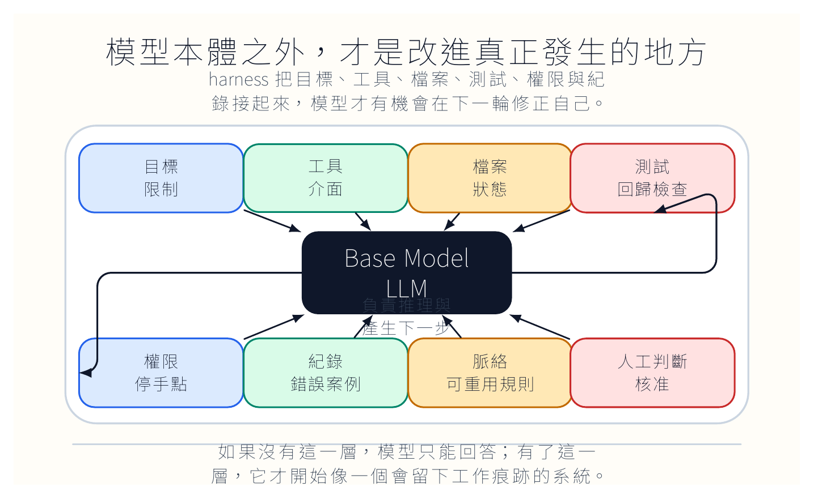
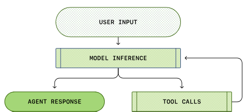
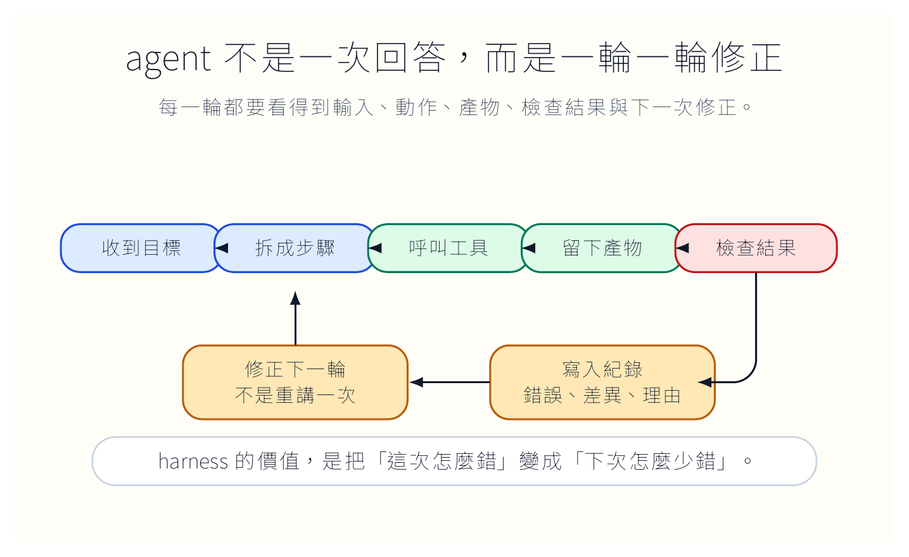
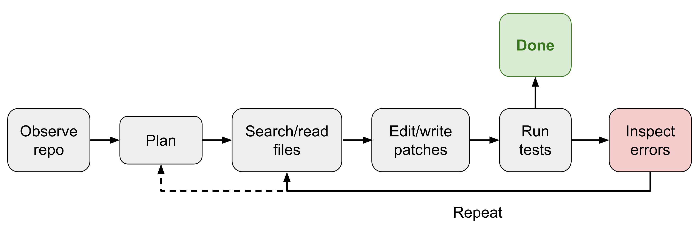

我這次讀 [Lilian Weng 的 Harness Engineering for Self-Improvement](https://lilianweng.github.io/posts/2026-07-04-harness/) 時，最刺眼的不是 recursive self-improvement 這個詞，而是另一個比較樸素的東西：harness。

如果把 AI 自我改進講得太像科幻，我們很容易誤會。好像某一天模型醒來，開始打開自己的腦袋，把權重改一改，然後就變成下一代。這種畫面很誘人，也很容易讓討論失焦。近期比較接近現實的路徑，通常不是模型直接重寫自己的權重，而是模型被放進一套更完整的工作環境：它能讀檔、寫檔、呼叫工具、執行測試、留下錯誤、根據結果再跑一輪。

這個工作環境，就是 harness。

我們平常叫 AI 幫忙寫東西時，常常只看到聊天視窗裡的答案。可是 agent 真正變得有用，通常不是因為它說得比較漂亮，而是因為它開始有地方做事。它能改一個檔案，跑一次測試，讀一段錯誤訊息，回頭修正。它能把上一輪的失敗變成下一輪的線索。這時候，AI 不再只是「回答」，而是在一個可追蹤的環境裡工作。

## 問題不是模型不夠強，是它沒有地方留下錯誤

我們可以先把問題縮小。假設我們請 AI 幫忙更新一個網站。它能產生文章、搬圖片、修改 front matter，甚至幫我們跑 `quarto render`。如果沒有 harness，這件事很快會退回人工確認：文章有沒有放對資料夾？圖片路徑有沒有壞？文章是不是公開？正式網站是不是同步？讀者會不會看到原始 Markdown 符號？

這些問題不是模型單靠一段回答能解決的。它需要一個可以留下痕跡的環境。

檔案系統讓它知道自己改了什麼。測試讓它知道某一步有沒有壞。紀錄讓下一輪知道上一輪錯在哪裡。權限讓它知道哪些事可以自己做，哪些事必須停下來等人。沒有這些東西，模型再會說話，也只能靠我們用眼睛替它善後。

所以我會把 harness 看成 AI 的工作桌。桌上有工具、有資料夾、有檢查清單、有垃圾桶，也有一張寫著「這個按鈕不能亂按」的紙。模型的聰明很重要，但如果它站在空房間裡，什麼工具都沒有，什麼紀錄都不能留下，它就只能憑當下那段文字做決定。那不是自我改進，只是每次重新猜。

**harness 讓錯誤有地方被保存**

錯誤若只存在對話裡，很快會消失。錯誤若被寫進檔案、測試、紀錄與規則裡，它才會變成下次工作的材料。這一點很像老師批改作業。學生錯一次，如果老師只是口頭提醒，下一次可能還會錯；如果老師把錯誤類型寫進範例，下一屆學生就有機會少踩一次。

Agent 也是這樣。它不是靠神祕的覺醒變好，而是靠失敗被留下來。

## agent 的能力藏在迴圈裡

我們平常容易把 AI 能力想成一次性的：問一次，答一次；貼一段 prompt，拿一段結果。可是 coding agent 的工作方式不是這樣。它比較像一個很快、很勤勞、但需要被約束的助理。

它先看任務，再讀 repo，規劃可能要改的地方，打開檔案，修改，跑測試，讀錯誤，再回頭修。這一輪不一定成功。真正有價值的是第二輪、第三輪。因為工具回應、錯誤訊息、測試結果都進入了下一次判斷。

我們若只看最後輸出，就會錯過 agent 的本體。Agent 的重點不在那一句回答，而在回答前後的行動軌跡。

這也說明為什麼單純 prompt engineering 會遇到天花板。提示詞可以讓模型知道任務該怎麼做，但它不能替系統留下檔案差異，不能替它跑測試，也不能替它判斷某個外部操作是否需要人工核准。提示詞像一張便條紙，harness 像整張工作台。

便條紙可以寫得很清楚，但工作台如果亂，任務還是會亂。

## 檔案系統不是落後做法，而是長任務的記憶

原文提到一個很重要的模式：file system as persistent memory。這句話看起來普通，實際上很硬。

我們常常幻想 AI 有長期記憶，好像它可以把所有事情都塞進一個巨大的 context window。可是長任務真正需要的不是把全部訊息倒回模型，而是把資訊放在可讀、可改、可比較的位置。檔案系統剛好是這樣的地方。

一份實驗紀錄、一段錯誤 trace、一個程式 diff、一份文章草稿、一張待辦清單，都可以放成檔案。Agent 需要時再讀，不需要時就不要塞進 prompt。這比把整段歷史貼回聊天視窗更穩，也更接近人類工作的方式。

我們寫研究、寫網站、寫程式時，也不是把所有資料塞在腦袋裡。我們靠資料夾、檔名、版本、註解、備忘錄和搜尋。這些看似土法煉鋼的東西，其實就是人類長期工作的外部記憶。

如果 agent 真的要處理長任務，它也需要這種外部記憶。差別只在於它讀檔和寫檔的速度比我們快很多，所以錯誤也可能擴散得更快。

## 權限是 harness 的骨頭

有些人談 harness，只談工具。工具當然重要，沒有工具，模型不能行動。但我更在意權限。

讀檔和刪檔不是同一件事。產生草稿和覆蓋原始檔不是同一件事。跑測試和發布正式網站也不是同一件事。Agent 如果能改進自己的工作方式，我們更要問：它能改哪些部分？它能不能改自己的權限？它能不能改檢查規則？它能不能刪掉不利於自己的錯誤紀錄？

這些問題聽起來像安全問題，其實也是產品設計問題。好的 harness 會把權限做成明確的路徑。哪些動作可以自動完成，哪些動作只能準備草稿，哪些動作一定要停下來等人。越接近不可逆動作，越不能靠模型臨場判斷。

我們不該期待 agent 每次都自己知道分寸。分寸要寫進系統裡。

## 自我改進不是浪漫故事，是工程紀律

recursive self-improvement 容易被講成一種宏大故事。但如果把它放回今天能看到的 agent 系統，畫面其實比較平實：我們先把工作環境設計好，讓模型能執行、能檢查、能留下紀錄，然後讓下一輪使用這些紀錄。

這件事不浪漫，但很重要。真正讓 AI 變可靠的，常常不是某一句更聰明的 prompt，而是很無聊的東西：檔案命名、測試清單、錯誤紀錄、權限邊界、回歸檢查。

我們若把這些東西做好，AI 才有機會在實際工作裡變好。若沒有，它就算回答得更像專家，也只是把我們帶進一場更難查錯的表演。

所以我現在看 agent，第一眼不是問模型是哪一個，也不是問 prompt 怎麼寫。我會先問：它把失敗放在哪裡？它下一輪怎麼讀回來？它不能碰什麼？它做完後誰檢查？

回答不了這幾個問題的系統，還不能談自我改進。它只是跑得很快。
