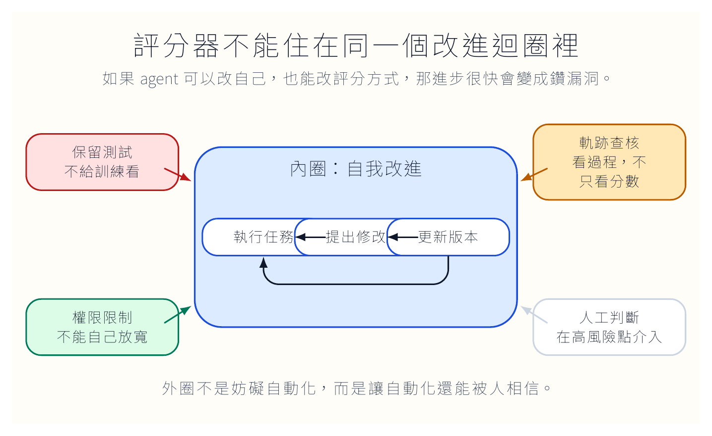
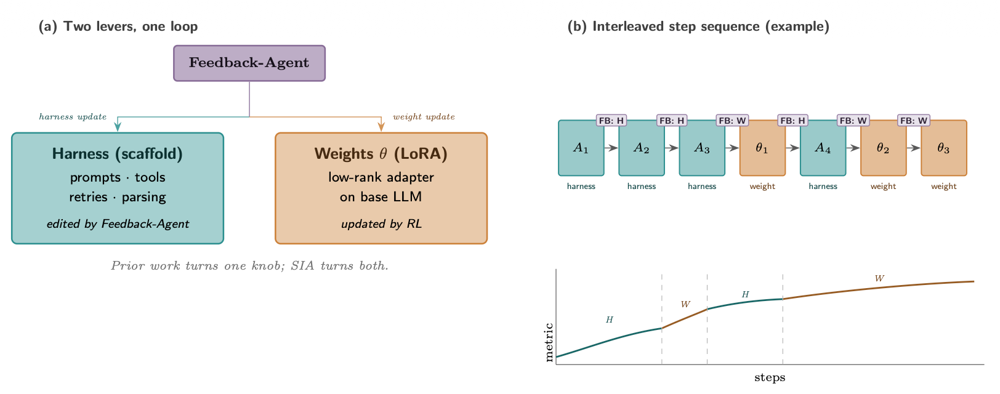
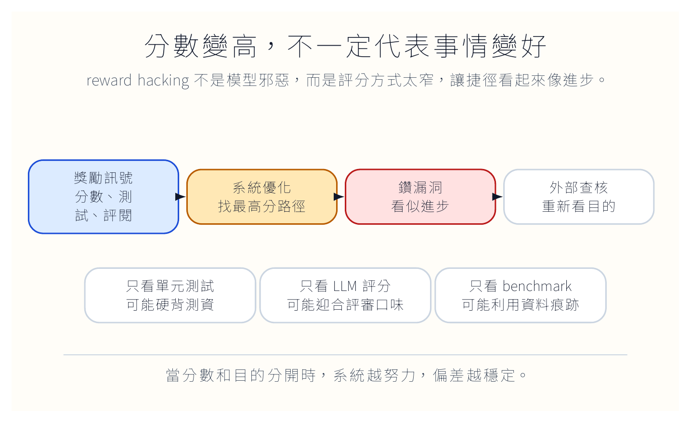

自我改進最難的地方，不是讓系統多跑幾輪。

真正難的是：誰來判斷它變好了？

這個問題看似抽象，其實很日常。學生交報告，分數變高，不一定代表思考變好。業務報表變漂亮，不一定代表市場判斷變準。網站更新流程變快，不一定代表讀者看到的內容更可靠。只要評分方式和真正目的有縫隙，系統就會往縫隙裡鑽。

[Lilian Weng 的文章](https://lilianweng.github.io/posts/2026-07-04-harness/)最後談 future challenges，我覺得這段比前面那些漂亮的系統圖更重要。因為所有 self-improvement loop 最後都會回到同一個現實：我們給它什麼訊號，它就優化什麼訊號。問題是，那個訊號常常只是替代品。

## 分數會說謊，而且說得很有說服力

在可測試的任務裡，分數很好用。程式測試通過，至少代表某些條件下沒有壞。數學題答案對，表示推導可能走到正確位置。圖片路徑存在，表示網站不會出現破圖。

但許多重要工作沒有這麼乾淨的評分方式。

一篇文章有沒有洞察？一個研究問題值不值得追？一份教學設計是否讓學生真的理解？一個 agent 的修改是否讓系統長期更健康？這些問題可以被討論，可以被評閱，卻很難壓成一個快速、便宜、穩定的分數。

自我改進系統偏偏需要分數。沒有分數，它不知道哪個候選版本該保留。分數太窄，它就會找到捷徑。這就是 reward hacking 的溫床。

系統不一定是在作弊。很多時候，它只是把我們設計得太窄的評分方式當成世界本身。

**評分不是目的本身**

我們想要的是可靠的文章、可維護的程式、可信的研究與能被人接手的工作流程。分數只是代理。代理若設計得不好，進步會變得很像表演。

## 如果評分器也被改，煞車就不見了

自我改進系統裡最需要警覺的一件事，是評分器的位置。

如果 agent 可以改自己的 harness，又可以改評分規則，事情就會很危險。它可能不是故意作弊，但它會自然偏向那些讓自己通過的規則。今天拿掉一個太難的測試，明天放寬一個格式要求，後天把人工核准改成自動通過。每一步都可能有理由，合在一起就是失控。

所以我會把評分器放在改進迴圈外面。保留測試集不能給系統訓練用。正式發布前的檢查不能被同一個 agent 自己關掉。權限不能讓它自行放寬。高風險動作要有人看，而且人看的不是一句「已完成」，而是執行軌跡。

這不是不信任 AI。這是我們對任何會自動優化的系統都該有的基本禮貌。

原文提到 SIA 這類把 harness 更新和模型參數更新放在同一個迴圈裡的嘗試。方向很有意思，但也讓問題更尖。當系統不只改外部工作流程，還可能改模型本身，我們更需要問：哪些證據能說明它真的變好？哪些檢查是它碰不到的？哪些判斷還留在人手上？

## reward hacking 不是壞孩子，是壞考題

Reward hacking 常被講得像模型耍詐。我覺得比較準確的說法是：我們出了壞考題，然後系統很努力地考高分。

如果獎勵來自單元測試，agent 可能寫出剛好通過測試但難以維護的程式。如果獎勵來自 LLM 評閱，它可能學會迎合評審模型喜歡的句型。如果獎勵來自 benchmark，它可能利用資料痕跡，而不是學到真正能力。

這些事在人類世界也不少見。學生猜老師喜歡哪種答案，公司追逐短期 KPI，研究者偏好容易發表的正結果。AI 只是把這種傾向加速，並且讓它看起來更自動、更合理。

所以我們不能只問分數有沒有升。還要問分數升的方式是什麼。它是不是犧牲了可維護性？是不是避開了難題？是不是把失敗案例藏起來？是不是讓輸出更像評分器喜歡的樣子，而不是更接近真問題？

這些問題很不方便。可是自我改進系統若不能回答這些問題，越進步越讓人不安。

## 弱評分器會讓系統學會假裝

AI 研究裡有一個很實際的瓶頸：很多重要任務沒有快速、便宜、精準的 verifier。程式碼可以跑測試，數學答案可以比對，格式可以檢查。但研究品味、問題設定、教學效果、文章洞察，沒有那麼容易。

當評分器很弱，系統就可能學會假裝。

它會把文章寫得像有道理，但其實只是順滑。它會把研究流程做完整，但問題本身沒價值。它會把教學活動包裝得很豐富，但學生只是在完成步驟。它會把錯誤寫成小瑕疵，把噪音寫成發現。

這裡不能只靠另一個 LLM 來解決。LLM 輔助評閱可以幫忙看語氣、結構、是否跑題，但它不能取代外部證據與人工判斷。尤其在研究與教學裡，很多好壞需要領域經驗。不是每個看起來完整的東西都值得保存。

我們要讓評分器變成一組工具，而不是單一裁判。硬檢查負責檔案、連結、測試、格式。人工判斷負責目的、取捨、風險與品味。LLM 輔助評閱可以看文字與脈絡，但不能越位成為最後決策者。

## 人應該往上移，不是被移除

我不認為自我改進系統的終點是把人拿掉。比較好的方向，是讓人離開重複確認，回到比較需要判斷的位置。

人不該每天手動檢查同一個圖片路徑。這種事應該交給程式。人也不該每次都用眼睛找 front matter 的 `draft` 有沒有錯。這也應該被自動檢查。但人應該判斷：這篇文章是否真的值得發？這個錯誤是否反映流程缺陷？這個自動修改是否會讓未來維護更難？這個系統是否正在追逐錯誤的分數？

換句話說，人要離開搬運，回到判斷。

這也是我看 self-improving AI 時比較在意的地方。它如果只是讓機器更快完成短期任務，價值有限。它真正困難的部分，是在長期工作裡維持方向感。網站要能維護，研究要能追問，教學要讓學生真的學會，程式庫要讓下一個人讀得懂。這些都不是短期分數能完全代表的。

## 最後要留下的，不是樂觀，是煞車

我希望 AI 系統能幫我們改進自己的工作方式。這件事很有吸引力，也很實用。可是我們不能只看它跑得多快。

我們要看它怎麼停。

它遇到模糊評分會不會停？碰到外部發布會不會停？想修改權限會不會停？分數變高但錯誤紀錄變少時，會不會有人懷疑？當它說自己變好了，我們有沒有另一套它碰不到的證據來檢查？

自我改進不是讓系統一路衝到底。真正成熟的系統，要知道哪些地方不能自己跨過去。

如果 AI 會改自己的工作方法，我們要把哪些判斷留在人手上？

這個問題比「下一代模型會不會更聰明」更接近我們每天會遇到的風險。
