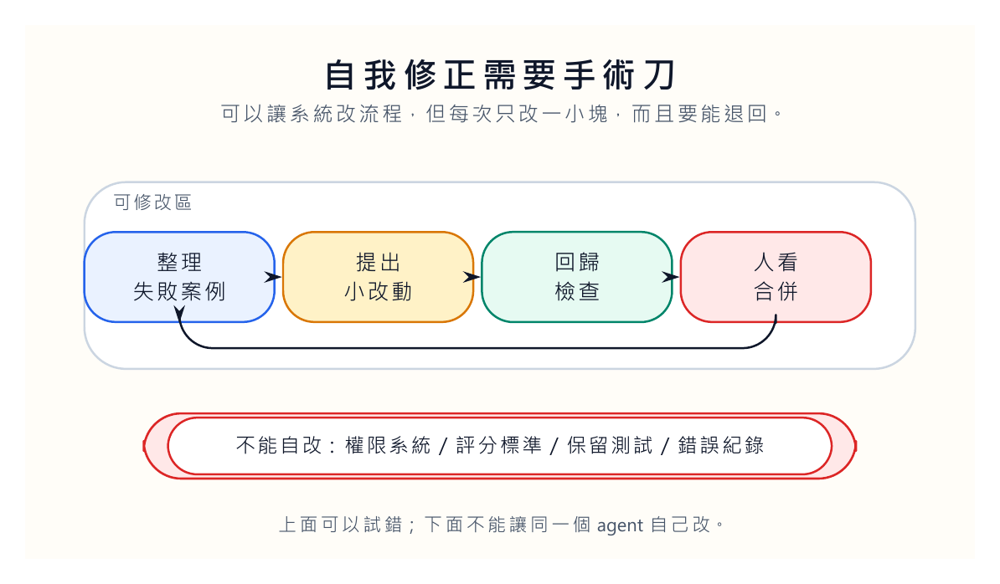
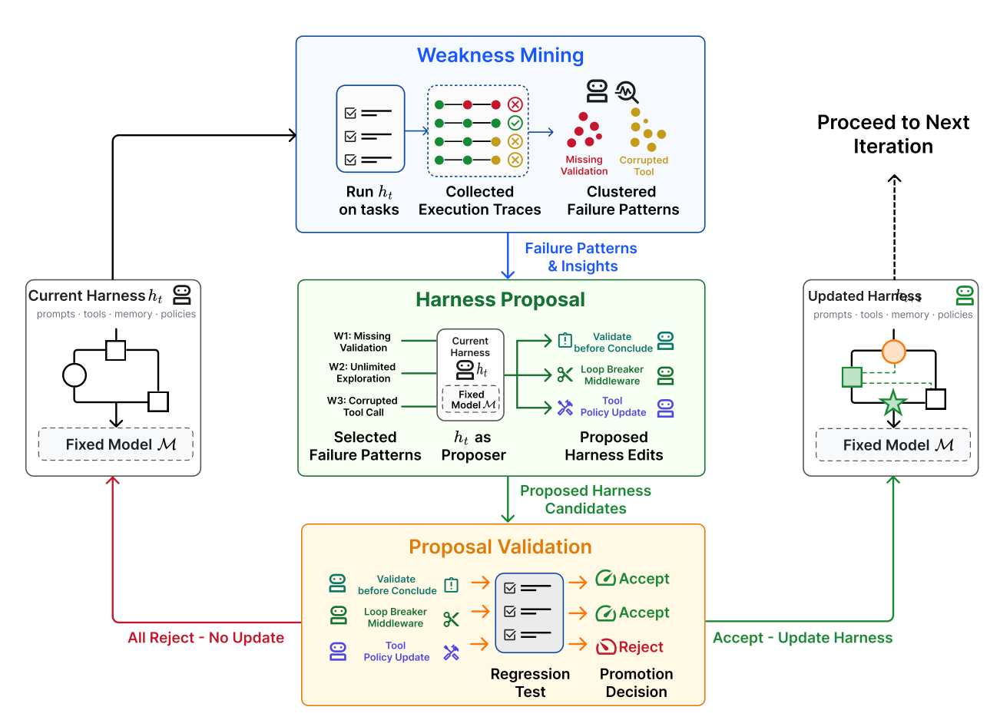
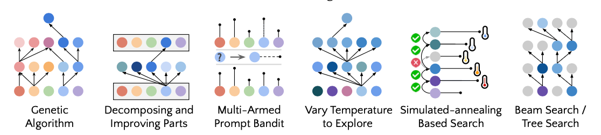
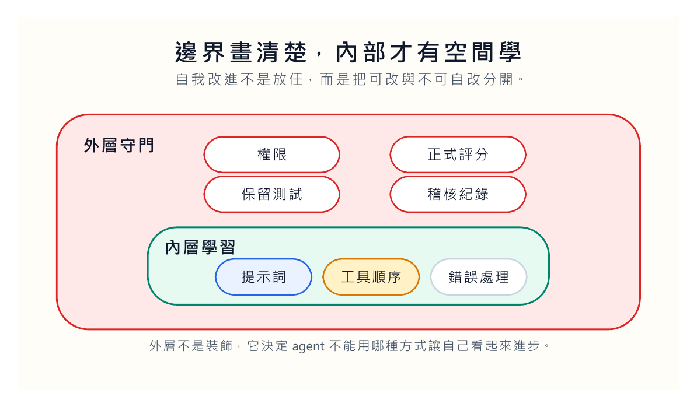

AI 改答案，和 AI 改產生答案的規則，是兩件完全不同的事。

前者像學生重寫一份作業。後者像學生開始改評分標準、改交作業流程、改老師看得到哪些紀錄。這當然可能讓效率變高，也可能讓事情變得很不安。

[Lilian Weng 的文章](https://lilianweng.github.io/posts/2026-07-04-harness/)在 self-improving harness 這一段談到 STOP、Self-Harness 這類研究。我讀這段時，一直想到網站維護裡最實際的問題：我們可以讓系統自己修正工作流程嗎？可以。但第一件事不是讓它自由發揮，而是先把可修改範圍畫清楚。

如果 agent 發現某類錯誤常發生，它可以提出修補。可是它不能順手改掉權限，不能改掉評分器，不能刪掉錯誤紀錄，更不能把讓自己失敗的測試拿掉。這些聽起來像常識，但自我改進系統最危險的地方，往往就是常識沒有被寫成邊界。

## 讓它修，但只修一小塊

Self-Harness 的核心精神，可以用很普通的話說：先整理失敗，再提出小範圍修改，接著測試，通過才合併。

這聽起來像工程師每天在做的事。某個功能壞了，先看 log，找出錯誤類型，再改一小段程式，跑測試，確認沒有弄壞其他地方。差別在於，這裡的修改者可能是 agent 自己。

這一步很迷人。因為我們不再只叫 AI 做任務，而是叫它檢查自己怎麼做任務。它可以看見某些反覆失敗的模式：工具順序不對、錯誤訊息沒有讀完、檔案命名不穩、測試前漏掉某個準備步驟。然後它提出修正。

但這裡也有一個硬限制：修改必須很窄。

如果一次修改太大，我們根本不知道哪裡帶來改善，哪裡帶來新的問題。更糟的是，agent 可能學會避開讓自己難看的情況。它不一定有惡意；它只是照著獎勵訊號往前跑，而系統沒有把邊界寫好。

**自我修正需要手術刀，不需要開山刀**

好的 harness 修改應該像小手術。切口小，理由清楚，可回復，能測試。若 agent 說「我想重寫整套流程」，我們應該先緊張，而不是拍手。

## 失敗整理不是找代罪羔羊

自我改進系統的第一步不是改，而是整理失敗。

這裡最容易犯的錯，是只看表面結果。timeout、missing artifact、render failed、link broken，這些只是症狀。兩次 timeout 可能完全不同：一次是工具卡住，一次是 agent 忘了等背景工作完成。兩次圖片壞掉也可能不同：一次是路徑錯，一次是檔名有空格，一次是圖片沒有被加入 Git。

如果我們只把錯誤貼上同一個標籤，後面的修改就會亂。Agent 會修表面的症狀，而不是修工作方式。

比較好的做法，是把錯誤寫成可追問的紀錄。當時輸入是什麼？agent 做了哪一步？用到哪些檔案？檢查器看到什麼？人最後怎麼判斷？這些資料夠了，失敗才有機會被分群。分群之後，修改才比較像針對病因。

這也是為什麼我不喜歡讓錯誤留在聊天紀錄裡。聊天紀錄很難重用，情緒也太多。錯誤需要被整理成乾淨的資料。不是為了責備，而是為了讓下一輪少走同一條路。

## STOP 告訴我們：會改進的方法，也需要被測試

STOP，也就是 Self-Taught Optimizer，提出一個很有意思的問題：我們能不能讓改進器自己也被改進？

這句話繞了一點。比較直白地說，我們不只想讓系統產出更好的答案，也想讓「產生更好答案的方法」變好。原文提到 STOP 在實驗裡找到一些策略，例如 genetic algorithm、拆解局部、multi-armed prompt bandit、temperature 變化、beam 或 tree search。

這些策略本身不神祕。要害在於：系統開始把方法當成可搜尋、可比較、可替換的東西。

但原文也提到一個讓人清醒的結果：較強的模型能讓 STOP 改善平均表現，較弱的模型反而可能讓結果變差。這提醒我們，遞迴結構本身不保證進步。讓一個不夠穩的系統去改自己的方法，可能只是把錯誤包得更漂亮。

所以 self-improving harness 不能靠口號。它要靠測試、可回復修改、清楚權限與外部檢查。

## 安全層不能住在同一個迴圈裡

如果 agent 能改自己的工作流程，我們就要問一個不舒服的問題：誰來決定它不能改什麼？

我會把系統分成內層和外層。內層可以改提示詞、工具順序、錯誤處理、資料整理方式。這些是工作方法，可以被測試，可以逐步改善。外層不能由同一個 agent 自己改。外層包括權限、正式評分器、保留測試集、錯誤紀錄與人工核准點。

原因很簡單。若一個系統可以改自己的評分方式，它很可能把「真正變好」變成「看起來分數更好」。若它可以刪掉錯誤紀錄，就沒有歷史能反駁它。若它可以放寬權限，就會把本來需要人核准的事變成自動通過。

我們不需要假設 agent 有壞意。只要獎勵訊號設計不完整，它就可能找到捷徑。自我改進系統不是邪惡，而是太勤勞。它會把我們給的目標做到很滿，連我們沒說清楚的漏洞也一起利用。

## 人不是最後補上的橡皮圖章

很多系統把人工核准設計成最後一步：agent 做完一切，人按同意。這樣的人其實很難負責。因為人看到的是結果，不是過程；看到的是總結，不是每一次分叉。

在 self-improving harness 裡，人應該出現在比較早、比較高風險的位置。比如修改可執行流程之前，合併 harness 改動之前，放寬權限之前，改變評分標準之前。這些地方不能只靠最後看一眼。

更好的設計，是讓人看到「這次修改要解決哪一類失敗」「它碰到哪些檔案」「它不允許碰哪些東西」「回歸檢查結果如何」「如果失敗能不能復原」。這樣的核准才有內容。

我們不是要把 AI 鎖死。相反，我們要讓它在明確範圍內真的能改進。邊界畫得清楚，內部才有空間試錯。

我也會要求每一次 harness 修改都留下「拒絕紀錄」。哪些修改被提出，為什麼沒有合併，是因為效果不明、破壞舊任務，還是碰到不該碰的權限。很多團隊只記成功版本，失敗版本消失得太快。問題是，失敗版本常常才是系統安全感的來源。它讓下一次 agent 知道哪些路已經試過，哪些捷徑看起來合理但其實會出事。

回歸檢查也不能只測新錯誤有沒有被修掉。它還要測舊任務有沒有被弄壞。這聽起來像工程常識，但自我改進系統最容易忽略的就是常識。它太想證明這次修改有效，就會把注意力放在當前錯誤。人要做的事，是提醒系統：舊的可靠性不能拿去換新的分數。

自我改進最危險的地方，不是系統開始學，而是它學的時候順手把考場、考題、監考和成績單都拿去改。

那不是進步。那只是沒有人看得見它怎麼贏。
