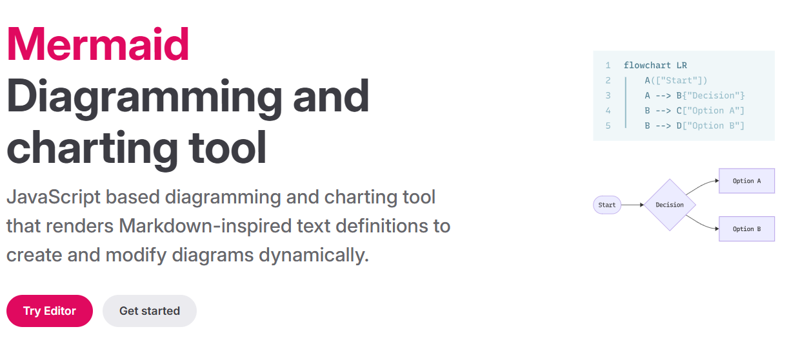
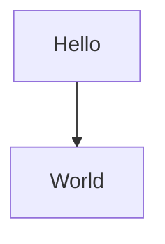
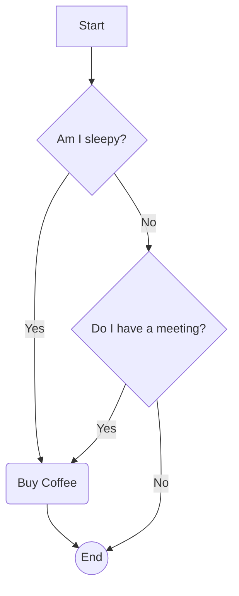
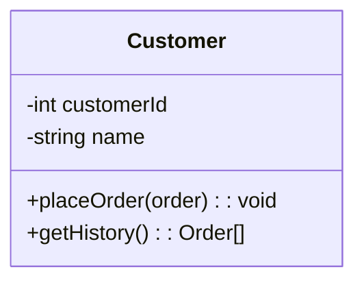
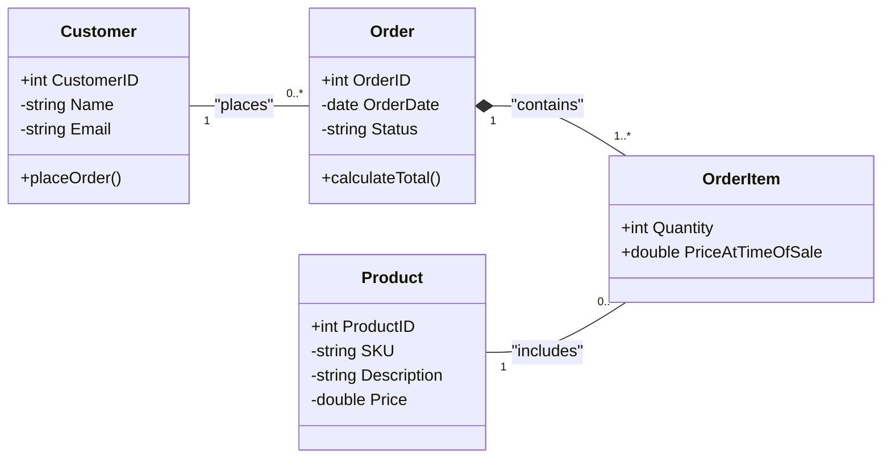
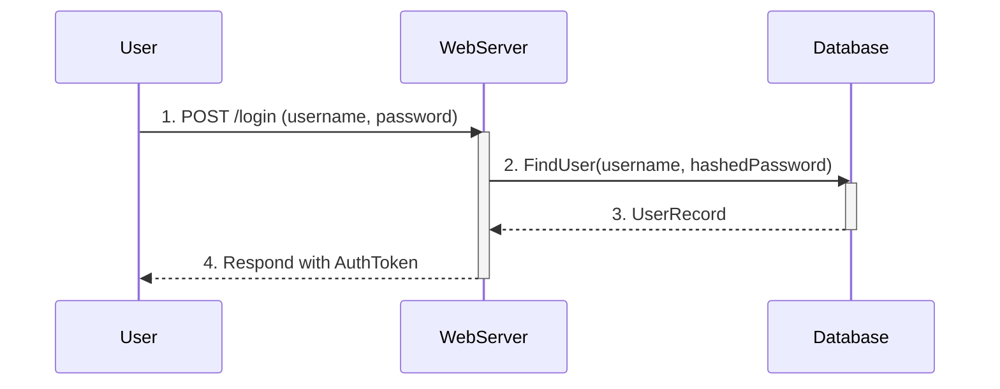

Welcome! This guide will teach you how to create beautiful, complex diagrams simply by writing text.

### **What is Mermaid?**

- Mermaid is a simple, text-based language that lets you create charts and diagrams.
- Instead of using a mouse to drag and drop shapes, you just write code that describes your diagram.
- **Why use Mermaid?**
    - **It's Fast:** Writing text is often much faster than clicking and dragging.
    - **It's Easy to Edit:** Just change a line of text to update your diagram.
    - **It's Great for Version Control:** You can track changes to your diagrams in Git, just like code.
    - **It's Integrated:** Mermaid works in many of the tools you already use, like GitHub, GitLab, Notion, and other Markdown editors.

### **Getting Started: The Mermaid Live Editor**

The best way to learn is by doing. We will use the **Mermaid Live Editor**.

1. Open this link in a new tab: [**https://mermaid.live**](https://mermaid.live/)
2. You will see a "Code" panel on the left and a "Diagram" panel on the right.
3. Delete any text in the "Code" panel and you're ready to start.

Let's make your first diagram. Copy and paste the code below into the "Code" panel:

Instantly, you should see a diagram appear:

[Hello] --> [World]

Congratulations! You've just made your first Mermaid diagram.

---

### **Part 1: Flowcharts (The Basics)**

Flowcharts are the most common diagram to start with.

**1. Declaration:** You always start by declaring your diagram type. For flowcharts, this is `graph` followed by a direction.

- `graph TD` (Top to Down)
- `graph LR` (Left to Right)

2. Nodes (The Shapes):

A node is a shape with text. You give it a unique ID (like A or B) and then define its shape and text.

| **Shape** | **Syntax** | **Example Code** |
| --- | --- | --- |
| Rectangle (Default) | `id[Text]` | `A[Start]` |
| Rounded Rectangle | `id(Text)` | `B(Process)` |
| Circle | `id((Text))` | `C((End))` |
| Diamond (Decision) | `id{Text}` | `D{Is it Friday?}` |

3. Links (The Arrows):

You connect nodes using arrows. You can also add labels to the arrows.

| **Link Type** | **Syntax** | **Example Code** |
| --- | --- | --- |
| Arrow Link | `-->` | `A --> B` |
| Labeled Link | `-- "label" -->` | `D -- "Yes" --> C` |
| Dotted Link | `-.->` | `A -.-> C` |

### **Example: "Should I Buy Coffee?" Flowchart**

Let's combine these to make a useful flowchart. Copy this into the Live Editor.

This code creates a clear decision-making process.

---

### **Part 2: UML Class Diagrams (The Core Skill)**

This is one of the most powerful features of Mermaid. It's perfect for planning a database or an application. (This will use the syntax we've been discussing).

**1. Declaration:** Start with `classDiagram`.

2. Defining a Class:

A class is a box with a name, attributes, and methods.

- **Visibility:** The `+` (public),  (private), and `#` (protected) symbols define visibility.
- **Attributes:** `+attributeName: type` (e.g., `string name`)
- **Methods:** `+methodName(parameters): returnType` (e.g., `+getHistory() : Order[]`)

3. Relationships (The Lines):

This is how you show how classes are connected.

| **Relationship** | **Syntax** | **Meaning** |
| --- | --- | --- |
| **Inheritance** | `Parent <|-- Child` | "Child" *is a* "Parent" |
| **Composition** | `Whole *-- Part` | "Part" *cannot exist without* "Whole" |
| **Aggregation** | `Whole o-- Part` | "Part" *can exist without* "Whole" |
| **Association** | `ClassA -- ClassB` | "ClassA" *is related to* "ClassB" |

4. Multiplicity (The Numbers):

You add multiplicity in quotes "" to define the business rules for a relationship.

- `"1"` or `"1..1"`: Exactly one
- `"0..*"` or `"*"`: Zero or more
- `"1..*"`: One or more
- `"0..1"`: Zero or one

### **Example: E-Commerce System Class Diagram**

This is a complete example showing a `Customer` placing an `Order`, which has many `OrderItems`. This is the classic way to model a Many-to-Many relationship.

---

### **Part 3: Sequence Diagrams (A Quick Look)**

Sequence diagrams are great for showing how different systems (or objects) interact over time.

**1. Declaration:** Start with `sequenceDiagram`.

**2. Participants:** These are the "columns."

- `participant A`
- `participant B`

**3. Messages:**

- `A ->> B: Message Text` (Solid line, solid arrow for a call)
- `B -->> A: Reply Text` (Dotted line, solid arrow for a reply)

**4. Activations:** Use `activate` and `deactivate` to show when a participant is "working."

### **Example: User Login Sequence**

---

### **Your Next Steps**

You've learned the three most common diagram types!

1. **Practice:** The best way to learn is to model things you know. Try to make a flowchart of your morning routine or a class diagram for your favorite hobby (e.g., `Book`, `Author`, `Library`).
2. **Use Comments:** Use `%%` at the start of a line to write a comment. This is very helpful for complex diagrams.
3. **Explore the Docs:** Mermaid can do so much more! (Gantt charts, Pie charts, ER diagrams, etc.). The [Official Mermaid Documentation](https://mermaid.js.org/intro/) is the best place to learn more.

Congratulations on learning a new and powerful skill!