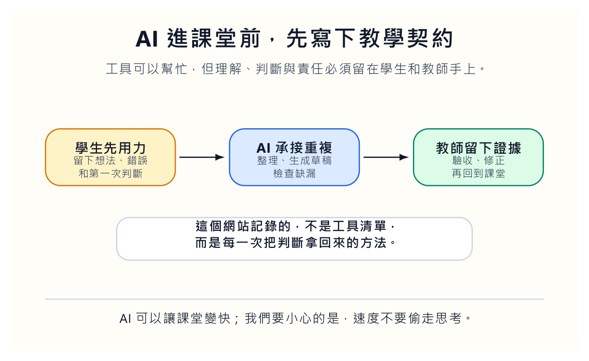
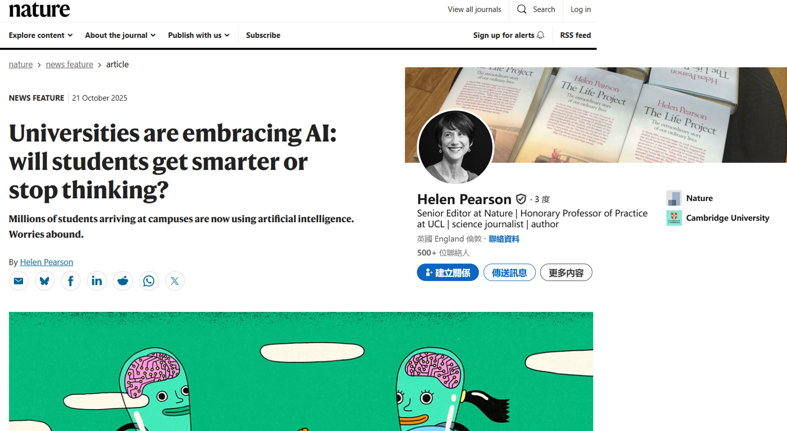
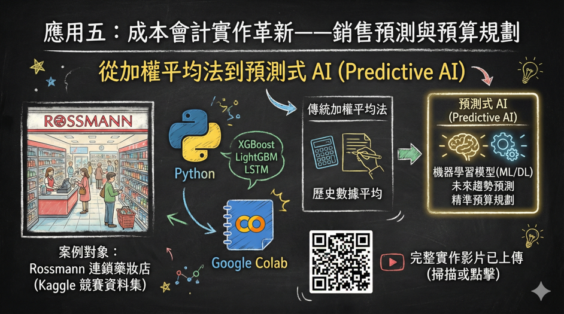

這是我知識站的第一篇文章。

我在國立臺北大學會計學系任教。剛開始建立這個網站時，我想得很簡單：把課堂上做過的 AI 教學實驗記錄下來，讓學生、老師，或對財會資料分析有興趣的人，可以看到一個比較接近現場的版本。

後來我發現，這個網站不能只是工具清單。工具清單很快就會過期，今天好用的按鈕，三個月後可能被新版本移走。真正值得留下來的，是我們怎麼判斷一個工具有沒有讓學生更會想，怎麼知道一個自動化流程沒有把錯誤藏起來，怎麼在速度很快的時代，不把責任推給模型。

我希望這個知識站保留的，不是「我試過某工具」這種新鮮感，而是一些可以回頭檢查的教學判斷。哪個地方應該讓學生先卡住，哪個地方可以交給工具，哪個地方一定要留下證據，哪個地方看似省時，實際上只是把責任藏到更遠的地方。這些判斷沒有那麼華麗，卻比較耐放。

## 一開始不是願景，是時間不夠

去年八月，我到臺北大學任教。第一個學期，我碰到的是很平凡、也很硬的問題：班上 48 位學生。依規定，修課人數未滿 50 人，沒有教學助理。

48 這個數字很尷尬。它不像 15 人，可以用小班討論慢慢磨；也不像 80 人，制度上會給你一位助教。它剛好落在一個教師必須自己扛住所有細節的位置。公告、教材、出題、改卷、學生信件、課堂狀況、行政雜事，全都會在同一週裡擠進來。

那時我也剛成為新手爸爸。晚上不是備課，就是抱小孩。凌晨醒來時，我常常不是在想什麼教育創新，而是在想明天的投影片哪裡還沒補，作業題目有沒有寫清楚，學生如果問到那個觀念，我能不能用三分鐘講明白。

所以 AI 對我而言，一開始不是潮流，也不是口號。它比較像一個很務實的問題：如果我們把重複工作交出去，能不能把省下來的時間拿回來看學生真的卡在哪裡？

但這個問題後面藏著另一個更麻煩的問題：如果 AI 只是讓老師更快、學生更省力，那課堂會變好，還是只會變得更滑？

這個問題後來變成我做每一個教學實驗前的門檻。若某個工具只讓作業看起來更完整，卻沒有讓學生留下自己的判斷，我就會懷疑它。若某個流程讓老師省下時間，卻讓學生更不知道誰在評分、誰在負責，我也會懷疑它。工具可以進課堂，但它要先回答一個很樸素的問題：它讓哪一個人的判斷變得更清楚？

## 工具最危險的地方，是它太順手

我很早就對「AI 讓學習更輕鬆」這句話保持警覺。輕鬆有時是好的。學生不必把時間浪費在重複排版、機械搜尋、格式整理上，這當然好。可是學習裡有些痛感不能拿掉。

讀一張報表，看不懂欄位之間的關係，那個卡住很有價值。寫一段解釋，發現自己講不清楚，那個停頓也有價值。做預測模型時，才發現自己把未來資料偷拿來訓練，那個尷尬更有價值。

如果 AI 一出手就把這些卡住的地方磨平，學生得到的可能不是理解，而是「我好像懂了」的幻覺。

這張截圖之所以被我放在第一篇文章裡，不是因為它提供了一個簡單答案。剛好相反，它問了一個很刺耳的問題：當大學開始擁抱 AI，學生到底會變得更會思考，還是更習慣不思考？

我不想把 AI 禁掉。禁止通常只是把問題推到地下。學生仍然會用，只是我們看不到他怎麼用。比較誠實的做法，是把使用方法帶到桌面上，讓學生知道哪些地方可以交給工具，哪些地方必須自己留下痕跡。

這就是我說的教學契約。學生要先留下自己的判斷、疑問、錯誤和第一次想法；AI 可以承接整理、生成草稿、檢查缺漏；教師要把最後的證據帶回課堂，讓學生看見自己的思考到底在哪裡變清楚，又在哪裡被工具遮住。

教學契約不是一張漂亮宣言。它要出現在作業規則、評分表、課堂活動和回饋方式裡。若教師只口頭說「請負責任地使用 AI」，學生其實不知道怎麼做。比較好的做法，是把責任拆成可以交付的東西：第一版判斷、查證過程、修正理由、刪除紀錄、最後願意署名的結論。這些東西會讓學生知道，使用 AI 不是把自己消失，而是把自己的判斷留下來。

## 預算課最該教的不是模型，是時間線

成本會計裡談預算，最容易教成公式課。拿過去幾期銷售量，加權平均，乘上一個成長率，再得到下一期預估。公式乾淨，學生容易算，考試也好改。問題是，真實世界的銷售不太理會這種乾淨。

促銷、季節、價格、競爭者、通路缺貨、一次性大單，哪一個都可能讓平均數看起來像一個有禮貌的謊言。

所以我把預測式 AI 放進成本會計課，不是要學生變成資料科學家，而是要他們先問一個會計人該問的問題：做預算的那一天，管理者手上到底知道什麼？

這個問題比模型名稱更接近管理會計。因為預算不是事後諸葛，預算是在資訊不完整時做出的承諾。學生很容易犯資料洩漏的錯，把事後才知道的退貨資料、後來才確認的銷售結果、甚至未來的平均值拿去訓練模型。程式也許不會報錯，模型分數甚至會很好看。可是那種好看沒有意義。

我會把課堂分成兩張表。

第一張表叫「當時知道的資料」。裡面只能放歷史銷售、價格、既定促銷計畫、節慶、通路資料。第二張表叫「事後才知道的資料」。裡面放實際銷售、退貨、競爭者突然降價、月底庫存異常。學生先不用建模型，只要把欄位放到正確表格。

這個活動會比想像中困難。因為很多資料看起來都很有用，但有用不代表當時能用。會計教育真正要守住的，不只是算得準，而是知道自己站在哪一個時間點說話。

## 會計學生不必怕程式，但要學會說清楚需求

另一個實驗是會計資訊系統課。我帶學生做公開資訊觀測站月營收與財務報表資料整理。

過去這類作業很容易卡在程式門檻。學生一看到英文函式、套件錯誤、環境設定，就先被嚇走。可是我們真的要訓練會計學生背語法嗎？我不這樣看。

我比較在意的是，他能不能說清楚資料要去哪裡拿，欄位定義是什麼，例外狀況怎麼處理，輸出格式要給誰用，錯誤訊息出現時該留下什麼紀錄。

AI 可以幫學生產生程式草稿，也可以把互動式介面做出來，讓學生不用改程式碼，就能選年份、月份、公司代號，下載整理好的 Excel。這件事確實會讓學生眼睛亮起來。因為他們突然發現，自己不是只能被資料系統支配，也可以開始描述一個資料系統應該怎麼服務他。

但我會提醒他們，會用中文下指令不等於會管理資料。需求說不清楚，AI 只會替你把模糊放大。公司代號錯了，資料期間錯了，合併表格時欄位對不上，這些都不會因為介面變漂亮就消失。

所以我的課不是「不用寫程式也能完成分析」。那太便宜了。比較準確的說法是：我們先降低語法門檻，再把責任移到需求定義、資料查核和結果解讀上。

我也會讓學生知道，中文需求不是願望清單，而是工作文件。說「幫我抓資料」不算需求；說清楚來源、欄位、期間、單位、例外、輸出格式和驗收方式，才算開始工作。AI 讓語法變得比較便宜，但也讓含糊的代價變高。以前需求說不清楚，程式寫不出來；現在需求說不清楚，程式可能還是寫得出來，只是錯得很安靜。

## 教師不是工具介紹者

這個知識站會記錄很多工具，但我不想把自己變成工具介紹者。介紹工具很容易，今天錄一段影片，明天換一個平台，後天再說哪個按鈕更快。那種內容短期有用，長期很薄。

教師真正要回答的是另一件事：這個工具進來後，課堂上的責任怎麼重新分配？

學生什麼時候可以請 AI 幫忙？什麼時候一定要先寫下自己的判斷？老師如何知道學生不是只把答案貼回來？一個看起來漂亮的模型輸出，要經過哪些檢查才可以被拿去討論？如果 AI 幫老師批改，學生要不要知道評分依據？如果系統錯了，誰負責修正？

這些問題不好炫耀，也不容易做成短影片。但它們才是課堂能不能站穩的地方。

我會在這裡寫 AI 教學實驗、會計資料分析、Agent 工作流程、課堂評量、研究工具，也會寫失敗。哪些功能看起來很聰明，最後卻讓教師更累；哪些自動化真的省下時間；哪些圖表漂亮，但學生看完沒有多懂一點；哪些提示詞讓模型說得頭頭是道，卻沒有交出可以檢查的證據。

失敗要寫下來，因為成功故事太容易讓人誤會。成功故事常常只留下成品，失敗才會留下方法。哪一步卡住、哪個假設錯了、哪個學生反應提醒我們設計有問題，這些東西比一句「導入 AI 成效良好」有價值。教學若只保存成功，就會越來越像宣傳；保存失敗，才有機會變成研究。

## 我們要把判斷拿回來

AI 進入課堂後，教師最容易被誘惑的，不是懶惰，而是把判斷外包。

它可以幫我們寫講義、出題、整理資料、產生評語、翻譯逐字稿、做圖、寫程式。每一項都很有吸引力。可是如果我們沒有設計檢查流程，沒有留下學生思考的痕跡，沒有讓錯誤回到課堂被討論，AI 只會讓表面更順，底層更空。

所以這個網站想記錄的，不是我用了哪些工具，而是每一次把判斷拿回來的方法。

工具可以跑得很快。課堂不能只追求快。

我們要讓學生慢在該慢的地方，錯在有價值的地方，重新說一次自己的理由，然後才把 AI 請進來。
