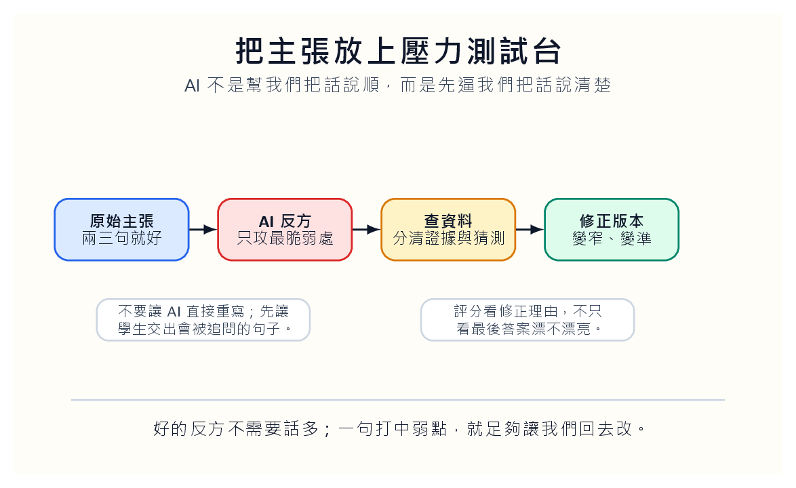
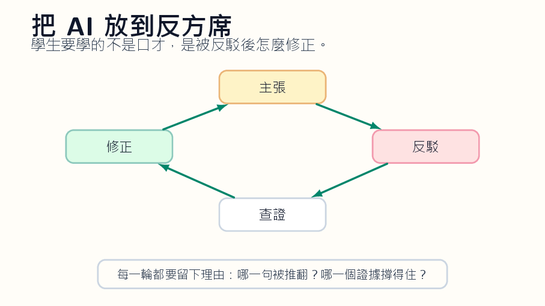
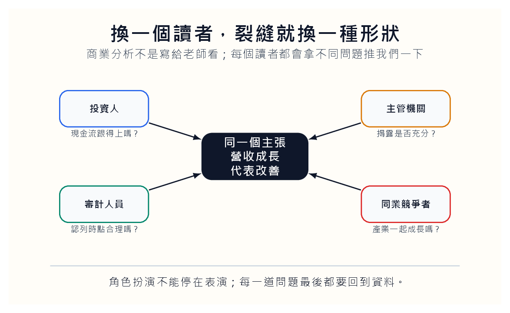

*學生先把自己的句子交出來，AI 只負責施壓；最後要留下修正理由。*

## 學生缺的常常不是意見，而是壓力

學生很少真的沒有意見。他們有直覺，有立場，也有一點在網路、課本、同儕那裡吸來的語句。問題是，這些意見太少被用力推過。它們平常被放在報告裡，看起來像結論；放到課堂討論裡，又常被我們用「很好，下一位」輕輕帶過。久了之後，學生會以為把話講完整，就是有主張。

AI 辯論教練的價值不在陪學生練口才。口才太容易騙人。真正值得訓練的是句子受壓之後的變形：它縮小了嗎？它多了限制嗎？它找得到資料嗎？它願不願意承認自己原本說太滿？

比如學生寫：「某公司營收成長代表營運改善。」這句話像分析，卻還沒有被追問。AI 反方可以立刻把它推到牆邊：營收成長是不是來自價格上漲？毛利率有沒有同步改善？應收帳款是不是變長？現金流跟得上嗎？同業是不是也一起成長？這些問題不是為了刁難學生，而是讓他第一次看見自己的句子其實站得很鬆。

## 先讓主張變小，才可能變硬

我會要求學生交四段材料。第一段是原始主張，只能用兩三句話，不准躲在長篇文字裡。第二段是支持證據，列出資料來源與數字。第三段是 AI 反方提出的最強反駁。第四段是學生修正後的主張。

評分重點不在 AI 問得多漂亮，而在學生如何處理。最好的答案通常不是原本立場全勝，而是變得更窄、更準、更有邊界。學生原本說「AI 會改善大學教學成效」，被追問後可能改成：「在大班基礎課中，AI 若被限制在形成性回饋與錯誤分類，可能減少教師重複批改時間；但是否改善學習成效，還要看學生是否閱讀並修正回饋。」後一句不華麗，但它開始能被檢查。

*好主張不是大聲，而是被追問後還有骨架。*

這就是 AI 反方適合進課堂的地方。它不會讓學生更會贏辯論，而是讓學生更不容易相信自己第一句話。這種不輕信自己，是分析能力的開端。

## 反方也要被查證

AI 反方不是裁判。它可能提出不存在的資料，可能把一個概念反駁過頭，也可能用很有氣勢的語句掩蓋空洞。這正好可以成為課堂材料。學生不能把 AI 的反駁照單全收。他要標記哪些反駁有資料支持，哪些只是可能性，哪些需要查證。

這樣一來，AI 同時扮演兩個角色：它是挑戰者，也是被檢查的對象。學生會發現，反方不是站在正確那一邊；反方只是逼你把話說清楚。這個差別很重要。如果學生以為 AI 反方一定比較聰明，他只是從相信自己，改成相信模型。那不是批判思考，只是換一個權威。

課堂可以把規則寫得很硬：AI 反方要提出最強版本，不准只挑語病；學生要查證反方，不准只說「我同意」；最後修正要說明哪一處被改變。沒有這些規則，AI 對話很快會變成一堆流暢泡沫。

## 換一個讀者，裂縫就不同

商業分析裡，一個主張很少只面對一種讀者。投資人會問現金流，審計人員會問認列時點，主管機關會問揭露是否充分，同業競爭者會問你是不是忽略產業共同因素。同一個句子，被不同角色推一下，裂縫會出現在不同地方。

*同一個主張，換一個讀者，就會露出不同問題。*

這種角色切換很適合用 AI 練習。讓 AI 依投資人、審計人員、主管機關、同業競爭者的角度各問一題。但角色扮演不能停在表演。每一道問題最後都要回到證據。投資人質疑現金流，就要看現金流量表；審計人員質疑認列時點，就要看收入認列條件；主管機關質疑揭露，就要看資訊是否足以讓外部人判斷。

學生會慢慢知道，一個好論點不是壓掉所有反對意見，而是知道哪些反對意見必須被正面回答。能回答，就留下；不能回答，就縮小主張。這不是退讓，是誠實。

## 修改不是失敗，是論點開始有重量

很多學生把修改視為失敗，好像原稿被改就表示自己不夠好。AI 反方可以把修改變成規則的一部分。每個人的主張都要被攻擊，每個人都要修正。當修改不再是個人能力被否定，而是課堂流程的一步，學生比較願意承認自己原本說太快。

教師可以把幾段修正前後的主張匿名拿到課堂上比較。不要只稱讚最後版本，而要指出中間變化：哪個詞被刪掉後更準，哪個限制加上後更可信，哪個證據讓主張從口號變成分析。學生看見這種變化，會比聽教師說「要批判思考」更有感。

批判思考不是姿態，是修改句子的手藝。AI 若能讓學生寫下「我原本錯在這裡」，它就已經不是玩具。那一刻，學生不是輸給模型，而是第一次看見自己的句子如何長出骨頭。
