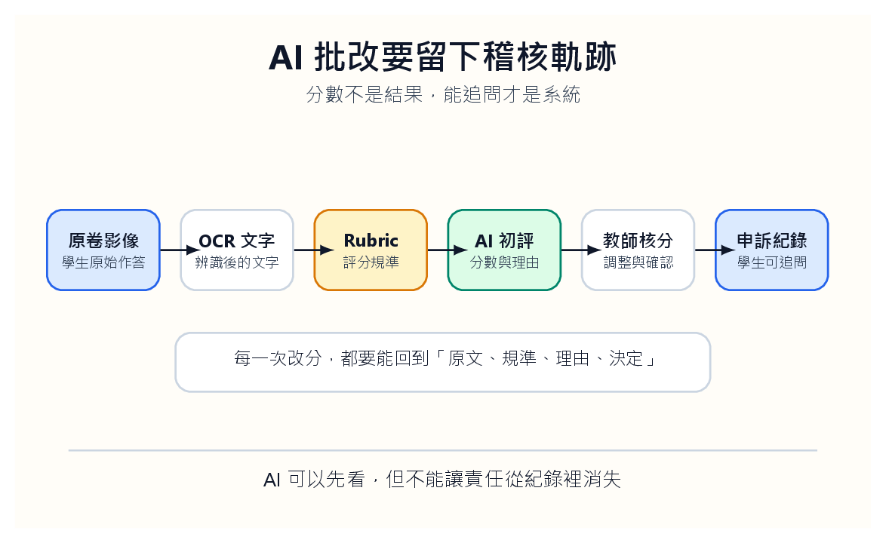
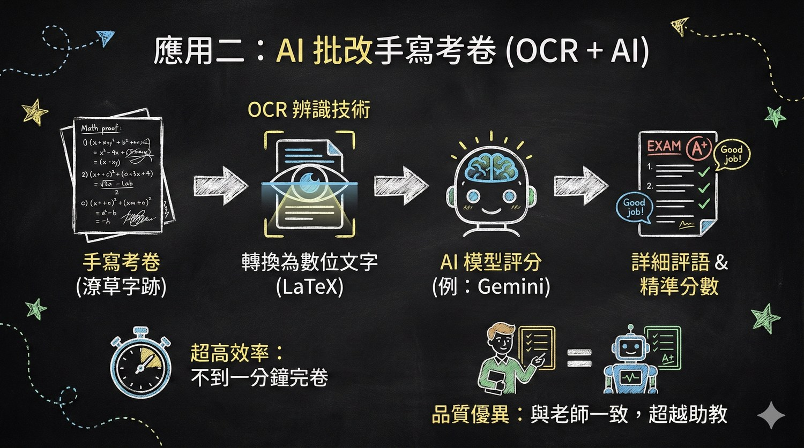
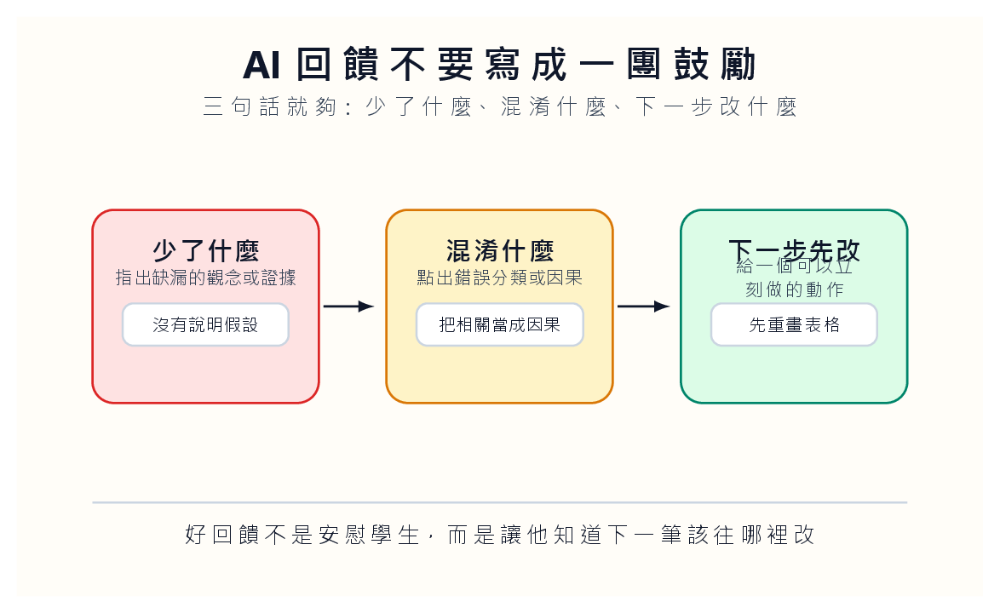

*分數不是輸出，是一條可以被追問、回放、修正的軌跡。*

## 最危險的不是 AI 打錯分，而是我們不知道它怎麼錯

AI 批改考卷很容易讓人興奮。紙本答案掃描，OCR 轉文字，模型依 rubric 初評，教師再確認。流程看起來很順，尤其面對大班課時，任何能少看一點重複答案的工具都很誘人。可是評量不是一般文書處理。分數一旦出現，就牽涉公平、解釋、申訴與學生對課堂的信任。

所以我不會先問 AI 能不能自動給分。我會先問：如果它錯了，我們能不能知道它在哪一步錯？是原卷掃描不清楚？OCR 把字讀錯？Rubric 寫得太含糊？AI 初評過度推論？還是教師最後核分時沒有留下理由？如果這些問題回答不了，系統就算準確率看起來很高，也還不能進正式評分。

AI 批改最該自動化的，不是分數，而是軌跡。每一個分數都要能回到原卷影像、OCR 文字、評分規準、AI 初評、教師修正與申訴紀錄。沒有軌跡的分數，只是一個看起來有效率的黑盒。

## 先讓 AI 做初評，不要讓它做裁判

比較穩的設計，是讓 AI 做初評與回饋草稿，不直接產生正式成績。它可以依照 rubric 找出可能缺漏，可以把答案分成幾種錯誤類型，可以提醒教師哪幾份答案需要優先看。這些工作有價值，因為它們讓教師把注意力放在最需要判斷的地方。

*流程可以自動化，裁判權不能自動交出去。*

正式成績仍要回到教師。這不是因為教師永遠比模型準，而是因為教師需要對分數負責。學生若來申訴，教師不能回答：「系統就是這樣判。」他必須能指出：原卷哪一句被判讀、rubric 哪一條被使用、AI 初評哪裡被採納、哪裡被修正。

這也會逼教師把 rubric 寫得更清楚。很多時候，不是 AI 不會批改，而是我們的規準原本就含糊。AI 進來後，模糊會被放大。它迫使我們把「分析有深度」「有連結決策」這類話拆成可觀察的行為。這件事本身就是一次評量設計的整理。

## 回饋要指到錯誤現場

AI 很會寫禮貌回饋，也很容易寫出沒用的禮貌。「你的答案方向正確，但仍可加強細節。」這句話不會傷人，也不會幫人。真正有用的回饋要指到錯誤現場：少了什麼，混淆什麼，下一步先改什麼。

*回饋不是安慰文字，而是讓學生知道下一步踩哪裡。*

例如學生把固定成本當成單位成本來算，AI 不該只說「請加強成本概念」。它應該指出：「你在第二步把固定成本除以產量，因此後面用單位成本判斷決策時出現偏差。先回到固定成本總額不隨產量變動這個前提。」這種回饋比較尖，但學生知道該改哪裡。

教師可以讓 AI 先產生回饋草稿，但要保留改寫權。尤其是語氣。太像客服的回饋會讓學生感覺自己在讀系統通知，不是在被老師教。好的評語不一定溫柔，但要準確；不一定長，但要讓學生能動。

## 申訴不是例外，是評量系統的一部分

很多人設計 AI 批改流程時，把申訴當成特殊情況。這是錯的。只要有分數，就會有申訴。申訴不是系統失敗，而是評量正常運作的一部分。真正成熟的流程，應該一開始就把申訴放進去。

學生提出疑問時，我們要能打開同一條軌跡：原卷影像、OCR 文字、AI 初評、教師修正、最後分數。若 OCR 讀錯，就修 OCR；若 rubric 不清，就修 rubric；若 AI 初評偏差，就修提示與檢查規則；若教師核分沒有理由，就補上理由。每一次申訴都不只是處理個案，也是在修評量系統。

這會讓教師比較累嗎？短期會。可是長期來看，它會讓分數更可解釋，也讓學生知道課堂不是把答案丟進機器。公平不是沒有錯，而是錯了能被看見、能被修正、能留下理由。

## 批改不是把人移走，而是讓人看對地方

AI 批改的理想狀態，不是教師完全不看考卷。那不是教育，是外包。比較好的狀態，是 AI 幫教師把重複辨識、初步分類、回饋草稿先整理好，讓教師把時間用在判斷、修正與回應學生。

這也改變我們對「效率」的理解。真正的效率不是更快產生分數，而是更快找到需要人處理的地方。哪幾份答案 OCR 不穩？哪幾題學生集體混淆？哪一條 rubric 最常造成爭議？這些訊號比單純省下批改時間更有價值。

如果 AI 讓教師少看學生，那它用錯了。如果 AI 讓教師看見過去看不到的錯誤分布、規準漏洞與申訴理由，那它才開始像教學工具。評量的核心不是速度，而是學生相信分數背後有人願意負責。
