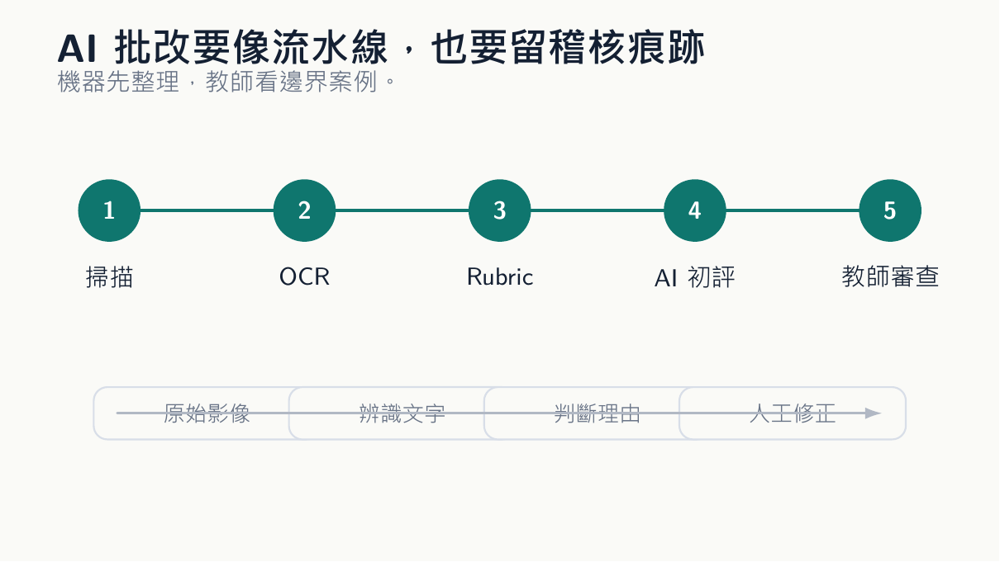

*概念圖呈現從紙本掃描到 AI 初評，再由教師抽查與修正的評量流水線。*

## 先別急著讓機器給分

桌上那疊考卷有一種壓迫感。不是因為它厚，而是因為每一張都在要求你重複同一件事：看懂字跡，對照標準答案，圈出錯誤，寫一兩句評語。批到最後，教師常常不是不想給回饋，而是手已經不聽話。於是評語越來越短，圈圈越來越多，學生拿回考卷時只知道自己少了幾分，卻不太知道下一次該怎麼辦。

先把原稿留住

OCR 加上 AI，確實能改變這個場景。考卷掃描後，文字被辨識出來，再交給模型依照 rubric 做初步判斷。它可以標出學生提到哪些概念、漏掉哪些步驟、哪一段可能答非所問。這聽起來很誘人，尤其在大班課裡最明顯。可是我會先踩煞車：這套流程最適合先做診斷，不適合一開始就拿來自動給分。

原因很簡單。考卷不是一般文件，分數會傷人，也會產生制度責任。OCR 可能把一個字看錯，AI 可能把模糊答案解讀得過度善意，也可能把學生不標準但合理的說法判成錯。這些錯誤若發生在草稿階段，教師可以修；若直接變成成績，就會變成不公平。比較穩的做法，是把整個流程拆成幾個可回頭檢查的層次。

第一層是原始影像，保留學生答案的照片或掃描檔。第二層是 OCR 文字，任何辨識錯誤都能回去對照。第三層是 rubric，明確寫出得分條件，不讓 AI 自己幻想標準。第四層是 AI 初評，它只能提出建議與理由。第五層才是教師審查，尤其要看低信心、邊界答案、意外高分與意外低分。

## 流程要能回頭檢查

我會特別要求 AI 在回饋裡引用學生原句。不要只說「學生未能完整說明成本動因」，而要指出是哪一句顯示他把成本動因和成本項目混在一起。沒有引用原句的評語，很容易變成空泛判斷。引用原句後，教師也比較容易檢查 AI 是否亂抓。這套流程的好處，不只是省時間。它也讓教師看見全班錯誤分布。

分數要能被追問

比如一題預算差異分析，若三分之一學生都在同一步出錯，這不是個別學生不努力，而是課堂上的某個概念沒有落地。AI 可以先把這些錯誤分類，教師再決定下一週要不要補一個十分鐘的小活動。這才是批改自動化比較有意思的地方：它讓考卷不只是成績表，也變成教學診斷資料。但資料保護不能輕描淡寫。

學生答案裡可能有姓名、學號、甚至個人描述。若使用外部服務，教師要先知道資料是否會被保存、是否會被拿去訓練、是否符合學校規範。能匿名就匿名，能本機處理就本機處理。不要為了省半小時批改，把學生資料送進自己也說不清的地方。還有一點很少被說：AI 批改會改變學生對公平的感覺。

若學生知道有機器參與，他會問得更細：「為什麼我這句沒有算？」「為什麼別人那樣寫可以？」這不是壞事。反而逼教師把 rubric 寫得更清楚。以前很多評分標準藏在教師腦中，現在必須外化，否則機器也無法照著做。

## 申訴時看得見理由

我願意使用 AI 批改，但我不願意讓它一鍵決定成績。它可以幫忙讀、幫忙分、幫忙寫第一版意見。最後那個紅筆，無論是實體的還是數位的，都應該握在人手上。學生可以接受老師嚴格；比較難接受的是，自己被一個沒有人願意說明的流程判定。考卷批改還有一個常被忽略的場景：學生申訴。

回饋要指到錯誤現場

傳統申訴常讓教師很累，因為要重新翻考卷、回想當時怎麼判、再用文字解釋。若 AI 批改流程有留下原始影像、OCR、rubric 對照、AI 初評和教師修正，申訴反而可以變得比較清楚。教師可以指出：這一分沒有給，是因為你少了哪個條件；這一處 AI 原本判低，但我人工調整了；

這一段 OCR 讀錯，所以以原卷為準。這種紀錄不是為了防學生，而是讓雙方都少一點猜。當然，紀錄越多，管理越麻煩。檔案命名、資料保存期限、誰能看、是否匿名，這些事都要先想。很多學校還沒有準備好這套制度，所以教師不該一開始就把全班正式考試丟進 AI 系統。

可以從低風險作業開始，例如練習題、小測、形成性評量。先用來找錯誤型態，不急著給正式分數。我也會提醒學生，AI 批改不是讓他們面對機器，而是讓教師有機會給更好的回饋。若最後學生只收到一堆罐頭評語，那這套系統失敗了。

真正好的結果，是教師能把時間省下來，看那些以前沒力氣看的答案：奇怪但有創意的解法、半對半錯的推理、表面算錯但概念清楚的學生。AI 應該把教師帶回判斷，而不是把教師推離判斷。

## 長回饋不等於好回饋

教師也要小心另一種誘惑：因為 AI 可以產生很長的回饋，就以為長回饋比較好。學生不需要每一題都收到一篇小作文。他需要一兩句能讓他知道下一步怎麼改的話。AI 很容易把簡單錯誤包裝成五句禮貌建議，反而讓學生抓不到重點。教師審查時應該刪，刪到評語能直接指向錯誤。

申訴不是例外情境

我會把 AI 回饋限制在三種句型：你少了什麼、你混淆了什麼、你下一步先改什麼。這不是讓語言變僵硬，而是讓回饋回到行動。比如「你把價格差異和數量差異混在同一段，先把公式拆開再解釋原因。」這種句子不華麗，但學生知道要做什麼。批改若不能讓學生下一次少錯一點，就只是分數管理。

有些教師會問，這樣做會不會讓批改變成一套冷冰冰的制度。我反而覺得，若設計得好，它會讓教師比較能保留人味。因為那些最機械的比對、轉錄、分類先被處理掉，教師才有時間寫出真正針對學生的句子。人味不是每一份考卷都手工處理；人味是學生在需要判斷的地方，真的遇到一個人。

所以 AI 批改系統的目標不該是「老師不用改」。這句話聽起來很省力，也很危險。比較好的目標是「老師把力氣用在最需要判斷的地方」。如果系統最後讓教師更少看學生答案，那它走錯了；如果它讓教師更快找到值得看的答案，那它才有教育價值。

## 把教師帶回判斷

我也會把幾份 AI 初評和教師修正後的版本保存下來，作為下次調整 rubric 的材料。如果同一種誤判反覆出現，問題可能不在模型，而在規準寫得太模糊。批改流程會反過來逼教師把「我心裡知道」的標準寫成別人也能檢查的文字。
