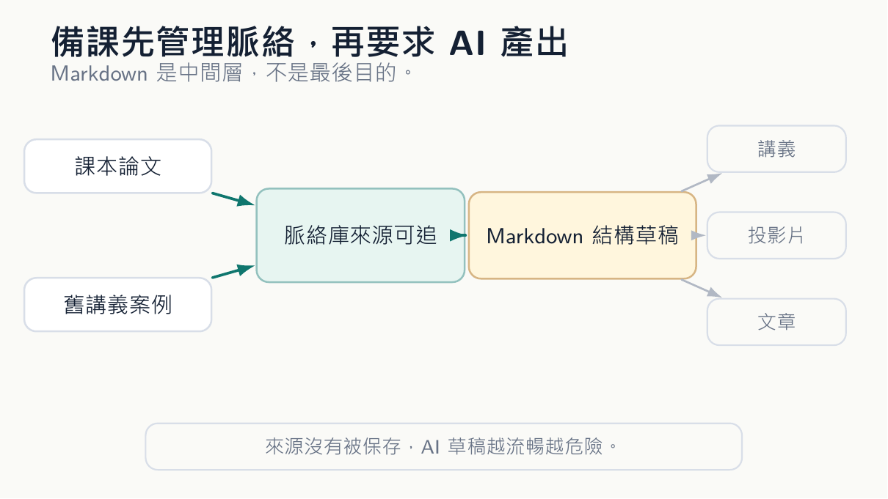

本文整理自「AI 輔助教學：授課教師的應用場景與實踐」簡報第 26-29 張，並改寫為知識站文章。

*概念圖呈現教材來源如何進入脈絡管理，再輸出成講義、投影片、學習單與知識站文章。*

## 為什麼這個主題值得獨立成一篇

備課最耗時的地方，往往不是沒有材料，而是材料散在不同地方。課本、論文、新聞、舊講義、投影片與個人筆記若沒有共同格式，AI 很難穩定協助整理。

Markdown 是很好的中間格式：它保留標題、段落、清單、引用與程式碼結構，又能轉成網頁、講義與投影片。

## 課堂中可以怎麼做

教師可以先把來源集中到資料夾或 NotebookLM 類工具，讓 AI 在明確來源中回答問題。接著要求 AI 依照課程對象產生草稿，再轉成 Markdown 檢查結構。最後輸出成學生講義、教師口述稿、課後練習或知識站文章。

這種流程的價值在於可重複使用。下次教授同一主題時，不是從零開始，而是在既有脈絡上迭代。

## 使用 AI 時要保留的判斷

AI 備課最容易忽略來源界線。教師應標記哪些內容來自自己、哪些來自公開資料、哪些只是 AI 的整理。引用與授權資訊要跟教材一起保存，不要讓 AI 把來源洗掉。
