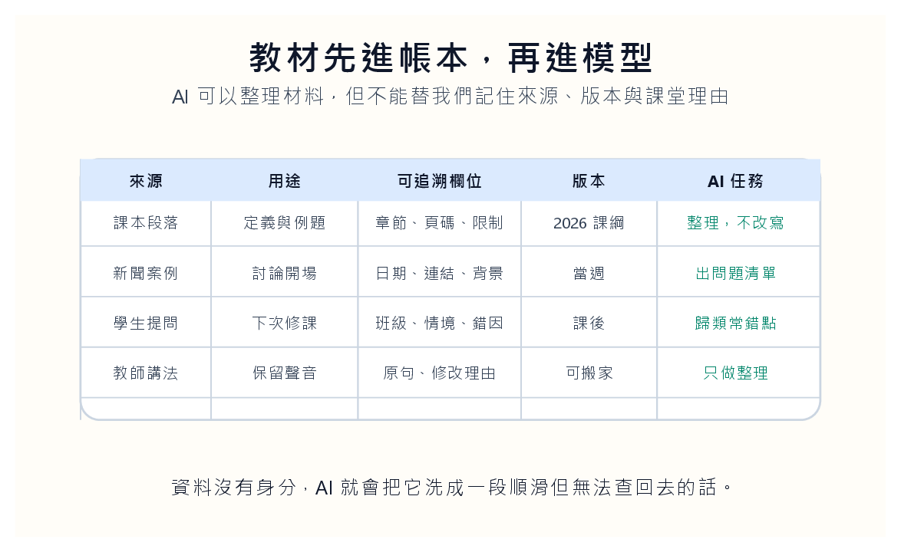
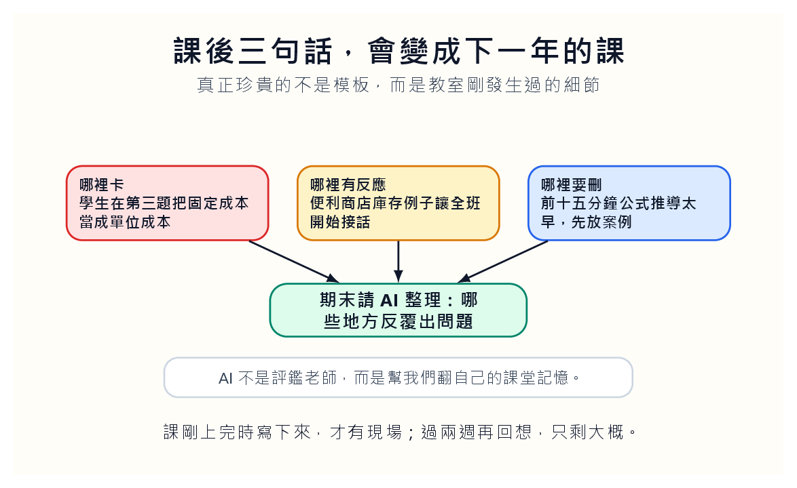

## 材料沒有身分，課就會失憶

很多教師的備課資料不像資料庫，比較像抽屜。某個案例藏在三年前的簡報裡，某篇文章躺在下載資料夾，某段自己講得很順的說明留在去年的 Word 檔，學生問過的一個好問題則沉在信箱深處。每次備課都像搬家。東西明明都在，只是找不到；找到了，也忘了當初為什麼留下。

AI 進來後，這個問題不會自動消失，反而可能變得更嚴重。你把一堆零散材料丟給模型，它會替你縫成一堂看起來完整的課。句子順了，段落齊了，標題也有了。可是如果材料沒有身分，AI 只會用自己的平均語氣把它們抹平。最後產出的不是你的課，而是一份沒有記憶的教材。

備課的第一步不是生成，是登記。這句話聽起來不浪漫，卻很重要。每一份材料至少要知道四件事：它從哪裡來，準備用在哪裡，哪一版改過，AI 可以對它做什麼。課本段落可以被整理，但不能被改寫成沒有頁碼的說法。新聞案例可以被轉成討論題，但日期與背景不能消失。學生提問可以被歸類，但不能被洗成一個抽象的「常見問題」。

材料先有身分，AI 才不會把來源洗成一段查不回去的順滑文字。

我會多留一欄，叫「為什麼現在不用」。很多材料不是不好，只是時機不對。某個新聞案例很精彩，但學生還沒學到必要概念；某篇論文很適合研究所，不適合大二；某個商業故事很吸引人，可是會把課堂帶到旁枝。把不用的理由寫下來，明年回來看時，教師才不會又被同一份材料誘惑一次。備課的成熟，不只在會收集，也在知道何時先放下。

我還會替材料加上「入口難度」。有些材料本身很好，但需要三個前置概念；有些材料不深，卻能讓學生立刻進入問題。教師若只看材料品質，很容易把課備成自己的閱讀清單。入口難度讓我們記得，教材不是給教師收藏的，而是給學生走進來的。

## Markdown 只是讓材料安靜下來的桌面

我偏好 Markdown，不是因為它時髦，而是因為它樸素。標題就是標題，引用就是引用，清單就是清單。它不像簡報那樣急著美化，也不像 Word 那樣容易把格式問題推到前面。備課時先用 Markdown 寫出一堂課的骨架，我們就比較不會被外觀騙走。

一堂課的骨架可以很簡單：這堂課要處理哪個誤解？學生進教室前已經知道什麼？我們要用哪個例子讓他們卡住？最後希望他們帶走哪一道問題？這些問題還沒寫清楚之前，叫 AI 幫我們「做一堂課」通常只會得到一份漂亮大綱。漂亮大綱最危險的地方，是它讓教師誤以為自己已經備課。

AI 可以幫我們把材料轉成不同形式，但形式不能早於課堂判斷。

Notion 可以當工作桌，NotebookLM 可以協助在來源裡查找，Markdown 則像砧板。砧板不負責做菜，但沒有砧板，材料會散得到處都是。現在的備課不是把每個工具都用上，而是讓工具各自待在它該待的位置。來源管理、文本骨架、生成輔助、版本保存，這些工作若混在一起，教師很快就會失去對教材的控制。

Markdown 還有一個好處：它讓刪改比較誠實。簡報裡刪掉一頁，很快就不見；Word 裡改掉一段，也容易被格式遮住。Markdown 搭配版本紀錄，能讓我們看見一門課如何被修改。哪一段被刪，哪個案例被換，哪個小標改成問題句，這些都是教學判斷。AI 可以幫我們整理差異，但它不能替我們決定哪些差異值得留下。

我會替每次改版寫一句 commit message 式的註記。不是技術潔癖，而是讓未來的自己知道當時為什麼改。比如「把公式推導移到案例後，因為學生上週太早卡住」「刪掉報導連結，因為討論偏離成本習性」。這些註記比漂亮檔名有用。檔名只告訴我們版本，註記告訴我們判斷。

**教材也需要刪除理由**

我會要求自己不只記錄新增了什麼，也記錄刪掉了什麼。刪掉一個案例，可能是因為它過時；刪掉一張圖，可能是因為學生每年都誤讀；刪掉一段理論，可能是因為它放在這裡太早。這些理由若不寫下來，明年很容易又把同一段放回去。備課不是累積越多越好，而是讓每一段留下來都有理由。

## 課後三句話，比十頁大綱值錢

備課還有一個常被忽略的部分：課剛上完的那十分鐘。那時候教師最知道哪裡不順，哪個例子有效，哪個活動拖太久，哪個學生的問題其實問到了核心。可惜我們通常太累，關掉電腦，明年再來。等到明年，現場已經蒸發，只剩模糊印象。

我會在每堂課後留下三句話：哪裡卡，哪裡有反應，哪裡要刪。不要寫長，也不要寫得像正式報告。比如：「學生在第三題把固定成本當成單位成本。」「便利商店庫存例子讓全班開始接話。」「前十五分鐘公式推導太早，明年先放案例。」這些句子很粗，卻是教材記憶的礦脈。

AI 可以幫我們翻自己的課堂記憶，但記憶必須先被教師寫下來。

期末時，AI 很適合讀這些課後筆記，幫我們整理哪些單元最常出問題、哪些案例值得保留、哪些活動浪費時間。這不是讓 AI 評價教師，而是讓它幫我們翻自己的記憶。真正的判斷仍然在人手上，但我們不用每次都從一堆散落的片段裡重挖。

這三句話最好在下課後立刻寫，不要等晚上。晚上寫出來的常是理性版本，現場感已經被修飾過。真正有用的是那種還帶著疲累的句子：「這裡全班靜掉」「這題太早」「學生以為變動成本就是可控制成本」。這些句子不漂亮，卻能讓下一年的自己直接回到教室。

學生問題也要回流進教材。很多課堂修改不是來自教師突然想通，而是某個學生問了一句讓人停住的話。這種問題如果只在課堂上被回答一次，很可惜。它應該進到下一版講義旁邊，成為提醒：這裡有一個學生曾經這樣誤解，明年要先鋪橋。

我會把學生問題分成兩種。一種是個別問題，只需要當場回答；另一種是結構問題，表示教材本身沒有把橋搭好。若三個學生在不同年份問到同一個地方，那就不是學生粗心，是教材欠他們一個台階。AI 可以幫我們整理問題頻率，但教師要判斷：這是學生的缺口，還是教材的缺口。

## 來源被洗掉，課就開始不像自己

AI 很會把來源洗成一段順滑文字。順滑到你忘了它原本來自哪裡，也忘了哪一句是自己多年前在課堂上講出來的。這對教學很危險。教師可以整理，可以改寫，可以轉述，但不能讓來源消失。不是為了形式，而是為了讓學生知道知識不是空中掉下來的句子。

當我們把所有材料都交給模型平均化，課堂會變得很像網路文章。句子都對，結構也順，卻沒有自己的手紋。學生不一定說得出哪裡不對，但他們會感覺那堂課不像你。它不會提到某一年學生曾經怎麼誤解，不會留下你自己踩過的坑，也不會在某個地方停下來說：「這裡最容易錯。」

好的教材常有一點不平整。那不是瑕疵，而是可信的地方。它讓學生知道，這門課不是剛剛由模型吐出來的，而是有人教過、改過、失敗過、重新想過。

我會保留一些「講得不夠漂亮但有效」的句子。例如課堂上臨時說出的比喻，或學生聽懂後全班笑了一下的說法。這些句子放進正式講義未必高雅，但它們知道學生的入口在哪裡。AI 很可能把它們改得更順，也改得更沒有用。備課時要有一點保護粗糙的勇氣。

這不代表拒絕修辭，而是要知道哪些粗糙有功能。某句話如果只是懶得改，當然該修；但某句話如果保留了課堂裡的轉折、停頓或學生能懂的入口，就不能隨便交給 AI 磨平。教材不是文學比賽，教材要能把學生帶到概念前面。

這裡有一個很細的判斷：順不一定比較好。順的句子讓人滑過去，粗糙的句子有時讓人停一下。教學需要某些停頓。學生在那裡停，才會發現自己原來沒有懂。AI 最擅長移除停頓，所以教師要知道哪些停頓是噪音，哪些停頓是學習入口。

## 保留課堂的手紋

教師應該有一個很私人的教材資料夾。裡面放的不是最漂亮的版本，而是最有用的痕跡：學生問過的怪問題，自己講錯後修正的例子，某年某班特別有效的活動，某個失敗但值得保留的比喻。這些東西 AI 不會替我們發明。它可以幫忙整理，但不能替我們經歷。

AI 備課最好的樣子，不是全自動生出一堂課，而是讓一門課越教越有記憶。每一年多一點註記，多一點刪改，多一點學生反應。十年後打開資料夾，我們不只看到教材，也看到一門課如何慢慢長成。

所以，備課不要急著問 AI 能生成什麼。先問我們留下了什麼。沒有留下現場，再快的生成都只是資訊。留下了現場，AI 才有東西可以整理。教材不是資料的集合，而是一門課被反覆教過之後留下的紋路。

一門課真正的財產，不是最終版投影片，而是那些讓最終版變成現在這樣的痕跡。哪一年刪掉一個章節，哪一次把公式往後放，哪個學生問題逼我們重寫例子。AI 可以幫我們把這些痕跡排好，但教師要先承認：教材不是一次完成的作品，而是一段持續修正的關係。

所以備課資料夾不應該只追求整齊。它要能回答三個問題：這份材料從哪裡來？這段講法為什麼留下？這個版本和上一版相比，教師學到了什麼？若資料夾能回答這些問題，AI 才有東西可以整理；若不能，AI 再會生成，也只是替失憶的課堂做一次漂亮包裝。
