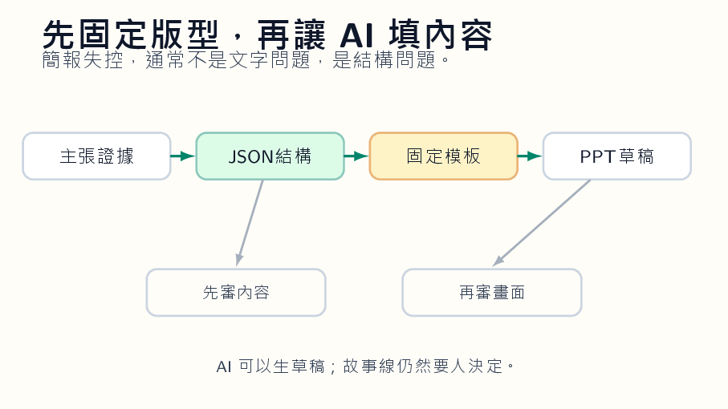

*概念圖顯示 AI 簡報生產線：先讓內容結構化，再套用版型，最後由人做敘事與視覺審查。*

## AI 太會把頁面填滿
AI 做簡報最常見的災難，不是它不會寫字，而是它太會填滿。每一頁都有標題，每一頁都有三個點，每一頁都像剛從同一個模子壓出來。字很多，圖很滿，語氣很正面。看起來像簡報，其實像一份被切成二十頁的報告。觀眾坐在台下，很快就失去耐心。
問題不在 AI 不會設計，而在我們把太多決定交給它。簡報有兩件事不能混在一起：內容結構和畫面版型。內容結構回答「這一頁要說什麼」。畫面版型回答「這句話要怎麼被看見」。如果你叫 AI 同時決定兩件事，它通常會用平均值處理：每頁一個標題、三個項目、一張不痛不癢的圖。安全，無聊，也很像機器。
比較好的方法是先讓 AI 輸出 JSON 或其他結構化格式。每一頁只保留幾個欄位：頁面主張、必要證據、圖表需求、講者備註、資料來源。不要讓它急著排版。這一步像寫分鏡，不是做海報。人可以很快檢查：這一頁有沒有主張？證據是否對應？順序是否合理？哪一頁只是填空？
接著才套固定模板。模板決定字體、頁碼、標題位置、圖表區域、留白。這聽起來很死板，其實正是簡報能正式使用的原因。好的簡報不是每一頁都自我表演，而是讓聽眾不用重新學一套視覺規則。當版型穩定，注意力才會回到內容。
## 先寫分鏡，不要先排版
我會要求學生做一個練習：先交 JSON，不准交 PPT。這會讓很多問題提早露出來。有人會發現自己每一頁都沒有主張，只是放資料。有人會發現圖表需求寫得很空：「放一張趨勢圖」。趨勢圖要支持哪一句話？看哪個期間？比較誰和誰？如果這些說不清，PPT 做得再漂亮也只是裝飾。
AI 在簡報工作流裡適合當整理員，不適合當總導演。它可以幫忙把長文變成頁面草稿，可以把資料整理成表格，可以建議哪裡需要圖。但它不知道你站在台上時哪一頁需要停頓，哪一句話要先丟出去讓聽眾皺眉，哪個例子不能刪。這些是演講者的判斷。
很多簡報失敗，是因為作者把「我知道的東西」全放上去，而不是放「聽眾下一步需要知道的東西」。AI 會加劇這個毛病，因為它很會把資料堆得整齊。整齊不是清楚。清楚常常意味著刪除，甚至是忍痛不說。模型不會替你心痛，它只會繼續補。
因此，AI 簡報生產線要有人工審查。第一輪審故事線：每頁是否推進同一個問題？第二輪審證據：資料是否支撐主張？第三輪審畫面：字是否過多，圖是否說話，空白是否足夠。這三輪審查不需要寫成華麗流程，但需要真的做。否則你只是用 AI 更快地做出一份平庸簡報。
## 每一頁只做一件事
真正好的 AI 簡報，不會讓觀眾感覺「這是 AI 做的」。它會讓觀眾感覺講者很清楚自己要說什麼。工具退到後面，判斷站到前面。那才是簡報該有的位置。
我會讓學生做一個殘酷練習：把每頁投影片縮成一句話。如果縮不出來，表示那頁不該存在，或者它其實包含兩三頁的內容。AI 很會把一頁塞滿，學生也很容易接受，因為滿滿的畫面看起來像努力。但簡報不是倉庫。每頁只能承擔一個動作：提出問題、給證據、轉折、比較、收束。多了就散。
資料圖也不能讓 AI 隨便選。長條圖、折線圖、散點圖、表格，各自有它適合說的話。若學生說不出為什麼用這張圖，就先不要放。AI 可以建議圖形，但人要檢查圖是否真的支撐主張。很多簡報失敗，是因為圖表只是「有資料」的痕跡，不是論證的一部分。觀眾看完圖，仍然不知道講者要他相信什麼。
最後一輪審查最好用朗讀。把講者備註念出來，看每一頁能不能自然接到下一頁。AI 生成的簡報常有一種頁面之間互不相欠的毛病，每頁都完整，整場卻沒有推進。朗讀會抓出這個問題。人一開口，就知道哪裡卡、哪裡重複、哪裡像不是自己會說的話。簡報終究是要被說出來的，不是只被下載。
## 刪除也是能力
還有一個簡單測試：把投影片列印成縮圖，一頁只有拇指大小。如果縮圖上看不出重點，那張投影片大概也不會在投影幕上說話。AI 生成的頁面常在全螢幕看似豐富，縮小後只剩一團字。這個測試很殘忍，但有效。它逼作者承認，有些資訊應該進講稿，不該上畫面。
模板不是創意的敵人。對多數教學簡報來說，模板是救命繩。它限制字數，固定圖表位置，讓學生或聽眾知道眼睛該往哪裡去。真正的創意不在每頁換一種花樣，而在你怎麼安排問題、證據與停頓。AI 可以幫忙生出材料，模板幫你管住材料，人負責決定哪一頁值得留下。
如果要讓學生真正理解簡報，還可以讓他們做反向作業：給一份 AI 生成的糟糕簡報，要求他們只刪不加。刪到剩下一半頁數，刪到每頁只剩一句主張，刪到圖表能說明那一句話。這個練習比要求他們做新簡報更有效，因為它讓學生感受到簡報的本質是取捨，不是填滿。
我也會要求每份 AI 簡報保留資料來源頁，但不要把來源塞進每一張投影片。演講時畫面要乾淨，事後查證要完整。這兩件事可以分開。很多學生把所有資訊放上畫面，是因為怕被說不完整。其實完整應該放在備查資料裡，投影片只負責讓人當下聽懂。
## 用耳朵檢查簡報
還可以要求學生交一份「刪除清單」：哪些頁面被刪，哪些圖表被換，哪些文字被移到講稿。這份清單會讓教師看見學生的取捨能力。AI 生出內容不難，難的是學生敢不敢說這一頁不需要。敢刪，通常才表示他真的知道自己要講什麼。
投影片還有一個人味來源：講者知道哪裡要停。AI 生成的簡報通常一路平推，沒有停頓，也沒有沉默。可是課堂或演講裡，停頓常常比多一頁內容更有力量。你提出一個問題，讓聽眾想三秒，再放出資料；你放出一個反例，先不要解釋，讓不舒服存在一下。這些節奏不會自然出現在自動生成的檔案裡。它們必須由人放進去。
所以我會把最後一道檢查交給耳朵。把簡報從頭講一次，哪裡不像自己會說的話，就改。AI 可以幫你排材料，但不能替你站上台。
最後留下的，應該是講者的聲音。
