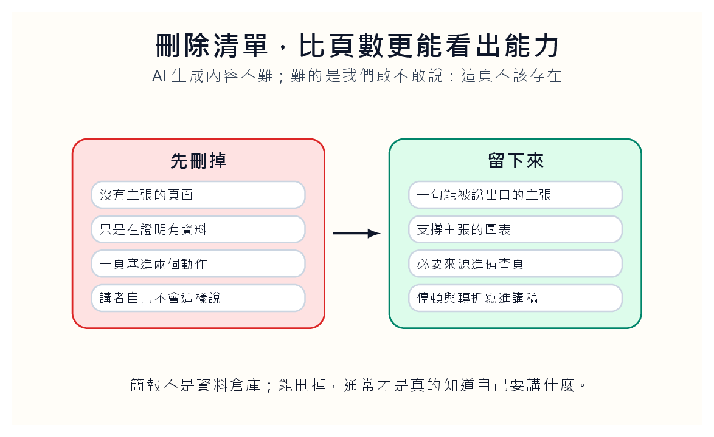
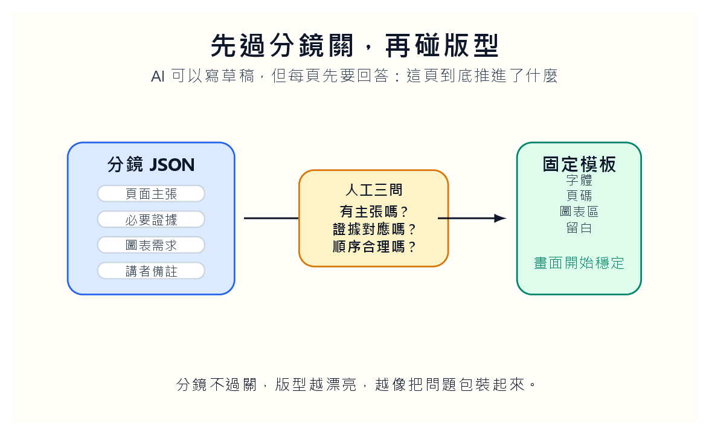

## AI 會把「看起來像簡報」做得太快

AI 做簡報最常見的災難，不是它不會寫字，而是它太會填滿。每一頁都有標題，每一頁都有三個點，每一頁都有一張看起來合理的圖。畫面很滿，語氣很正面，格式很整齊。看起來像簡報，其實像一份被切成二十頁的報告。

這種簡報最麻煩的地方，是它不會立刻顯得荒謬。它有頁碼，有標題，有項目符號，有圖表。學生會覺得自己完成了，教師也可能一眼掃過覺得還行。可是觀眾坐在台下，很快會感覺不到推進。每一頁都完整，整場卻沒有方向。

問題不在 AI 不會設計，而在我們把太多決定交給它。簡報有兩件事不能混在一起：內容結構和畫面版型。內容結構回答「這一頁要推進什麼」。畫面版型回答「這件事要怎麼被看見」。如果我們叫 AI 同時決定兩件事，它通常會用平均值處理：安全、整齊、無聊。

我會讓學生保留一頁空白頁。那頁不是漏做，而是故意留下來問自己：如果這裡沒有內容，整場會不會更清楚？很多人第一次做 AI 簡報時，最害怕空白，好像沒有把版面塞滿就表示準備不足。可是講者真正需要的不是滿，而是可被聽見。空白有時是讓一句話被聽見的時間。

還有一種更隱密的危險，叫三點式幻覺。AI 很愛把任何主題拆成三點，因為三點看起來完整，也方便排版。可是三點不一定是思考，有時只是版型在替我們決定節奏。若一頁明明只需要一個衝突，AI 也會補出另外兩個看似合理的項目。這時學生要學會問：這三點真的是三個必要推論，還是只是模板需要三格？

我會讓學生在第一版簡報旁邊寫一份「填滿紀錄」。哪些頁是 AI 自動補出來的？哪些圖表不是原本問題需要，只是看起來像簡報該有？哪些段落在講者開口時其實用不到？這份紀錄會讓學生第一次看見，AI 不是只幫他完成簡報，也偷偷替他做了很多不一定必要的決定。

能刪掉，通常才表示我們真的知道自己要講什麼。

## 先寫分鏡，不要先排版

我會要求學生先交分鏡，不准先交 PPT。分鏡可以是 JSON，也可以是一張表。每一頁只保留幾個欄位：頁面主張、必要證據、圖表需求、講者備註、資料來源。這一步不是做海報，而是檢查每一頁有沒有存在的理由。

分鏡不過關，版型越漂亮，越像把問題包裝起來。

這個練習會讓很多問題提早露出來。有人會發現自己每一頁都沒有主張，只是在放資料。有人會發現圖表需求寫得很空：「放一張趨勢圖。」趨勢圖要支持哪一句話？看哪個期間？比較誰和誰？如果這些說不清，PPT 做得再漂亮也只是裝飾。

AI 在簡報工作流裡適合當整理員，不適合當總導演。它可以把長文拆成頁面草稿，可以把資料整理成表格，可以建議哪裡需要圖。但它不知道你站在台上時哪一頁要停頓，哪一句話要先丟出去讓聽眾皺眉，哪個例子不能刪。這些是講者的判斷。

課堂上我會要求學生把分鏡念出來。不是念投影片，而是念每一頁的「動作」。第一頁提出什麼問題，第二頁讓聽眾看到哪個矛盾，第三頁放哪一個證據，第四頁要不要讓觀眾先停兩秒。如果念不出動作，表示那一頁只是資料停車格，不是簡報的一部分。

我也會要求每張投影片寫一句「不說什麼」。這不是玩文字遊戲。簡報失控常常不是因為說得太少，而是沒有決定哪些東西暫時不說。學生若在分鏡階段寫下「本頁不討論公式推導」「本頁不比較同業」「本頁不談政策意涵」，他就比較不會在排版時被資料誘惑。好的投影片不是一張小百科，而是一個被限制過的動作。

分鏡還要有一欄叫「聽眾下一步」。這一頁講完後，聽眾應該更想知道什麼？如果答案是「下一頁內容」，那太空。比較好的答案是：「他會想知道現金流為何沒有跟上營收」「他會想知道這個比率和同業差多少」。簡報的推進不是頁碼往前，而是聽眾的問題被一步一步帶出來。

## 一頁只能做一件事

很多簡報失敗，是因為作者把「我知道的東西」全放上去，而不是放「聽眾下一步需要知道的東西」。AI 會加劇這個毛病，因為它很會把資料堆得整齊。整齊不是清楚。清楚常常意味著刪除，甚至是忍痛不說。

每一頁只應該做一個動作：提出問題、給證據、轉折、比較、收束。多了就散。資料圖也不能讓 AI 隨便選。長條圖、折線圖、散點圖、表格，各自適合說不同的話。若學生說不出為什麼用這張圖，就先不要放。

AI 可以產生材料；簡報是否成立，要回到人對節奏與取捨的判斷。

真正好的 AI 簡報，不會讓觀眾感覺「這是 AI 做的」。它會讓觀眾感覺講者很清楚自己要說什麼。工具退到後面，判斷站到前面。那才是簡報該有的位置。

會計課裡尤其如此。學生常想把比率、公式、表格、管理意涵一次塞進同一頁。可是聽眾一次只能跟上一個推論。若這一頁要講毛利率下降，就不要同時講存貨週轉和現金流。那些可以留到下一頁。簡報不是把所有知識攤開，而是安排聽眾一步一步走過我們的判斷。

我會讓學生做一個「一頁一句話」測試。每張投影片先不用看畫面，只看一句話：如果聽眾只記得這一句，這頁值不值得存在？若那句話寫成「介紹公司財務狀況」，這頁大概還沒想清楚。若寫成「營收上升沒有同步變成現金，管理者不能只看成長率」，畫面就有方向了。AI 可以幫我們排字，但這一句話不能讓 AI 代決定。

## 刪除清單比新增頁面更重要

我會讓學生交一份刪除清單：哪些頁面被刪，哪些圖表被換，哪些文字被移到講稿。這份清單比頁數更能看出能力。AI 生出內容不難，難的是學生敢不敢說這一頁不需要。

還有一個簡單測試：把投影片列印成縮圖，一頁只有拇指大小。如果縮圖上看不出重點，那張投影片大概也不會在投影幕上說話。AI 生成的頁面常在全螢幕看似豐富，縮小後只剩一團字。這個測試很殘忍，但有效。它逼作者承認，有些資訊應該進講稿，不該上畫面。

模板不是創意的敵人。對多數教學簡報來說，模板是救命繩。它限制字數，固定圖表位置，讓聽眾知道眼睛該往哪裡去。真正的創意不在每頁換一種花樣，而在你怎麼安排問題、證據與停頓。

我也會讓學生交一份「講稿搬家紀錄」。哪些字從投影片搬到講者備註，哪些細節搬到備查資料，哪些圖表被換成一句話。這份紀錄會逼學生承認：不是所有重要資訊都應該上螢幕。有些內容需要被保留，但不該站在第一排搶走注意力。

備查資料也要被設計。很多人把刪掉的表格丟到最後，像垃圾場。比較好的做法，是讓備查頁回答特定追問：資料來源在哪裡？計算公式怎麼來？若聽眾質疑比較基準，有哪張表能補上？這樣投影片前台可以乾淨，後台也不會空。AI 最適合幫忙整理後台，但前台要不要乾淨，仍然是講者的選擇。

刪除清單也可以成為評分的一部分。學生要說明刪掉某頁後，哪一頁承接它原本的工作；若刪掉的是資料表，備查資料裡要放哪裡；若刪掉的是論點，是否代表整個故事變窄。這樣刪除就不是任意減量，而是一種可被追問的設計判斷。

## 最後一道檢查交給耳朵

AI 生成的簡報常有一種毛病：每一頁都能獨立存在，整場卻沒有推進。朗讀會抓出這個問題。把講者備註念出來，看每一頁能不能自然接到下一頁。人一開口，就知道哪裡卡、哪裡重複、哪裡像不是自己會說的話。

簡報終究是要被說出來的，不是只被下載。AI 可以幫我們排材料，但不能替我們站上台。最後留下的，應該是講者的聲音。畫面要乾淨，備查資料要完整，這兩件事可以分開。投影片負責讓人當下聽懂；資料來源頁負責讓人事後查證。

一份好的 AI 簡報，不是生成得快，而是刪得準、停得住、說得像人。空白不是偷懶。很多時候，空白正是講者終於知道自己要說什麼的證據。

我會請學生錄一次三分鐘彩排，不看畫面，只聽聲音。若講者一直在唸螢幕，表示投影片偷走了人的工作；若講者一直解釋畫面看不懂的地方，表示畫面沒有把路鋪好。好簡報會讓人有話可說，也讓畫面懂得退後。AI 生成的頁面若通不過耳朵，就還不是簡報。

彩排後要留下「卡點紀錄」。哪一頁講者停住了？哪一張圖需要太多解釋？哪一個轉場聽起來像硬接？這些卡點比成品更有價值。它們讓學生知道簡報不是檔案，而是一段現場行動。AI 可以幫我們把檔案做快，卻不能替我們承擔現場的沉默。
