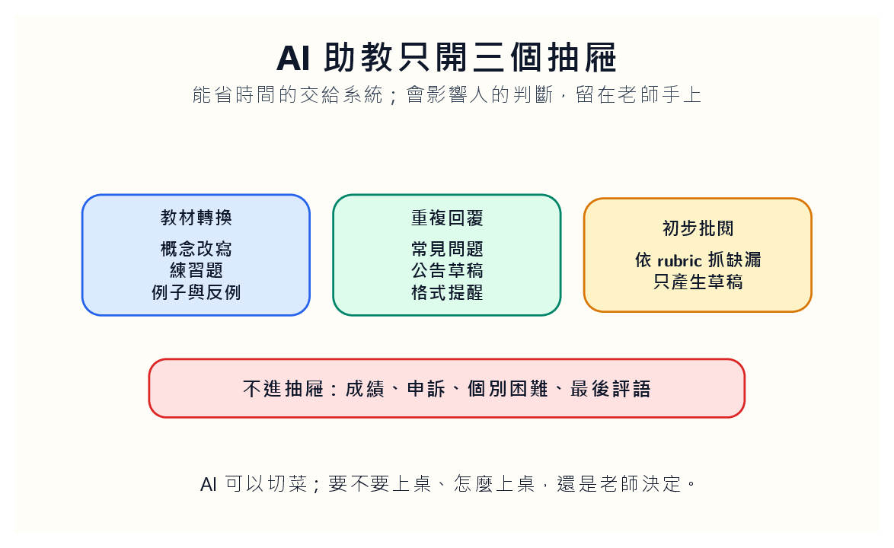
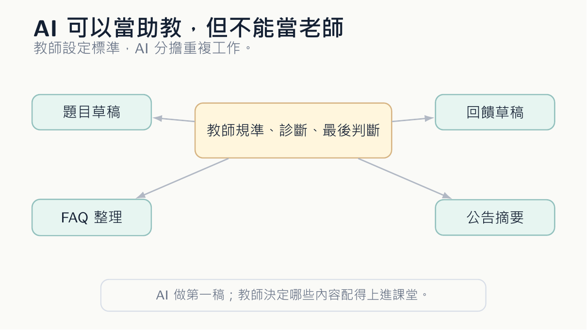
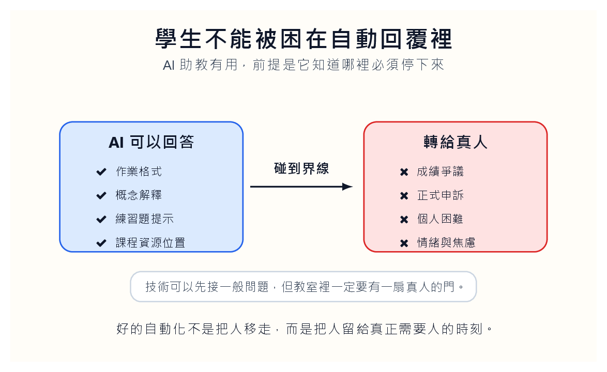

能省時間的交給系統；會影響人的判斷，留在老師手上。

## 教師最先被消耗的，不是理念，是體力

晚上十一點半，信箱跳出第七封類似的信：「老師，請問作業第三題的意思是什麼？」這不是壞事。學生願意問，表示他還在題目裡。麻煩的是，同樣問題已經出現好幾次。教師回第一封時很完整，回第五封時開始簡短，回第十封時只想把題目重新寫一遍。

沒有 TA 的課，常常不是教學理念輸了，而是體力輸了。教師知道應該多回一點、多看一眼、多補一句，可是一天只有那些時間。AI 在這裡的價值很樸素：它不怕重複。它可以把同一段概念改寫成三種難度，可以把講義轉成檢核題，可以把常見問題整理成 FAQ，可以依 rubric 先寫一版回饋草稿。

但我不喜歡把 AI 說成「取代 TA」。真正的 TA 不只是回覆問題。他會知道哪個學生常卡在同一種錯誤，會聽出一句話背後的焦慮，會在課後提醒老師某個例子全班都沒聽懂。AI 沒有這種課堂記憶。它能做的，是把重複工作先攤平，讓教師有力氣回到那些需要人的地方。

這也是我不願意把它包裝成效率神話的原因。效率如果只是讓老師回信更快、改卷更快、公告更快，最後可能只是讓教師被期待做更多事。AI 助教比較好的用法，是讓教師有勇氣拒絕一些低價值的忙碌，把時間還給課堂裡真正會改變學生的互動。

我會先替一門課寫下「服務水位」。哪些問題學生可以期待二十四小時內得到系統回覆，哪些問題必須等老師，哪些問題不是這門課該回答。這看起來像行政細節，其實是保護教師，也保護學生。沒有服務水位，AI 助教很容易讓學生以為課程永遠在線上，老師永遠應該立刻出現。

服務水位也是一種班級治理。課堂不是便利商店，教師也不是客服。學生當然需要被支持，但支持不等於任何時間都有人回。AI 助教若沒有邊界，最先受傷的不是系統，而是師生之間對時間的想像。學生會習慣即時回覆，教師會被迫補上 AI 回答不了的所有灰色地帶。到最後，技術沒有減輕工作，只是把等待變成新的焦慮。

## 三個抽屜，三條界線

我會把 AI 助教限制在三個抽屜裡。第一個抽屜是教材轉換：把課堂概念改成練習題、比較表、例子、反例。第二個抽屜是重複回覆：把常見問題整理成公告或 FAQ。第三個抽屜是初步批閱：依照明確 rubric 抓出可能缺漏。

這三個抽屜都可以省時間，但都不能碰最後判斷。成績、申訴、個別困難、正式評語，不能讓 AI 自己決定。這不是保守，而是責任的位置不能模糊。學生收到一段回饋，他面對的不該是一個無人稱系統，而應該是願意為這段話負責的老師。

AI 可以接走重複，但不能接走責任。

最容易出事的是語氣。AI 很會寫那種聽起來客氣、實際上沒有觸感的回饋：「你的回答已經具備基本方向，但仍可加強分析深度。」學生看了不會生氣，也不會改進。真正有用的回饋常常更小，也更尖：「你把固定成本當成單位成本在算，所以後面整個判斷歪掉。」這句不漂亮，但學生知道要改哪裡。

所以三個抽屜之外，還要有一個鎖起來的抽屜。裡面放成績、個人狀況、申訴、學習焦慮、缺席原因，以及任何會影響學生被如何看待的資料。這些東西不是不能使用科技協助整理，而是不能讓系統自己回覆。教師要知道自己在哪裡親自出面。若這條線不清楚，AI 助教很快會從幫忙變成擋箭牌。

每一次人工介入也要留下紀錄。不是為了監控，而是讓教師看見 AI 助教在哪裡經常停下。若一週內有十位學生都被轉到同一個概念，問題可能不在學生，而在講義或作業說明。AI 助教的停下來，其實是在替課程指路：這裡需要重講，這裡需要改題目，這裡需要一個更好的例子。

**便利最容易越界**

真正危險的不是 AI 助教答錯一次，而是它答得太方便。方便會讓人不知不覺把更多東西交出去。今天讓它回覆格式問題，明天讓它回覆成績問題，後天讓它安慰一個明顯需要老師聽見的學生。每一步都看似合理，最後責任就被切成碎片，沒有人真的站在學生面前。好的系統設計，要在方便之前先放幾道門檻。

## 不要把老師的聲音洗掉

教師使用 AI 當助教時，要保留自己的粗糙語氣。不要把每一句話都磨成客服口吻。好的教學回饋不是永遠溫柔，而是準確。學生不需要一團雲。他需要知道自己哪一步踩空，下一步要踩哪裡。

FAQ 也一樣。把常見問題整理成共同文件是好事。學生問了好問題，教師用 AI 草擬回答，再人工改過，最後放進 FAQ。下一個學生看到時，會知道自己不是唯一卡住的人。這會降低提問的羞恥感，也讓教師少回幾封重複信。

可是共同文件不能變成冷冰冰的知識庫。教師可以保留一點口語，一點脾氣，一點課堂裡的暗號。比如：「如果你在這裡把固定成本除以產量，你後面會一路摔下去。」這比「請注意固定成本與單位成本之區別」更像活人。AI 可以整理，不要讓它消毒。

我會把這種語氣稱為「可被辨認的教師聲音」。學生不一定記得每一條規則，但他會記得老師怎麼提醒他不要踩坑。AI 若把所有回覆磨成同一種溫柔格式，表面上很專業，實際上把教室的觸感拿掉了。課堂不是客服中心，老師也不該變成系統通知的署名欄。

因此，我會準備一小份「教師語氣樣本」。裡面不是漂亮文案，而是幾段我真的會在課堂說的提醒、糾正和安慰。AI 草擬回覆時，可以參考這些語氣，但不能假裝它就是老師。最後送出的共同公告，仍要由教師讀過。學生可以接受老師偶爾嚴厲，但很難接受系統冒充老師的關心。

這份語氣樣本也會提醒教師自己：我們不是在追求完美口吻，而是在保留可辨認的關係。學生知道老師會怎麼罵人、怎麼開玩笑、怎麼承認題目寫得不好。這些小小的不完美，反而讓課堂有可信度。AI 若把所有句子修成漂亮公告，表面乾淨，實際上把老師從語言裡擦掉。

## 學生不能被困在自動回覆裡

要不要把 AI 助教開給學生直接使用？可以，但不能裸奔。它應該先進課程規則裡：只回答課程範圍內的問題，遇到成績、個人困難、正式申訴就停下來。它可以提醒作業格式，可以解釋概念，可以給練習題，但不能替學生判定自己是否達標。

好的自動化不是把人移走，而是把人留給真正需要人的時刻。

這張門檻圖其實是整個 AI 助教設計的核心。好的自動化要知道自己何時無權回答。成績焦慮、學習挫折、個人狀況，不能被 FAQ 擋回去。技術可以先接一般問題，但教室裡總要有一扇門，門後不是模型，而是老師。

這扇門也要讓學生看得見。課程大綱可以直接寫：哪些問題可以問 AI 助教，哪些問題請直接寄信給老師，哪些問題系統會自動轉人工。學生最怕的是被流程卡住，不知道自己正在跟誰說話。透明的界線本身就是一種照顧。

轉人工不應該被設計成失敗。它應該像教室裡舉手一樣自然。系統可以回覆：「這個問題牽涉成績或個人狀況，我會請老師處理。」這句話比硬答安全，也比沉默友善。學生知道自己沒有被推開，只是被帶到正確的人面前。

轉人工也要有承諾。不能只說「已轉給老師」，然後讓學生等在空白裡。比較好的做法，是告訴他大概何時會收到回覆，以及急迫情況要走哪一個管道。學生卡在作業前一天晚上，最怕的不是 AI 不會答，而是不知道自己是否還有人可以找。自動化若讓等待變得更黑，它就沒有比較友善。

## AI 若做得好，教室會更有人味

這句話聽起來反常，但我相信它。AI 若把最不像人的重複勞動接走，教師反而能多看幾份真正需要看的作業，多回幾封真的需要人的信，多花十分鐘跟卡住的學生說話。技術最好的位置，不是在講台中央，而是在後台把燈線整理好。

實作上，不要一開始就讓 AI 做太多。第一週只整理 FAQ，第二週只產生練習題，第三週才試回饋草稿。每週結束後問兩件事：它到底省了哪一段時間？它有沒有製造新的麻煩？如果省下二十分鐘，卻多花一小時修錯，那不是助教，是新工作。

AI 助教的目標不是讓老師消失，而是讓老師更常出現在真正重要的位置。當學生終於問到那個需要人聽懂的問題時，我們希望老師還有力氣在場。

這也是我判斷 AI 助教是否成功的標準。不是看它回覆了多少訊息，而是看教師最後多出了哪一段人和人的時間。多看一份草稿，多問一句「你到底卡在哪裡」，多把一個學生從自責裡拉回題目本身。若沒有這些，技術只是把忙碌重新命名。

所以期末檢討時，我不會只看使用次數。我會看三種資料：哪些問題被自動解決，哪些問題轉人工，哪些問題反覆出現。第一種告訴我們節省了什麼，第二種告訴我們責任邊界在哪裡，第三種告訴我們課程本身哪裡還沒教好。AI 助教若不能讓課程變得更會反省，它就只是比較勤勞的收發室。
