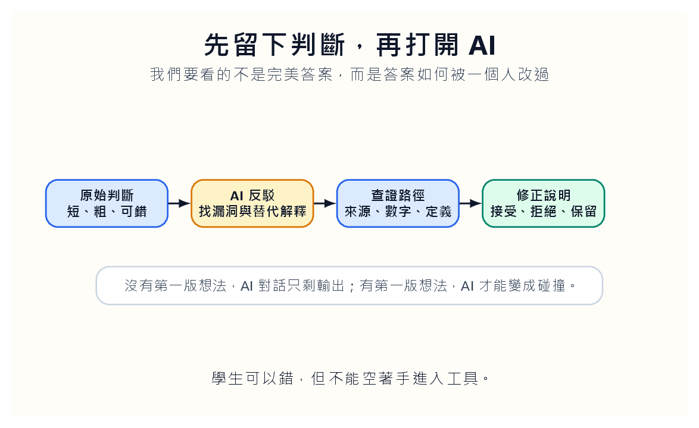
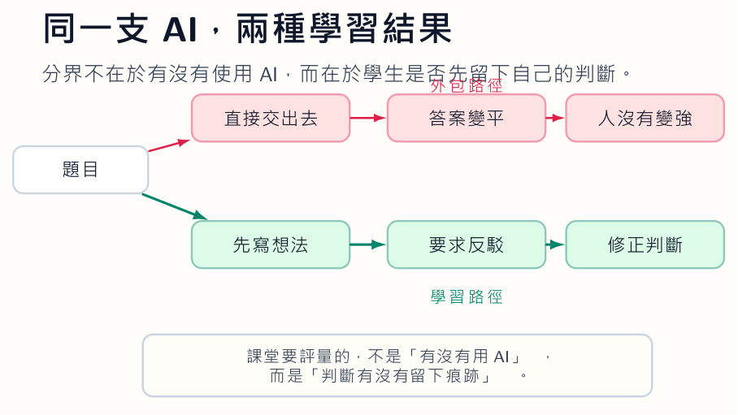
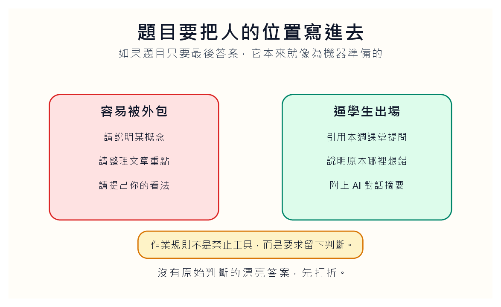

*學生可以錯，但不能空著手進入工具。*

## 太乾淨的答案，常常沒有主人

有一種作業，我們一看就知道不對勁。段落完整，語氣平穩，轉折乾淨，沒有錯字，也沒有任何猶豫。它讀起來像答案，卻不像一個學生剛想完問題後留下的文字。過去我們會把這種東西稱為「寫得很好」。現在我們反而要停一下。太乾淨，有時不是成熟，而是沒有經過人。

我不太接受「AI 會讓學生變笨」這句話。它太方便了。工具被推到前面，題目本身就不用被檢查。可是很多作業原本就沒有要求學生留下任何非他不可的東西：請說明某概念、請整理某文章、請提出你的看法。這些題目在沒有 AI 的年代就已經很薄，只是以前學生要花時間把薄的東西寫出來。現在模型幾秒鐘就能把它包裝好。

真正的問題不是學生會不會按下送出，而是我們的作業有沒有要求他先站出來。沒有原始判斷的答案，不管多流暢，都只是一個輸出。它可能正確，可能漂亮，可能足以通過評分表，但它沒有讓學生冒任何思想上的風險。教育最怕的不是學生犯錯，而是整份作業裡沒有一處需要他承擔判斷。

## 先交出粗糙，才有資格請 AI 幫忙

我會把 AI 使用規則改得很簡單：學生可以用 AI，但必須先交出第一版判斷。那一版可以短，可以笨，可以有錯。它甚至可以只有幾句：「我目前猜這家公司營收成長不是好事，因為應收帳款也升高，但我還沒有檢查現金流。」這種句子不漂亮，卻有一個很重要的東西：它有主人。

接著才讓 AI 進場。不是請它代寫，而是請它反駁、追問、提出相反解釋。學生最後要交的，也不是單純修正版，而是三個小註記：哪一點被 AI 說服，哪一點沒有接受，哪一點回去查了資料。這三個註記比最後那篇順滑文章更值得看，因為它們讓我們知道學生如何移動。

*工具不是起點。工具應該碰到一個已經有方向、也可能犯錯的人。*

這裡最困難的地方，不在學生，而在教師。我們過去太習慣批改成果，現在卻要回頭看形成。草稿、提問、查證路徑、被反駁後的修改，這些東西比最後答案亂，也更難評分。可是如果最後答案已經變得廉價，我們還只看最後答案，就是假裝教室沒有改變。

## 粉筆不能交出去

我喜歡把這件事想成黑板。學生先拿粉筆寫下一個解法。旁邊有人提醒他少算了一個條件，有人問他資料在哪裡，有人提出另一種可能。AI 只是那個旁邊的人之一。它可以很快，可以很耐心，可以一次提出十種反例，但粉筆不能交到它手上。

一旦粉筆交出去，學生就從思考者變成審稿者，而且常常審得很鬆。模型寫出來的文字太像答案，學生很容易只做表面修改。換幾個詞，刪幾句太像機器的話，交出去。這不是使用 AI，這是替 AI 做排版。好的作業設計要讓學生知道：AI 可以坐在旁邊，但第一筆與最後一筆都要由人寫下。

*作業規則不是禁止工具，而是要求留下判斷。*

因此，題目要把人的位置寫進去。不要只問「請說明某概念」，而要問「請用本週課堂中你原本聽錯的一個地方，重新說明這個概念」。不要只問「請整理文章重點」，而要問「請指出你原本最想同意的一句話，後來為什麼改變或沒有改變」。不要只問「請提出看法」，而要問「請附上 AI 反駁你的三句話，並說明你接受哪一句、拒絕哪一句」。

這些限制不花俏，但它們會提高代寫成本。更重要的是，它們讓學生知道，課堂在乎的不是文件完成，而是判斷有沒有被留下來。

## 偵測工具不能替我們看見學習

AI 偵測工具給人一種安全感。它丟出百分比，好像問題可以被量化。可是學生是否思考，不能靠一個機率決定。真正可檢查的是過程：他一開始怎麼想？他問了什麼？他怎麼改？他留下哪些資料來源？這些東西麻煩、笨重、不漂亮，但比偵測分數更誠實。

我們不應該把課堂變成追查警察。那會讓學生學會隱藏，而不是學會判斷。更誠實的做法，是公開承認 AI 會進入學習，然後把成熟的使用方式說清楚。哪一步可以用，哪一步不能用，哪一步要附上紀錄。學生不會因為規則存在就成熟，但至少他知道成熟不是把工具藏起來，而是能說明自己怎麼用。

這也讓教師少一點道德戲劇，多一點教學設計。與其問學生有沒有偷用 AI，不如問：你的第一版判斷在哪裡？你的查證路徑在哪裡？你原本錯在哪裡？這些問題更慢，卻更接近學習。

## 讓學生練習和答案保持距離

AI 最危險的地方不是錯，而是它錯得很順。它能把沒有根據的話寫得像有根據，把模糊的判斷寫得像成熟結論。學生若沒有練習和文字保持距離，很容易被語氣帶走。這正是我們應該教的能力：看見一段流暢文字，先不要臣服。

我會在課堂上示範自己怎麼拆 AI 的答案。不要只拿修好的版本給學生看。把失敗版本投影出來，讓學生看見：這一句偷換定義，這一句沒有來源，這一句語氣太滿，這一句看似合理但還不能採用。學生需要看到成年人如何面對一段很會說話但不可靠的文字。

最後，考試與平時作業也不必互相否定。平時訓練學生帶著工具思考，考試檢查他把工具蓋上後還剩下什麼。這個標準比禁止更高。禁止只要求服從；這個標準要求學生真的有東西可說。

AI 給出的第一個答案，不是終點。它是一個需要被審問的對象。學生若能學會這一點，他不會因為 AI 變笨。相反地，他會開始明白：思考不是把答案生出來，而是知道答案出現後，自己還不能停。
