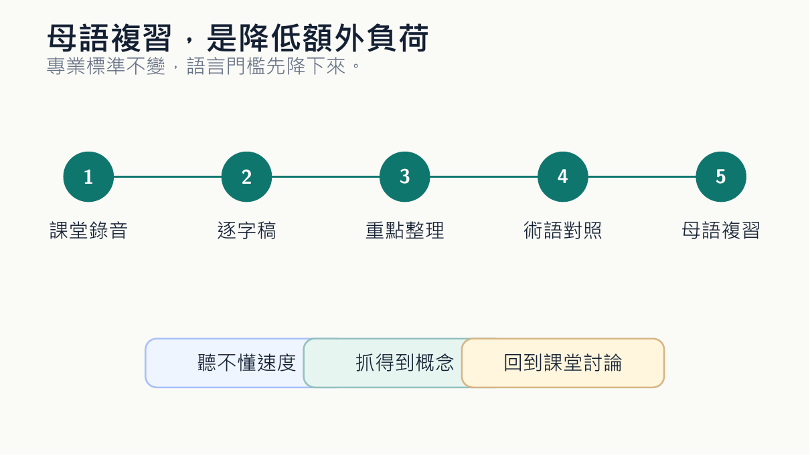

本文整理自「AI 輔助教學：授課教師的應用場景與實踐」簡報第 30-32 張，並改寫為知識站文章。

*概念圖呈現同一堂課如何被轉成逐字稿、摘要、翻譯與語音，成為外籍學生的支援層。*

## 為什麼這個主題值得獨立成一篇

外籍學生在專業課程中的困難，常不是能力不足，而是語言負擔太重。當課堂同時包含專業術語、快速口語與本地案例，學生可能還沒理解概念，就先被語言速度擋住。

AI 的語音辨識、翻譯與摘要功能，可以幫教師在課堂外加一層多語言支援，讓學生用母語重新接觸核心內容。

## 課堂中可以怎麼做

流程可以從課堂錄音開始：先產生逐字稿，再整理章節重點，接著翻譯成學生需要的語言，並保留關鍵術語的中英對照。若需要聽覺支援，也可以產生語音複習檔。

教師也可以建立每週概念詞表，說明專有名詞在課堂脈絡中的用法，而不是只給字典翻譯。

## 使用 AI 時要保留的判斷

翻譯不是完全可靠，尤其遇到專業術語時更容易失真。教師應建立固定詞彙表，並讓學生回報不自然或不準確的翻譯。多語言支援的目標不是降低標準，而是降低語言造成的額外負荷。
