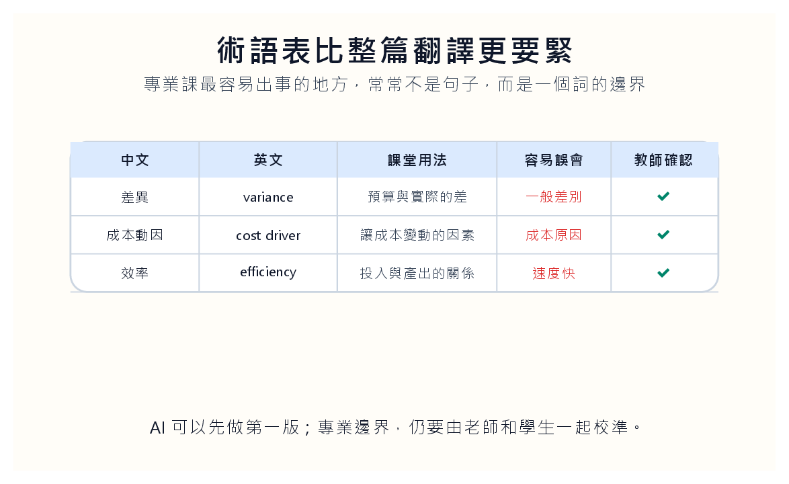
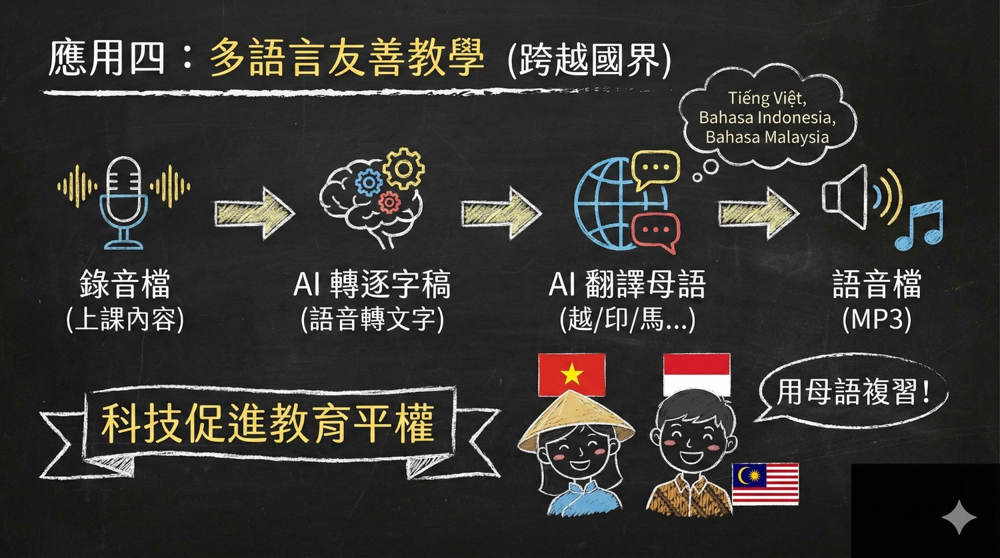
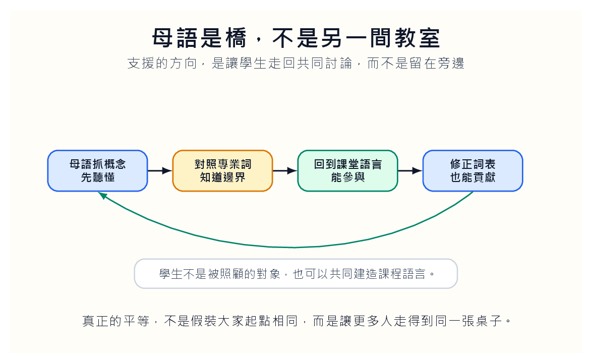

有些學生坐在教室裡，很安靜，點頭也很準時。老師講到重點，他也低頭寫筆記。表面上，一切都正常。

可是我們若把那個安靜拉近看，常會看到另一個畫面：他其實沒有慢半拍，而是每一句話都要多走一段路。中文進入耳朵，先在腦中拆成字，再找母語裡接近的概念，接著還要判斷這個詞在會計、管理、教育現場裡到底是日常用法，還是專業用法。等他終於追上，老師已經換到下一個例子。

這不是懶惰。這也不是程度差。這是一種額外負荷。

那個負荷常常被誤認成沉默。老師問「有沒有問題」，他沒有舉手，不一定代表懂了。可能只是他還在把上一句話搬過語言的橋。等他終於知道自己哪裡不懂，討論已經往前走。多語言友善的第一步，是承認有些學生不是缺少努力，而是每一分鐘都比別人多做一層轉換。

## 安靜有時只是翻譯中

多語言教學最容易被誤解的地方，是把它想成「幫外籍學生多準備一份翻譯」。翻譯當然有用，但如果我們只停在翻譯，問題會被縮小成語言問題。事實上，學生真正需要的不是另一份平行教材，而是能重新走回同一堂課的路。

我們可以先做三件很小的事。

第一，留下逐字稿。逐字稿不用寫得漂亮，它的功能是讓學生回到某一句話。第二，做課堂順序摘要。不要把它改寫成一篇看起來很工整、卻失去現場脈絡的文章。學生需要知道老師在哪裡轉彎，哪一個例子接在哪一個概念後面。第三，建立術語表。中文、英文、課堂用法、容易誤會之處，要放在一起。

這三件事看起來很樸素，卻會改變一個學生晚上的複習方式。他不必再靠零碎記憶猜老師白天說了什麼，也不必在翻譯軟體和課本之間來回尋找。他可以停在那個卡住的詞，慢慢把它拆開。

逐字稿不必完美，但要有時間戳。時間戳讓學生能回到老師當時說話的位置，也讓教師知道哪些段落被反覆回看。若一段話被很多學生重看，不一定是學生慢，也可能是那段講得太快。AI 支援若只產生漂亮摘要，就失去了這種診斷能力。

## 術語表不是附錄，是課程的骨架

專業課最容易出錯的地方，常常不是句子，而是詞。

以 variance 為例。字典可以告訴學生它是差異，可是成本會計裡的 variance 不只是差異。它可能是預算和實際的差，也可能是價格差異、數量差異、效率差異。學生若只記到一個中文詞，很快會把不同情境揉成同一團。看起來懂了，其實只是把問題藏起來。

所以術語表不該只是課後附件。它應該像課程地圖一樣，一週一週長出來。我們可以先請 AI 依照逐字稿整理第一版，接著由老師修正，再讓學生在課堂上補充「我原本以為這個詞是什麼」。這個補充很有價值，因為它會讓老師看見誤解的形狀。

有時候，本地學生也會在這裡露餡。他們聽得懂中文，卻不一定真的懂專業語。只是熟悉的語言替不懂蓋了一層布。當一個詞被翻成英文、日文、越南文或印尼文，再被拿回中文課堂討論，很多原本模糊的地方會突然露出邊界。

這就是多語言支援反過來幫助全班的地方。外籍學生的困難，逼我們把課講得更清楚；本地學生也跟著受益。真正的公平不是假裝每個人一開始都站在同一個位置，而是承認有人進教室時多背了一袋重量。

共同詞表最好不要只由老師維護。每週可以讓學生投票選出最容易誤解的三個詞。外籍學生可以寫母語理解，本地學生可以寫自己原本以為的意思。兩邊放在一起，會發現很多誤解其實不是語言問題，而是概念本身沒有被教清楚。這時候，多語言支援就不再只是照顧少數，而是在幫整班清理語言。

## AI 先做粗稿，老師負責劃邊界

AI 很適合做第一版支援材料。它可以把錄音轉成逐字稿，做摘要，整理專有名詞，也可以生成母語複習語音。這些工作若全部交給老師，很快會變成無法維持的熱情勞動。

但我們不能把專業邊界交給 AI。財會、法律、醫療、教育這類課程，錯一個詞，意思就會換掉。AI 生成的翻譯常常太順，順到讓人忘記它可能把邊界抹平。它可能把「管理判斷」翻成聽起來很漂亮的字，卻漏掉責任和證據；也可能把「成本動因」翻成一般成本原因，讓學生以為只是在找理由。

我們可以讓 AI 先做粗稿，但粗稿一定要被修。老師修一次，學生也修一次。學生可以在術語表旁邊加上「我原本怎麼理解」、「修正後怎麼理解」。這樣他不是被動接受翻譯，而是在學習專業語言的路上留下自己的腳印。

我會把 AI 產出的翻譯標成「待確認」，而不是直接放進教材。這個小標籤很重要。它提醒學生，翻譯不是權威，而是草稿。老師和學生一起確認後，才進入正式詞表。若每一段翻譯都帶著權威口吻，學生很容易把順口當成正確。

## 母語是橋，不是另一間教室

我最怕的多語言支援，是把學生送去旁邊學另一套課。看起來很照顧，實際上卻把他和全班切開。學生可能終於讀懂了內容，卻更難加入同一場討論。

母語材料應該有方向。先讓學生用熟悉語言抓住概念，再對照專業詞，最後回到課堂語言裡使用它。這條路比較慢，可是它讓學生最後能坐回同一張桌子。若我們只讓他停在母語材料裡，那不是支援，是延後進入專業社群。

我會要求母語複習材料最後都回到一個共同問題。比如成本差異分析，不管學生先用哪一種語言理解，最後都要能用課堂共同語言回答：「這個差異是價格問題、數量問題，還是效率問題？」母語是助跑，不是終點。真正的友善，是讓學生最後能參與同一個問題。

## 不要把支援藏到邊角

還有一個很現實的問題：很多學生不敢求助。尤其是語言弱勢的學生，他們怕被標籤，也怕打斷老師。他們寧願安靜坐著，課後自己補洞。久了以後，老師看到的是一個沉默的學生，學生感受到的是一門離自己越來越遠的課。

所以支援材料不要做成「有困難的人再來拿」。逐字稿、摘要、術語表，都應該是全班資源。需要的人自然會用，不需要的人也可以當複習。這種安排少一點尷尬，也少一點猜測。

我們甚至可以觀察哪些段落被重看最多，哪些詞一直被查，哪些例子需要母語說明。這些資料不該拿來監控學生，而是拿來修課。若某個術語每次都被反覆點開，表示我們可能講得太快；若某個例子靠本地文化背景才能懂，下一次就該補一個更乾淨的說明。

多語言友善教學最後會回到老師身上。它讓我們看見自己的課有哪些省略。母語學生能用習慣補起來的地方，外籍學生可能直接掉下去。AI 生成的逐字稿和術語表，就像把老師的語言攤在桌上。哪一句太長，哪一個詞第一次出現時沒有定義，哪一個轉折少了橋，會變得很清楚。

這種清楚有時會讓老師不太舒服。逐字稿會暴露我們的口頭禪、跳躍、沒有說完的句子，也會暴露一個例子其實靠本地生活經驗才能懂。但這正是它的價值。多語言教學不是把老師變得更完美，而是讓老師看見自己的語言如何影響學生能不能進入課堂。

## 讓學生也成為語言的建造者

更好的做法，是讓學生參與課程詞表。每週請學生選三個最卡的詞，用母語寫下自己的理解，再由 AI 幫忙轉回中文或英文。接著小組比較：哪一個翻法最接近課堂意思，哪一個翻法雖然順口但會誤導。

這個活動不花很多時間，卻會改變學生的位置。他不再只是被照顧的人，也能幫忙修正課程語言。當一個學生發現自己的母語解釋被放進共同詞表，他會知道自己不是在邊緣補課，而是在和大家一起把概念說清楚。

多語言友善不是把標準放低。標準仍然是能理解、能分析、能用專業語言參與討論。只是我們承認，有些學生要先把語言的重量放下來，才有力氣碰到真正的問題。

一門課若只讓最熟悉語言的人聽懂，那不是內容太高級，而是門檻設錯了位置。母語不是退路。它是一段助跑。學生跑回同一張桌子的那一刻，課堂才真的開始變寬。

我們也要小心，不要把多語言支援變成感動故事。學生不需要被同情，他需要明天就能用的做法。逐字稿、時間戳、共同詞表、母語橋接、回到課堂討論，這些都很普通。也正因為普通，才有機會被每週穩定執行。教育裡真正有用的友善，通常不是一句漂亮話，而是一個學生明天還能用的設計。
