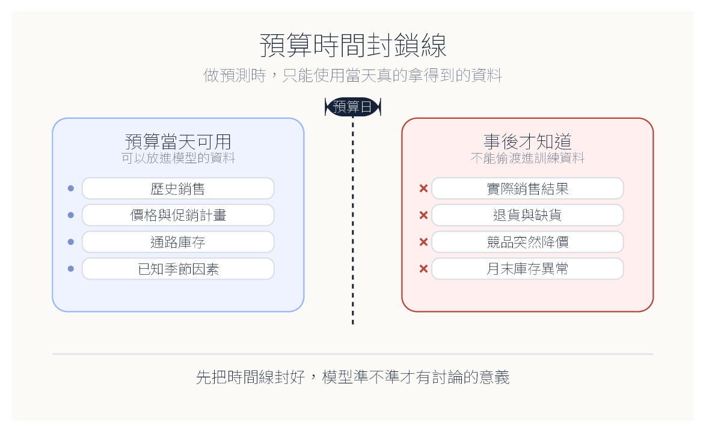
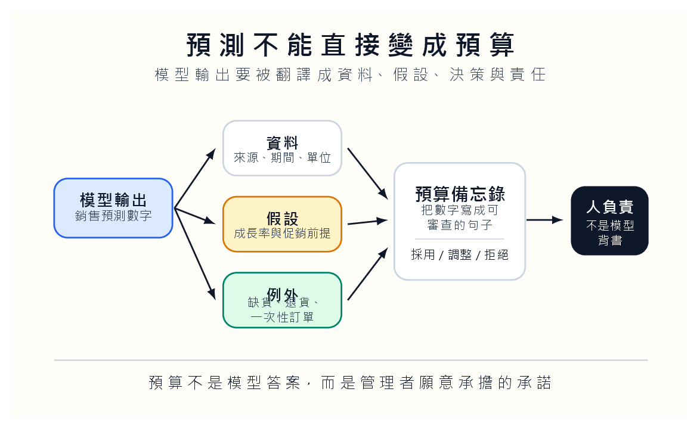

銷售預算有時被教得太乾淨。

我們拿前幾期銷售量，加權平均，乘上一個成長率，再得到下一期預估。公式排在黑板上很整齊，學生也容易算。可是公司裡真正麻煩的部分，通常不在公式。促銷提前、缺貨、一次性大單、競爭者突然降價、月底才發現退貨異常，任何一件事都能讓那個平均數看起來像一種禮貌。

禮貌的地方在於，它不吵，也不問問題。它把市場的破洞壓平，讓我們以為預算只是把過去稍微修一下。

這也是預算課常被低估的地方。它表面上是計算課，實際上是責任課。預算一旦寫進組織，後面的人會照著它採購、排班、備貨、借款、設定績效標準。學生如果只把預算看成一欄數字，就會忽略那個數字會如何推動別人的行動。

我會讓學生先想一個很普通的畫面：倉庫多進了貨，值班人力多排了兩班，現金被壓在庫存裡，月底才發現需求沒有來。這些事不會出現在模型準確率那一格，但它們是預算真正落到人身上的地方。預算錯了，不是表格錯而已，是有人照著那張表工作。

## 平均數很安靜，市場不安靜

我們不需要把平均法丟掉。平均法像木尺，粗糙，但看得見。學生先學它，是合理的。問題出在課堂若只停在木尺，學生會以為預算的工作就是把歷史資料整理得漂亮一點。

等預測式 AI 進來，學生又容易滑向另一端：既然模型能吃很多欄位，那就把所有資料丟進去，讓系統自己找規律。前者太相信公式，後者太相信模型。兩者其實都躲開了同一個問題。

做預算的人，在預算日當天，還不知道未來。

這句話聽起來像廢話。可是在課堂實作裡，學生最常犯的錯就是忘記它。用月底實際銷售結果去訓練月初預算，用促銷結束後才知道的退貨資料去預測促銷前的需求，用競爭者降價後的資料回頭解釋降價前的決策。程式不會抗議，模型還可能變得很漂亮。

漂亮得沒有意義。

我會要求學生在建模前寫一張「資料發票」。每一個欄位都要說明取得時間、來源、更新頻率、單位、是否會被事後修正。這張發票不是行政表格，而是防止偷看未來的第一道防線。沒有資料發票，模型就像拿到一袋沒有標籤的食材，煮出來再香，也不知道裡面混了什麼。

## 預算日是一道門

所以我會先把模型放在旁邊，讓學生看這張圖。

這張圖要學生記住的不是流程，而是一道門。門左邊，是預算日當天真的拿得到的資料：歷史銷售、價格、已排定促銷、通路庫存、已知季節因素。門右邊，是事後才知道的資料：實際銷售、退貨、缺貨、競爭者突然降價、月底庫存異常。

很多資料很有用，但有用不等於當時能用。這個分別若沒有先建立，AI 預測會變成一種偷看。學生可能交出很高的準確率，卻沒有交出誠實的預算。

我們可以把第一個作業設計得很笨：不准建模型，只准分欄位。每一個欄位都要被放進「預算當天可用」或「事後才知道」。放不進去的，要寫理由。學生通常會覺得這個作業比想像中難，因為資料世界不像課本那麼乖。某些欄位一部分能知道，一部分不能；某些資料看起來是歷史，裡面卻混了事後修正；某些促銷計畫雖然已經排定，但細節還沒定案。

這些灰色地帶，才是會計教育該保留下來的地方。

我會讓學生為每一個灰色欄位寫一句話：「如果我們把它放進模型，等於假設預算日已經知道什麼？」這句話很有力，因為它把技術選擇翻成管理假設。很多資料爭議不是程式問題，而是我們願不願意承認自己偷拿了事後資訊。

**資料時點是一種誠實**

資料洩漏聽起來像工程細節，但在預算課裡，它其實是誠實問題。你在決策日不知道的東西，就不能假裝當時知道。模型不會臉紅，報表也不會自己道歉。只有寫預算的人要說清楚：這個數字是在什麼資訊條件下做出的判斷。學生若學會這件事，會比多會一個模型更接近管理會計。

## 讓模型先出醜

時間線封好以後，我們再讓學生比較傳統預算與預測式 AI。不要急著問誰準。先讓模型犯一次很漂亮的錯。

我們可以故意把事後資料混進去，讓模型表現好到不合理。接著問學生：你們相信嗎？很多人會先被數字吸引。等我們把偷看的欄位圈出來，教室通常會安靜幾秒。那幾秒很值得。學生會第一次感覺到，準確率本身也可能在說謊。

接著用合法資料重跑。結果通常會變差。這個變差不是失敗，而是模型回到現實。公司做預算時本來就沒有未來資料。若我們只在課堂上追求高準確率，學生會把預算課當成資料競賽；若我們讓他們看見準確率下降的原因，他們才會開始理解管理現場。

第二次作業可以要求學生交兩份模型紀錄。第一份是自由建模，列出所有欄位。第二份是時間封鎖後的版本，凡是預算日不能知道的欄位，都要刪掉重跑。最後請學生寫一段短文：哪個欄位被刪掉後影響最大？這個影響是資料限制，還是管理上本來就該承擔的不確定？

學生若能寫到這裡，就不再只是操作模型。他開始在學預算。

我還會要求他們保存那個「作弊版」模型。不是鼓勵作弊，而是把它當成教材。作弊版通常很準，合法版通常比較難看。兩者差距越大，越能讓學生感覺到資料時點的重量。這比教師口頭說「不要資料洩漏」更有用，因為學生親眼看見一個漂亮模型如何靠不該知道的東西變漂亮。

這裡可以順手教一個殘酷事實：漂亮模型常常最需要被懷疑。當結果好得不合理，第一個問題不該是「我們多厲害」，而是「我們是不是偷看了什麼」。學生越早學會懷疑漂亮結果，越不容易在職場被儀表板牽著走。

## 預算是一個帶著時間戳的承諾

模型給出一個數字，學生很容易直接貼進表格。可是預算不是天氣預報。天氣預報錯了，我們頂多淋雨；預算錯了，採購、生產、人力、現金流、績效評估都會跟著動。

預測高了，庫存可能壓住現金；預測低了，可能錯過銷售。樂觀情境不是單純把數字調高，悲觀情境也不是單純把數字調低。每一個情境背後都有行動代價。

這裡可以讓學生做角色扮演。模型輸出同一個銷售預測，一組學生扮演財務主管，看現金流和授信額度；一組扮演業務主管，看市場機會和客戶承諾；一組扮演生產主管，看產能、採購和庫存壓力。三組人看同一個數字，感受到的風險不會一樣。

這時學生會發現，模型輸出不是答案，只是會議的開始。

同一個預測數字，在不同部門手上會變成不同壓力。財務主管看到的是資金缺口，業務主管看到的是承諾能不能兌現，生產主管看到的是加班與庫存。預算課若只問哪個模型準，就把管理現場壓扁了。真正該問的是：這個數字一旦被採用，誰會承擔它的後果？

我會要求每組學生在簡報裡加一頁「受傷順序」。如果預測高估，誰先受傷？如果預測低估，誰先受傷？如果促銷延後，哪個部門先被迫改計畫？這一頁通常比模型比較表更有教育價值，因為它逼學生承認預算不是中性的。每一個數字，都會把壓力分配給某些人。

## 把數字寫成能被追問的備忘錄

最後的交付物不該只是模型結果。我會要求學生交一份預算備忘錄，裡面只要寫清楚四件事：我們用了哪些資料；哪些資料在預算日不能使用；我們採用哪個情境；若判斷錯了，最可能傷到哪個部門。

這份備忘錄比程式碼更能看出學生有沒有進入會計。程式跑得出來，只代表工具聽話。備忘錄寫得清楚，才代表學生願意替數字說話。

評分也應該跟著改。模型是否能跑，只佔一小部分。時間封鎖是否正確、假設是否能被追問、情境代價是否說得出來、建議是否願意承擔後果，才是主要分數。這樣設計後，會寫程式的學生不能只靠技術過關；不熟程式的學生也能用資料判斷和管理語言拿回主導權。

我會讓學生在備忘錄最後寫一段「如果我們錯了」。不是寫漂亮的風險聲明，而是具體說明哪個部門最先受傷，哪個數字最早會提醒我們預算偏離，多久後要重估。預算不是一次交卷，而是把未來的不確定先放進一個可以追蹤的承諾裡。

## 哪些判斷不能交給模型

預測工具越普及，會計人的工作越不像按公式算數，而像替數字負責。以前學生可能會說「我是照公式算的」。以後他可能會說「系統算的」。兩句話都很方便，也都不夠專業。

我們希望他最後能說出另一句話：模型幫我們估了一個數字，但我們選擇如何使用它。

這句話沒有華麗技巧，卻很重。它把工具放回工具的位置，把人放回需要判斷的位置。預算課若能讓學生分清「系統算出來」和「我們願意承擔」之間的距離，那堂課就不只是多了一個 AI 範例。

它會讓學生在看到漂亮數字時，先停一下，問一個很不討喜、卻很專業的問題：做決定的那一天，我們真的知道這些嗎？

這個問題會讓課堂慢下來。慢，不是效率差，而是讓學生有時間分辨模型、資料和責任。預算若只追求快，很容易變成把未來包成一個單一數字；預算若願意慢一點，就能讓學生看見那個數字背後的假設、盲點和代價。

最後我會把預算課的評分問成一句話：如果這份預算明天被拿去開會，學生能不能坐在會議桌旁說明它的限制？如果不能，他只是交了一個模型結果；如果能，他才開始像一個會計人。會計人的專業不在於永遠算得準，而在於知道自己的數字能支持到哪裡。
