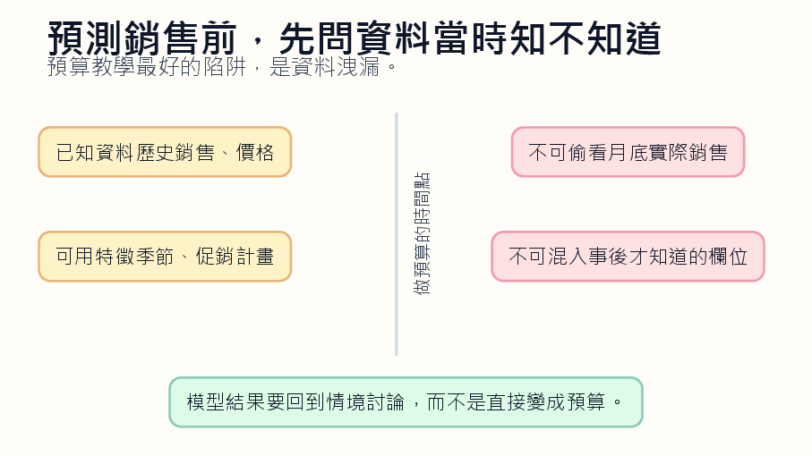
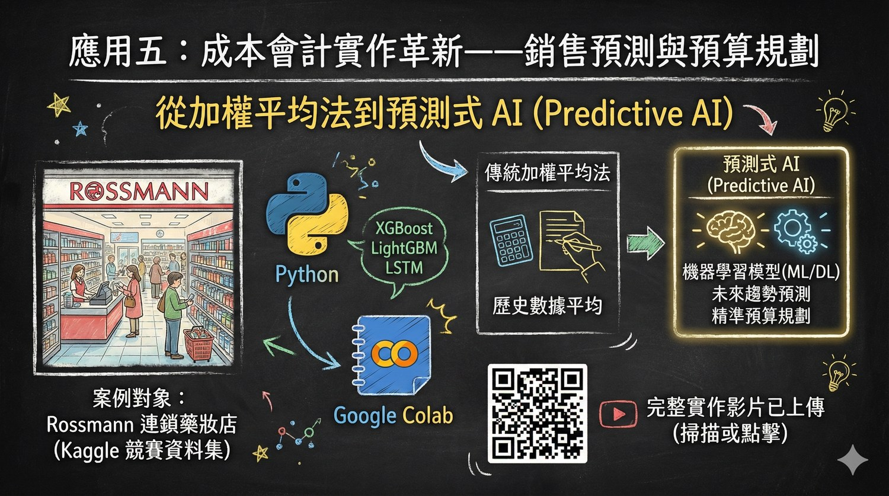

*概念圖把銷售預算教學拆成資料、模型、情境與決策四層，提醒學生預測不是按鈕，而是管理判斷。*

## 平均數有時像禮貌的謊言

銷售預算有時被教得太溫和。拿過去幾期銷售量，加權平均，乘上一個成長率，再得到下一期預估。公式乾淨，學生容易算，考試也好改。問題是，真實世界的銷售不太理會這種乾淨。促銷、季節、價格、競爭者、通路缺貨、一次性大單，哪一個都可能讓平均數看起來像一個有禮貌的謊言。

**先把時間線封好**

預測式 AI 可以進入成本會計課，但它不該以炫技方式進入。不要一上來就談模型多準、演算法多強。先問一個更粗暴的問題：做預算的那一天，管理者手上到底知道什麼？這個問題比模型名稱更接近管理會計。因為預算不是事後諸葛，預算是在資訊不完整時做出的承諾。學生很容易犯資料洩漏的錯。

比如用月底實際銷售結果去預測月初預算，用事後才知道的退貨資料去訓練模型，用未來促銷成效去解釋促銷前的決策。這種錯誤在程式上不一定會報錯，模型甚至會變得很準。可是那種準沒有意義，因為它偷看了答案。課堂上最值得讓學生摔一次的，就是這個坑。我會把銷售預算教案分成兩張表。

第一張表叫「當時知道的資料」，放歷史銷售、價格、既定促銷計畫、節慶、通路資料。第二張表叫「事後才知道的資料」，放實際銷售、退貨、競爭者突然降價、月底庫存異常。學生先不用建模型，只要把欄位放到正確表格。這個活動會比想像中困難，因為很多資料看起來都很有用，但有用不代表當時能用。

*銷售預算不是追求單一準確值，而是把資料、模型與管理假設放在同一張桌上。*

## 先問當時知不知道

等這一步清楚後，再讓學生比較傳統方法與 AI 預測。傳統方法的好處是透明。它粗糙，但學生知道它怎麼來。模型的好處是能抓較複雜的型態，比如季節或促銷互動。但模型也可能把資料裡的雜訊當成規律。這時候教師不要急著宣布誰贏。真正的討論在差異裡：為什麼模型比平均法高？它看到什麼？

**太漂亮的準確率要懷疑**

那個東西是穩定規律，還是去年剛好發生？預算課最怕學生把預測當答案。模型輸出一個數字，學生就拿去填表。可是預算不是天氣預報。預算會影響採購、產能、人力、現金流，也會影響後續績效評估。預測高了，庫存可能堆起來；預測低了，可能錯過銷售。模型只給一個可能，管理者要承擔後果。

因此，AI 預測後一定要接情境分析。價格提高 3% 會怎樣？促銷延後兩週會怎樣？某產品缺貨會怎樣？學生要看見預算不是一個點，而是一組假設。這也是成本會計能教得比資料科學更貼近管理的地方：我們不只問準不準，還問錯了要付什麼代價。這門課如果教得好，學生會對「準確率」這個詞多一點戒心。

商業決策裡，最準的模型未必最好。若它解釋不清、不能在會議上說服人、不能讓管理者知道風險在哪裡，它就只是漂亮的黑箱。反過來，一個稍微粗糙但能說清假設的模型，可能更適合預算討論。

## 太準也可能是警訊

所以我寧願讓學生先畫時間線，再寫程式。先知道哪些資料不能碰，再談模型。先說清楚管理問題，再談 AI。銷售預算不是把過去平均一下，也不是把資料丟進模型。它是人在不完整資訊裡，對未來做出一個必須負責的估計。課堂上可以做一個很有效的壞示範。故意把事後資料放進模型，讓預測結果漂亮得不合理。

**模型要跟現場同桌**

再問學生：你們相信嗎？一開始很多人會被數字吸引。等教師指出模型偷看了答案，學生通常會笑，然後有點尷尬。這種尷尬很好，它讓學生記住「太準」本身也可能是警訊。接著再讓學生用合法資料重做一次，結果通常會變差。這時才是真正的教學時刻。模型變差，不代表它沒用，而是它終於回到現實。

現實中的管理者本來就沒有未來資料。學生要學會接受不完美預測，並用情境分析補上。例如悲觀、中性、樂觀三種版本，各自對應採購與庫存決策。預測不是把不確定性消滅，而是讓不確定性被拿到桌上談。銷售預算也適合連到績效評估。若預算是由模型建議、管理者調整，年底差異該怎麼看？

是模型錯、管理者太樂觀，還是市場真的變了？這些問題會讓學生看見，AI 不是把責任變少，而是讓責任分布變得更複雜。未來的會計人員要能說明模型假設，也要能說明自己為什麼接受或拒絕那個數字。否則預算會變成一句很方便的推託：系統算的。

## 模型只是桌上的一份資料

教師也可以把模型錯誤變成角色扮演。讓一組學生扮演財務長，一組扮演業務主管，一組扮演生產主管。模型給出一個銷售預測，三組人各自說明接受或不接受的理由。財務長關心現金流，業務主管關心市場機會，生產主管關心產能與庫存。這時學生會發現，同一個數字在不同位置有不同壓力。

**調整必須留下理由**

這種討論能把 AI 拉回管理會計。模型不是站在會議桌外的神諭，它只是桌上的一份資料。資料要進入決策，必須被質疑、被翻譯、被放進責任分工。學生若能學會這點，以後看到任何預測工具都不會太快跪下。他會問：資料哪來？時間點對嗎？假設是什麼？錯了誰承擔？這些問題比模型名稱更有用。

我還會讓學生寫一段給主管的備忘錄，而不是只交模型結果。備忘錄裡要有三句話：我用了哪些資料，哪些資料在預算當時不能使用，我建議採用哪個情境。這三句話能檢查學生是否真的理解模型。若他只能貼出程式輸出，表示他還停在操作。若他能把模型變成管理語言，才算進入會計。

預測工具越普及，會計人的工作越不像按公式算數，而像替數字負責。數字會由系統生出來，但誰要向董事會、主管、客戶解釋？仍然是人。學生如果在課堂上沒有練習說明假設，以後就會在會議上把責任推給系統。那不是專業，是逃避。

## 數字由系統生，人替它負責

學生最後應該能說出一句樸素的話：模型幫我估了一個數字，但我選擇如何使用它。這句話看似簡單，其實是管理會計的核心。工具可以算，人要決定。若學生畢業前能分清這兩件事，這堂 AI 預算課就沒有白上。
