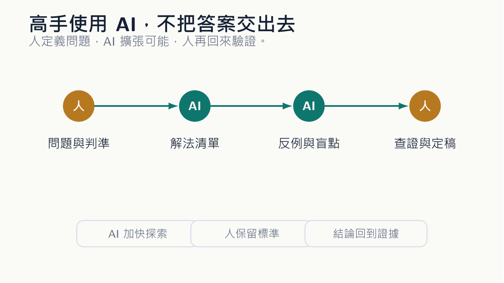
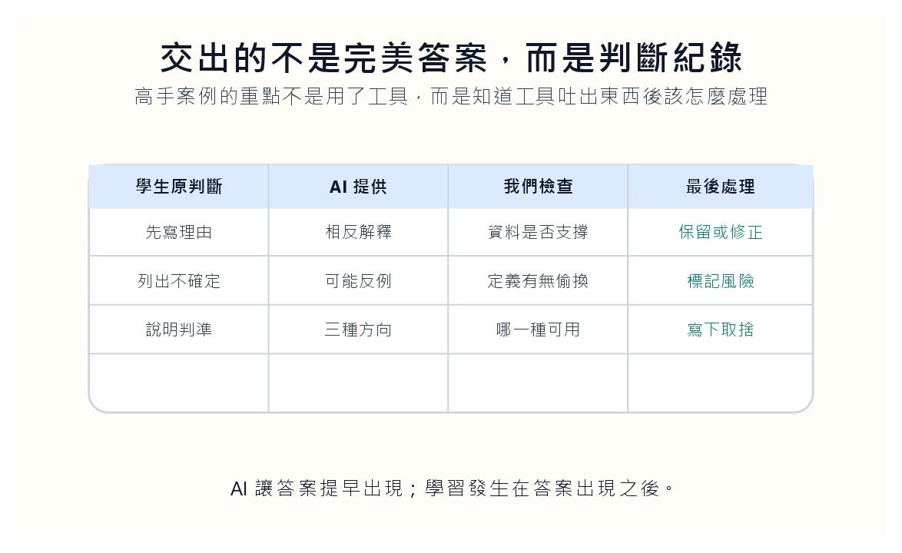
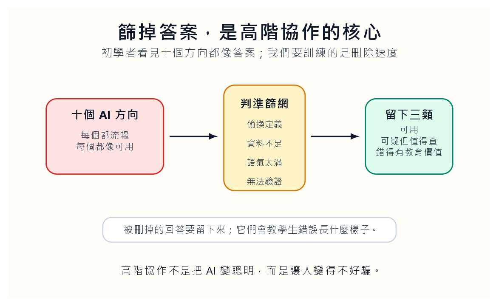

*概念圖呈現人機協作的接力：人提出問題與判準，AI 擴展可能性，人再回來驗證與定稿。*

## 不要把高手案例講成勵志

把陶哲軒放進 AI 教學討論裡，很容易變成一種廉價勵志：你看，連頂尖數學家都在用 AI，所以學生也應該用。這種說法太快了。真正有意思的不是「他用不用」，而是他怎麼把 AI 放在自己的工作位置上。高手用工具，通常不會把工具當神。他們會問：這個東西在哪裡能省時間？在哪裡會誤導我？

**高手不是因為工具才像高手**

哪一段必須由我自己判斷？這正是一般學生最缺的能力。學生常把 AI 當成答案的出口，高手則把 AI 當成問題的回音室。兩者差很多。前者把題目丟進去，等一段流暢文字吐出來。後者先知道自己要找什麼，再用 AI 生成可能方向、反例、不同語言的表述，然後一一檢查。

AI 在這裡不是老師，也不是裁判，比較像一個很快、很博雜、但常常需要被盯著看的研究助理。課堂如果只教學生「如何問 AI」，仍然不夠。真正要教的是「問完之後怎麼處理」。AI 給了五個想法，學生怎麼判斷哪一個有用？AI 提出一個看似漂亮的反例，學生如何回到定義檢查？

AI 把一段文章改寫得很順，學生如何知道它有沒有把意思改歪？這些問題比提示詞技巧更耐用。我們可以讓學生做一個很小的練習。先給他們一個問題，例如某個企業的財務比率變動，或者一個管理會計情境。第一輪，學生不能用 AI，只能寫下自己的判斷與理由。

第二輪，請 AI 提供三種不同解釋，其中至少一種要和學生原本判斷相反。第三輪，學生要逐句檢查：哪一種解釋有資料支持？哪一種只是詞語漂亮？哪一種需要更多證據？最後交出的不是一篇完美答案，而是一份判斷紀錄。

*AI 讓答案提早出現；學習發生在答案出現之後。*

## 答案出現後才開始工作

這份紀錄會暴露很多事。有些學生會發現自己原本的想法太薄，只是憑印象下判斷。有些學生會發現 AI 的反駁其實很強，逼他回去看資料。有些學生會看見 AI 也會亂講，尤其在它很有把握的時候。這種經驗比教師口頭提醒「AI 可能會錯」有效。因為學生不是聽到風險，而是親手抓到風險。

**答案只是初稿**

陶哲軒這類案例對教師的提醒，是不要把 AI 使用能力簡化成工具清單。工具清單很快過時。今天是 ChatGPT，明天換成另一個模型，後天又多了一個代理工具。真正留下來的是一種工作姿勢：人先提出問題，人先設定標準，人最後承擔結論。AI 可以在中間跑很遠，但終點線不能由它畫。

這也會改變教師對學生能力的想像。過去我們常把能力看成「會不會自己做」。現在還要加上一句：「會不會指揮別的系統做，並看出它哪裡做錯。」這不是比較輕鬆的能力。它甚至更難，因為學生要同時理解問題、理解工具、理解檢查方式。按下按鈕很容易，知道按完之後該懷疑哪裡，才是本事。

很多教師擔心 AI 會稀釋專業。這個擔心有一半是真的。如果專業只剩下產出答案，AI 當然會來搶。如果專業包含提出好問題、建立判準、辨認錯誤、對結論負責，那 AI 反而把專業的輪廓照得更清楚。以前學生可以用一篇通順報告遮住自己的空洞。現在通順報告太便宜，遮不住了。

## 教學生刪掉 AI 的答案

所以我們不必對學生說「你要像陶哲軒那樣使用 AI」。這句話太遠，也太空。我們可以說：你每一次打開 AI 前，先問自己一句話，這件事裡哪一部分只有自己能負責？如果答案是空白，那就先不要按送出。你還沒進入協作，你只是準備交出自己。

**刪除是一種主權**

這裡有一個細節很容易被忽略：高手之所以能讓 AI 有用，是因為他本來就知道什麼叫沒用。初學者缺的不是工具，而是篩選能力。AI 提出十個方向，初學者可能每個都覺得像答案；高手會很快刪掉七個，留下兩個可疑但值得查，一個真的有意思。這種刪除速度不是天生的，是長期訓練出來的判準。

所以教師不能只把 AI 交給學生，然後期待學生自然學會協作。要把篩選也教出來。比如讓學生比較三個 AI 回答：哪一個偷換定義？哪一個說法太滿？哪一個雖然短但比較可信？學生一開始會討厭這種練習，因為它不像「問 AI 得答案」那麼爽快。可是它能訓練一種比較慢的本事：不要被流暢文字牽著走。

我甚至會讓學生保存被刪掉的答案。很多時候，被刪掉的 AI 回覆比最後採用的答案更有教育意義。它讓學生看見錯誤長什麼樣子。錯誤不一定粗糙，有些錯誤非常優雅；不一定荒謬，有些錯誤只差一步就對。能辨認這種錯，比背一百條提示詞有用得多。高階協作不是把 AI 變聰明，而是讓人變得不好騙。

*被刪掉的回答要留下來；它們會教學生錯誤長什麼樣子。*

## 在課堂上拆一段錯誤回答

這也說明了為什麼「AI 素養」不能被做成一堂工具操作課。工具操作課很快就會老。今天教的按鈕，下學期位置就換了；今天的最佳模型，明年可能被另一個取代。可是「如何提出問題」「如何建立判準」「如何檢查反例」「如何承認不知道」，這些東西不會過時。

**把錯誤拿到檯面上**

它們甚至比過去更有用，因為 AI 把廉價答案生產得太快，學生更需要慢下來判斷。教師也要在課堂上示範自己的懷疑。不要只把 AI 產物修好後給學生看。可以把一段錯誤回答投影出來，當場拆給學生看：這一句偷換定義，這一句沒有來源，這一句語氣太滿，這一句雖然合理但還不能採用。

學生需要看見教師如何處理不可靠的文字。那種拆解，比任何工具教學都更像真正的研究訓練。把這件事放回大學課堂，其實是在教一種很古老的能力：學會和聰明但不可靠的人說話。AI 很聰明，也很不可靠。它像一位讀很多書但記憶混亂、語氣自信的同桌。你不能忽視他，因為他真的能給你線索；

你也不能信任他，因為他可能把錯誤包裝得很像真理。這樣的同桌很適合訓練學生。過去學生常把教材當權威，把老師當權威。現在他面前多了一個會說話的權威幻影。教師的任務不是再創造另一個權威，而是讓學生學會拆權威。能拆 AI 的學生，也比較能拆報告、拆新聞、拆財務敘事。

這才是這個工具進教室後比較深的變化。

## 高階協作，是讓人不好騙

高手和初學者的差別，也許就在這裡：初學者看到答案就停下，高手看到答案才開始工作。AI 讓答案大量出現，於是停止變得太容易。教師要訓練學生的，是答案出現後那段時間：檢查、刪除、追問、重寫。那段時間才真正像學習。
