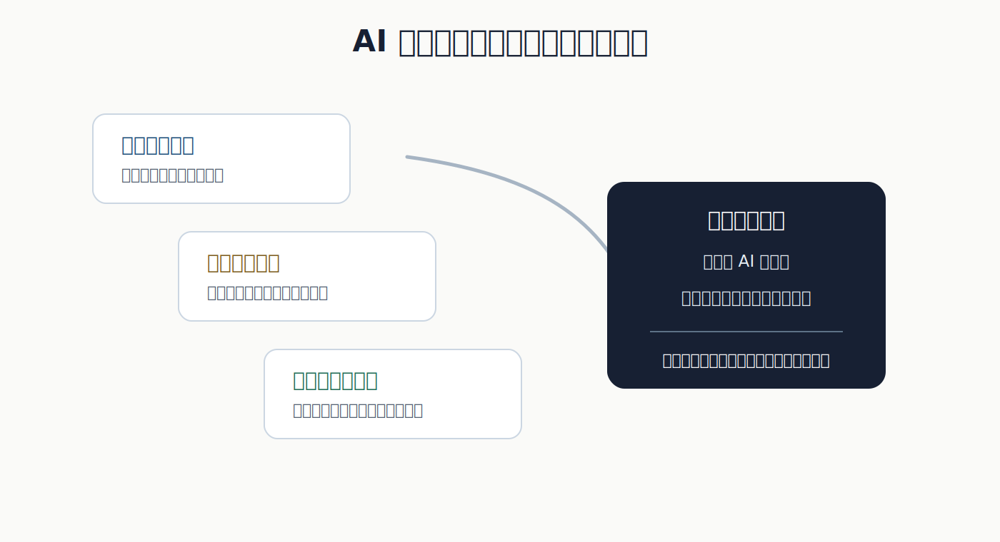
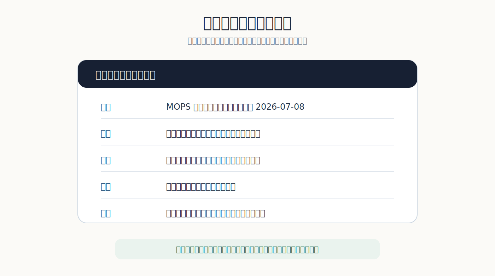

## 先把問題說成人話

很多會計學生不是討厭程式，他們是討厭一開始就被語法羞辱的感覺。第一堂課還沒搞懂要解決什麼問題，就先被括號、縮排、錯誤訊息打趴。於是程式變成一種身分篩選：會的人越來越會，不會的人越來越沉默。

Vibe Coding 有意思的地方，不是讓學生不用思考，而是暫時把語法門檻往後推。學生先用中文把需求說清楚，AI 再把那段話翻成第一版程式。這個順序如果做對，會計課可以避開「先背語法才准碰資料」的老路。

可是這也會讓問題變得更赤裸。你到底想抓什麼資料？公司代號從哪裡來？期間怎麼設定？月營收和財報欄位的定義是什麼？缺資料時要跳過、補零，還是提醒使用者？

這些不是程式問題。這些是會計資料問題。

**十行需求，先當成合約**

我會要求學生先寫一段不超過十行的白話需求。不能寫「幫我做財報分析」。那不是需求，那只是把責任丟給模型。比較好的句子長這樣：輸入公司代號與年份，抓取每月營收，整理成表格，畫出年增率，標出連續三個月衰退的區間，並列出資料來源與抓取日期。

*需求不清，程式跑起來也只是錯得很快。*

這張圖不是給學生背流程，而是讓他們知道：AI 寫程式前，需求要先能被人追問。若同學看不懂你的十行需求，模型寫出來的程式大概也不值得信任。

我會讓學生兩人一組交換需求，但不准立刻改程式。讀別人的需求時，只能問三種問題：資料從哪裡來？例外怎麼處理？結果怎麼驗證？如果被問的人答不出來，就代表需求還沒準備好交給 AI。這個活動會讓學生很快發現，所謂「不會寫程式」有時只是表面問題，真正卡住的是他還沒有把會計問題說清楚。

這也是 Vibe Coding 進會計課最值得留下的東西。它不是把學生變成軟體工程師，而是訓練他把工作需求說到別人可以接手。未來他進事務所、企業或資料團隊，未必親自寫爬蟲，但他一定會和資訊人員、資料工程師、內控人員合作。說不清需求的人，只能一直抱怨系統不好用。

## 紅字比成功畫面更有教育價值

第一版程式跑不起來，這是正常的。網站欄位變了，套件沒裝，路徑錯了，日期格式不合。這些錯誤不要急著替學生修掉。錯誤訊息是教材。

我會讓學生把紅字留下來，貼回去問 AI：「這個錯誤代表什麼？請不要直接改，先解釋原因。」這個要求看似小，差很多。它把 Vibe Coding 從魔術拉回學習。學生開始知道程式不是咒語，而是一串可以被檢查的指令。

*這張來源圖適合留在實作段落，因為它讓讀者看見課堂任務的實際材料：MOPS、Google Colab、Python 與資料爬蟲。*

會計課裡最不能省的是資料查核。爬到資料不代表資料對。月營收單位是不是千元？合併或個別？公司是否更名？某月為什麼空白？資料來源是公開資訊觀測站、交易所，還是二手網站？

AI 很會把表格整理得像真的，但它不會替你對資料來源負責。

所以我會把錯誤修正紀錄列入成績。學生每修一次，都要寫一句人話：這次錯在哪裡，我怎麼判斷，改了哪一行，改完後如何確認。這句話比程式碼更能看出他有沒有理解。只會一直貼紅字給 AI，最後剛好跑起來，並不等於學會了。能說出錯誤的種類，才開始接近專業。

## 資料卡比折線圖更誠實

真正的交付物不該只是程式碼。學生要交三樣東西。第一，原始提示詞與修正紀錄，讓人看見需求怎麼變清楚。第二，資料檢查卡，說明抓到的欄位、單位、缺漏與例外。第三，一段會計解讀：這個趨勢可能意味什麼？還需要哪些資料才能判斷？

*圖表讓人以為自己懂了；資料卡逼人說出自己查過什麼。*

如果只交一張折線圖，這堂課就被工具吃掉了。營收往上，不一定代表公司變好；營收往下，也不一定代表公司變差。可能是產品組合、一次性訂單、淡旺季、匯率、併購、會計分類改變。學生要被要求寫出至少兩個替代解釋，並說明需要哪個資料才能排除。

這會逼他們離開「圖看起來如何」這種膚淺判斷。

我也會要求學生把圖表旁邊的句子寫得保守一點。不能寫「公司營運改善」，只能寫「營收上升，但尚未排除產品組合、價格或一次性訂單影響」。這種句子看起來不華麗，卻比較接近會計判斷。會計教育不該鼓勵學生看到一條上升線就開始講故事。資料分析最危險的地方，不是沒有圖，而是圖太容易讓人以為自己已經看懂。

這裡可以安排一個很短的口頭報告。每組只講一分鐘：資料來源是什麼、哪裡可能錯、這張圖不能告訴我們什麼。第三句最難，也最有用。因為會計人在現場常常不是輸出答案，而是阻止別人過早相信答案。

**能重跑，才算完成**

我也會要求學生把程式介面做得笨一點。不要一開始追求漂亮 dashboard。先讓它清楚顯示輸入、資料來源、抓取時間、錯誤訊息與輸出檔名。很多初學者急著做視覺化，結果資料錯了也看不出來。

會計系統最怕的是安靜地錯。寧可讓程式大聲報錯，也不要讓它假裝成功。

## 自動化不是移除人

這裡有一種態度要慢慢養成：自動化不是把人移除，而是把人的檢查點安排好。月營收爬蟲可以自動抓，但欄位定義要人確認；圖可以自動畫，但異常點要人解釋；報告可以自動產生，但結論要人負責。

課堂最後可以安排一次「壞資料日」。教師故意提供一份有缺漏、有單位錯誤、有公司代號混淆的資料，讓學生用自己的工具跑。跑出錯誤的人不扣分，沒有發現錯誤的人才要被追問。這會改變學生對成功的定義。

程式順利執行不是成功。抓到不該相信的資料，才是成功。

這個設計也能修正一種常見的課堂氣氛。學生很怕紅字，因為紅字像失敗。可是資料工作裡，紅字有時比綠色成功訊息更誠實。它告訴你哪裡不能假裝順利。會計人若沒有這種敏感，以後面對自動化報表，很容易被安靜的錯誤騙過去。

我希望學生最後記得的不是某段語法，而是一種工作順序：先說清楚需求，再檢查資料，再解釋結果。工具會換，資料來源會換，AI 也會換。這個順序若能留下來，Vibe Coding 就不只是新玩具，而是進入資料工作的一扇門。

最後交出的不是漂亮作品，而是一份讓別人敢接手的工作紀錄。
