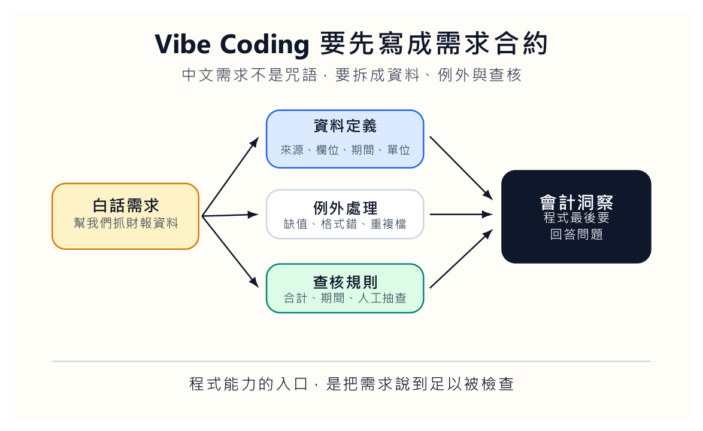
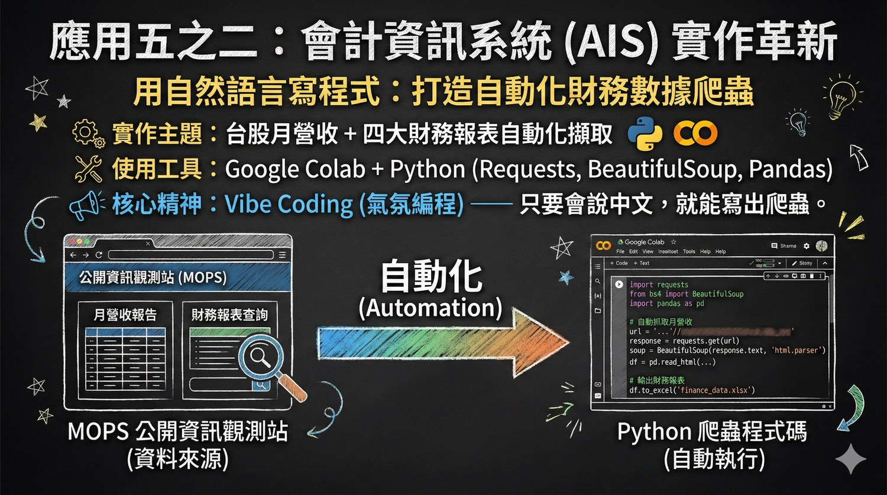
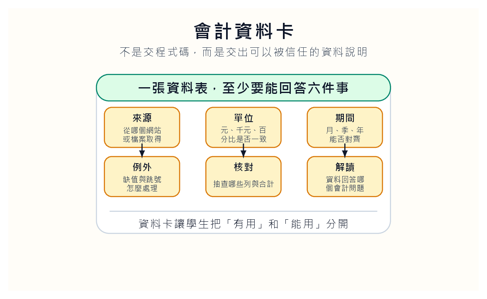

很多會計學生不是討厭程式。他們討厭的是一開始就被語法羞辱。

第一堂課還沒弄清楚要解決什麼問題，就先被括號、縮排、套件安裝、錯誤訊息打趴。會的人越改越快，不會的人越坐越安靜。最後程式課變成一種身分篩選：誰本來就有底子，誰被留在門外。

Vibe Coding 有一點值得拿進會計課，不是因為它讓學生不用學程式，而是因為它把語法門檻暫時往後移。學生先用中文說出工作需求，AI 再產生第一版程式。這個順序如果設計得好，課堂就不必把最寶貴的時間花在括號上，而能把學生拉回資料、查核和會計問題。

可是這個做法也有危險。若學生只把一句「幫我們做財報分析」丟給 AI，得到的東西再像樣，也只是責任外包。Vibe Coding 進會計課，第一步不是寫 prompt，而是寫需求合約。

## 十行需求，先當成合約

需求合約不需要長。十行就夠。可是每一行都要能被同學追問。

不要寫「幫我們抓財報資料」。這句話太輕，輕到模型可以任意解讀。比較好的寫法是：輸入公司代號與年份，抓取每月營收資料，整理成表格，計算年增率，標出連續三個月衰退的區間，列出資料來源、抓取日期、單位與缺漏月份。

這段話看起來不炫，卻已經把任務拆成資料、期間、計算、異常、來源與查核。這才值得交給 AI。

我們可以讓學生兩人一組交換需求，但不准改程式。讀別人的需求時，只能問三種問題：資料哪裡來？例外怎麼處理？結果怎麼驗證？如果被問的人答不出來，就代表需求還沒準備好。

這個活動會讓學生很快發現，所謂不會寫程式，有時只是表面。真正卡住的是我們還沒把會計問題說到可以被檢查。公司代號要手動輸入，還是讀一份清單？月營收單位是千元還是元？資料缺月時要報錯，還是留下空白？公司更名怎麼處理？同一家公司有合併與個別資料時，哪一種才符合任務？

這些問題不是程式問題。這些是會計資料問題。

## 紅字不是失敗，是教材

第一版程式很可能跑不起來。這很正常。網站欄位改了，套件沒裝，路徑錯了，日期格式不合，欄位名稱和預期不同。很多學生看到紅字就慌，因為紅字像失敗。

我們要把這個反應改掉。紅字其實是教材。

學生每遇到一次錯誤，不要立刻叫 AI 修好。先把錯誤訊息貼回去，問：「這個錯誤代表什麼？請先解釋，不要直接改。」這個小要求很有效。它把 AI 由代打者拉回助教的位置。學生開始知道程式不是咒語，而是一串能被拆開檢查的指令。

會計課裡最不能省的是資料查核。爬到資料不等於資料對。月營收是不是千元？資料是合併還是個別？公司是否更名？某個月為何空白？資料來源是公開資訊觀測站、交易所，還是二手網站？AI 很會把表格整理得像真的，但它不會替我們對資料來源負責。

所以錯誤修正紀錄應該列入成績。每修一次，學生要寫一句人話：這次錯在哪裡，我們怎麼判斷，改了哪一行，改完後如何確認。這句話比程式碼更能看出學生有沒有理解。只會把紅字貼給 AI，直到剛好跑起來，不算學會。能說出錯誤的種類，才開始接近專業。

## 資料卡比折線圖更誠實

學生最後不該只交程式碼，也不該只交一張折線圖。折線圖太容易讓人以為自己懂了。營收往上，不一定代表公司變好；營收往下，也不一定代表公司變差。可能是產品組合改變，可能是一次性訂單，可能是淡旺季，可能是匯率，也可能是會計分類調整。

我們要學生交的是三樣東西。

第一，原始需求合約與修正紀錄，讓人看見任務怎麼被講清楚。第二，資料檢查卡，說明來源、單位、期間、缺漏、人工抽查和資料限制。第三，一段會計解讀，不能只說趨勢，要說這個趨勢還不能告訴我們什麼。

第三項最難，也最有用。學生可以寫：「營收連續三個月上升，但我們尚未排除產品組合、價格調整或一次性訂單影響。」這句話不華麗，卻比「公司營運改善」誠實得多。會計教育不該鼓勵學生看到一條上升線就開始講故事。

我們也可以安排一分鐘口頭報告。每組只講三件事：資料來源是什麼，哪裡可能錯，這張圖不能告訴我們什麼。最後一句會逼學生保留判斷。很多時候，會計人在現場不是負責把答案講得很大聲，而是負責阻止別人太早相信答案。

## 先做笨介面，不要急著做漂亮畫面

初學者很容易急著做 dashboard。按鈕要漂亮，圖表要會互動，畫面要像作品集。可是資料還沒查清楚時，漂亮畫面只是包裝錯誤。

我會要求學生先做一個很笨的介面。它只要清楚顯示輸入、資料來源、抓取時間、錯誤訊息、輸出檔名和版本。這些資訊看起來無聊，卻是讓別人敢接手的條件。會計系統最怕的不是大聲報錯，而是安靜地錯。寧可讓程式明白告訴我們抓不到資料，也不要讓它假裝成功。

這裡可以加入一個「重跑測試」。學生要把自己的工具交給另一組同學使用。另一組只能看需求合約和操作說明，不准問作者。若工具跑不起來，作者要修的是工作紀錄，不只是程式。因為在真實組織裡，工具很少只給作者本人使用。別人能不能重跑，才是交付的一部分。

## 壞資料日，比成功畫面更像真實工作

課堂最後可以安排一次壞資料日。老師故意提供一份有缺漏、有單位錯誤、有公司代號混淆的資料，讓學生用自己的工具跑。這一天，跑出錯誤的人不扣分；沒有發現錯誤的人，才需要被追問。

這會改變學生對成功的定義。

程式順利執行不是成功。抓到不該相信的資料，才是成功。

壞資料日也能修正一種課堂氣氛。學生很怕紅字，因為紅字像被打叉。可是資料工作裡，紅字有時比綠色成功訊息更誠實。它提醒我們哪裡不能假裝順利。會計人若沒有這種敏感，以後面對自動化報表，很容易被安靜的錯誤騙過去。

## Vibe Coding 要留下的，不是新鮮感

Vibe Coding 進會計課，不該被包裝成「不會程式也能做」。這種說法太便宜，也容易害學生誤會。我們真正想留下的是一種工作順序：先說清楚需求，再檢查資料，再解釋結果。

工具會換，網站會改，AI 模型也會換。可是會計資料工作裡，有幾件事不會消失。需求要能被追問。資料要能被查核。例外要能被記錄。結論要願意承擔。

學生畢業後未必親自寫爬蟲。他可能在事務所、企業財會部門、內控團隊或資料分析專案裡和不同角色合作。那時候，說不清需求的人，只能一直抱怨系統不好用；說得清楚的人，才有機會把問題交給別人接住。

最後交出的不是漂亮作品，而是一份讓別人敢接手的工作紀錄。這比多學一段語法更像會計教育該守住的東西。
