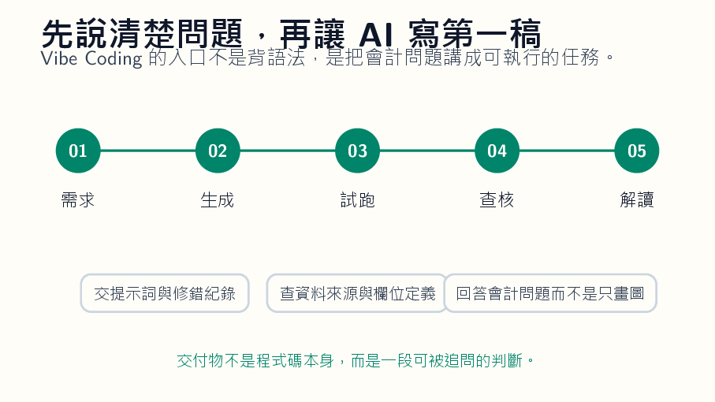

*概念圖呈現 Vibe Coding 的教學節奏：學生描述需求，AI 產生程式，學生測試、修正並解讀會計意義。*

## 先把問題說成人話

很多會計學生不是討厭程式，他們是討厭那種一開始就被語法羞辱的感覺。第一堂課還沒搞懂要解決什麼問題，就先被括號、縮排、錯誤訊息打趴。於是程式變成一種身分篩選：會的人越來越會，不會的人越來越沉默。Vibe Coding 有趣的地方，是它暫時把語法門檻往後推，讓學生先用中文把需求說清楚。

需求先過關，程式才有意義

可是這不代表學生可以不用思考。剛好相反。當 AI 可以幫你寫第一版程式，問題會變得更赤裸：你到底想抓什麼資料？公司代號從哪裡來？期間怎麼設定？月營收和財報資料的欄位定義是什麼？缺資料時要跳過、補零，還是提醒使用者？這些不是程式問題，這些是會計資料問題。

以前學生可以說「我不會寫程式」躲過去，現在躲不掉了。我會讓學生先寫一段白話需求，不能超過十行。比如：「輸入公司代號與年份，抓取每月營收，整理成表格，畫出年增率，標出連續三個月衰退的區間。」這段話越具體，AI 生成的程式越可能接近可用。

若學生只寫「幫我做財報分析」，AI 回來的東西通常也會像廢話，因為需求本身就是廢話。第一版程式跑不起來，這是正常的。網站欄位變了，套件沒裝，路徑錯了，日期格式不合。這些錯誤不要急著替學生修掉。錯誤訊息是教材。學生要把錯誤貼回去問 AI：「這個錯誤代表什麼？請不要直接改，先解釋原因。」這一步能把 Vibe Coding 從魔術變成學習。學生開始知道程式不是咒語，而是一串可以被檢查的指令。

## 錯誤訊息是教材

會計課裡最不能省的是資料查核。爬到資料不代表資料對。月營收單位是不是千元？合併或個別？公司是否更名？某月為什麼空白？資料來源是公開資訊觀測站、交易所，還是某個二手網站？AI 很會幫你把表格整理得像真的，但它不會替你對資料來源負責。

紅字要留下來

教師應該要求學生在作業裡附上資料來源、抓取日期、欄位說明與至少一筆人工核對。真正的交付物也不該只是程式碼。學生要交三樣東西。第一，原始提示詞與修正紀錄，讓人看見需求怎麼變清楚。第二，資料檢查表，說明抓到的欄位、單位、缺漏與例外。第三，一段會計解讀：這個趨勢可能意味什麼？

還需要哪些資料才能判斷？如果只交出一張折線圖，這堂課就被工具吃掉了。Vibe Coding 最好的用法，是讓非資訊背景學生第一次感覺「我可以讓電腦替我做重複工作」。這種感覺很重要，但不能停在興奮。興奮後要接責任。你讓 AI 寫了一個爬蟲，就要知道它爬了哪裡；

你讓它畫了圖，就要知道圖上的每個點從哪裡來；你讓它產生分析，就要知道哪一句只是猜測。這也會改變會計教育的語氣。過去我們常把程式能力當成額外技能，好像會計學生先把會計學好，之後有空再碰資料。這個順序已經不太夠。資料取得、整理、查核、解讀，正在變成會計判斷的一部分。

學生不一定要成為工程師，但不能對資料如何來到自己手上一無所知。

## 資料來源比折線圖重要

所以我不會把 Vibe Coding 包裝成輕鬆捷徑。它比較像一個翻譯器，把學生的會計問題翻成程式可以執行的任務。翻譯得好不好，取決於學生是否真的理解問題。語法可以請 AI 幫忙，問題不能。我會把修錯過程列入成績。不是因為錯誤值得獎勵，而是因為修錯最能看出學生有沒有理解。

資料卡比圖表更誠實

學生如果只是一直貼錯誤訊息給 AI，最後程式剛好跑起來，他其實仍然不知道發生什麼事。比較好的要求是，每次修正都要寫一句人話：這次錯在哪裡，我怎麼判斷，改了哪一行，改完後如何確認。會計資料爬蟲還有一種常見假象：圖畫出來了，就以為分析完成。折線圖很容易讓人產生理解的錯覺。

營收往上，不一定代表公司變好；營收往下，也不一定代表公司變差。可能是產品組合、一次性訂單、淡旺季、匯率、併購、會計分類改變。學生要被要求寫出至少兩個替代解釋，並說明需要哪個資料才能排除。這會逼他們離開「圖看起來如何」這種膚淺判斷。

Vibe Coding 對會計教育的價值，不是讓每個學生都變成開發者，而是讓他們對資料流程不再陌生。未來他們可能不親自寫爬蟲，但會和資訊人員、資料工程師、內控人員一起工作。若他能把需求說清楚，知道資料欄位可能出錯，知道自動化流程需要查核點，他就已經比只會說「幫我抓資料」的人前進一大步。

## 把修錯列入成績

我也會要求學生把程式介面做得笨一點。不要一開始追求漂亮 dashboard。先讓它清楚顯示輸入、資料來源、抓取時間、錯誤訊息與輸出檔名。很多初學者急著做視覺化，結果資料錯了也看不出來。會計系統最怕的是安靜地錯。寧可讓程式大聲報錯，也不要讓它假裝成功。

能重跑才算完成

這裡有一種態度要慢慢養成：自動化不是把人移除，而是把人的檢查點安排好。月營收爬蟲可以自動抓，但欄位定義要人確認；圖可以自動畫，但異常點要人解釋；報告可以自動產生，但結論要人負責。學生如果在大學時就習慣這種分工，以後進入事務所或企業，就不會把自動化當成黑箱，也不會把黑箱當成權威。

課堂最後可以安排一次「壞資料日」。教師故意提供一份有缺漏、有單位錯誤、有公司代號混淆的資料，讓學生用自己的工具跑。跑出錯誤的人不扣分，沒有發現錯誤的人才要被追問。這會改變學生對成功的定義。程式順利執行不是成功，抓到不該相信的資料才是成功。這種訓練會讓學生對 AI 產生健康的不信任。

不是敵意，而是查核習慣。當他看到一張漂亮圖表，他會問資料來源；看到一段自動生成分析，他會問欄位定義；看到一個執行成功的程式，他會問例外情況。這種人以後進入會計現場，比只會操作工具的人可靠得多。

## 自動化不是移除人

我希望學生最後記得的不是某段程式，而是一種工作習慣：先說清楚需求，再檢查資料，再解釋結果。程式語法會換，資料來源會換，AI 工具也會換。這個順序若能留下來，Vibe Coding 就不只是新玩具，而是進入資料工作的一扇門。
